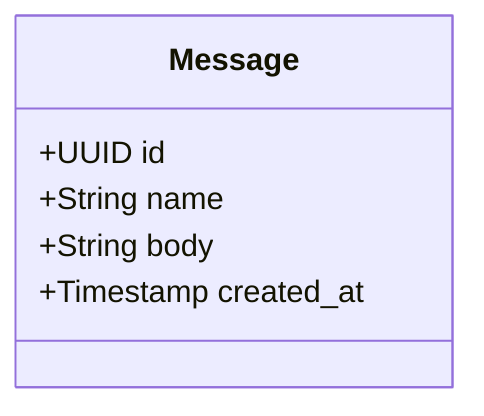
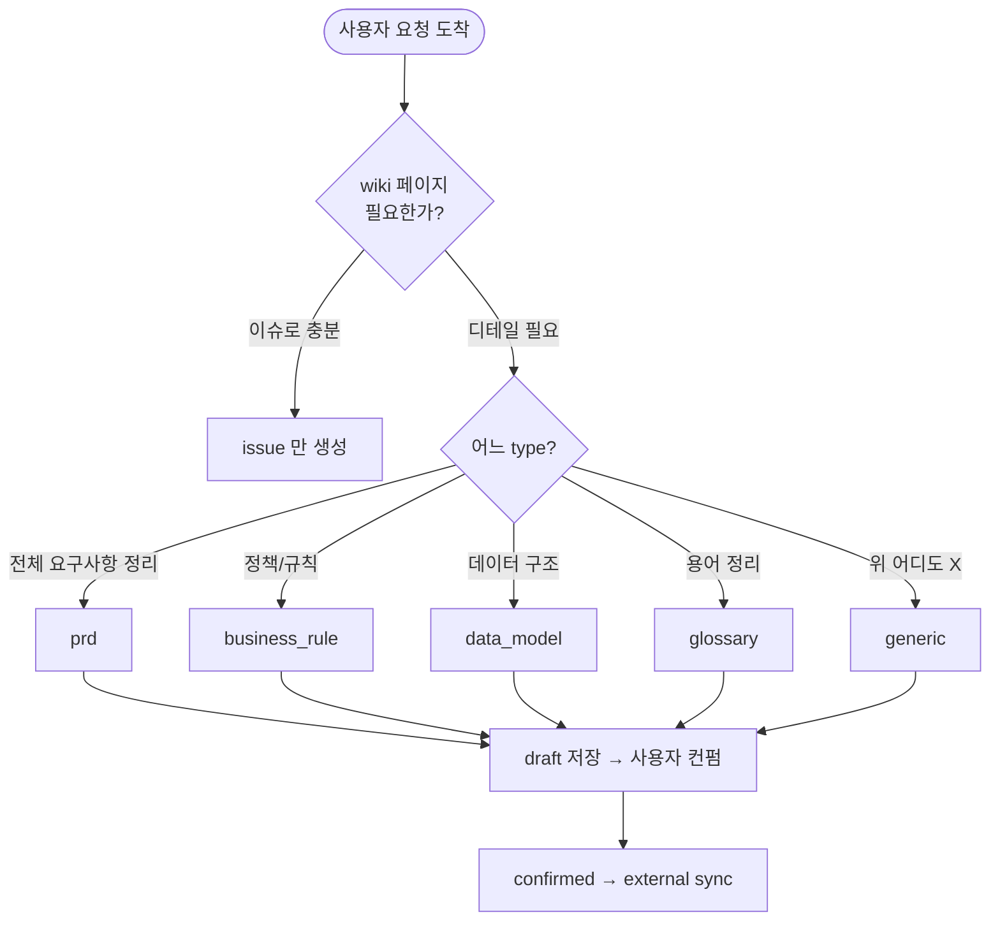

# Wiki Authoring Guide (Primary)

Primary 에이전트가 위키 페이지 (`wiki_pages` collection) 를 만들 때 따르는 가이드.
부팅 시 LLM persona 컨텍스트에 embed 됨 — 사람용 튜토리얼이 아닌 **에이전트용
prompt 자료**.

`page_type` enum 의 catalog 자체는 [`docs/doc-store-schema.md`](../../../docs/doc-store-schema.md)
의 §5 가 root of truth. 본 가이드는 **각 type 을 어떻게 작성하느냐** 에 집중.

---

## 0. 공통 작성 원칙

- **헤더 깊이 ≤ H4** — H5 / H6 는 새 페이지로 분리
- **Mermaid 다이어그램** — `flowchart` / `sequenceDiagram` / `classDiagram` 등.
  ASCII 도식 금지 (root CLAUDE.md 의 다이어그램 규칙)
- **표 / 리스트 활용** — 산문보다 구조화된 표현 우선
- **References 섹션 필수** — 관련 issue / 다른 wiki 명시
- **slug** — kebab-case, URL-friendly. 예: `prd-guestbook`, `business-rule-message-length`
- **structured 필드** — type 별 정의된 구조화 데이터 (마크다운 본문과 별개로 기계가 쿼리)

---

## 1. `prd` — Product Requirements Document

**언제**: 한 프로젝트의 전체 요구사항을 첫 정리할 때. 프로젝트당 보통 1개.

**표준 섹션**:

```markdown
# {프로젝트명} — PRD

## 배경
(왜 만드는가, 사용자 누구, 해결하려는 문제)

## 목표
(이 프로젝트로 달성하려는 것 — bullet list)

## 비-목표
(명시적으로 안 다룰 것 — 스코프 통제)

## 사용자 시나리오
(주요 user flow 1~3개)

## 기능 요구사항
(Epic / Story 단위로 분해 — 본 PRD 가 reference, 실 entity 는 issues 테이블)

## 비기능 요구사항
(성능 / 가용성 / 보안 / 운영 — 해당 시)

## 마일스톤
(M1 / M2 ... 또는 1차 / 2차 일정)

## References
- 관련 Story id 들
```

**`structured` 필드 (JSONB)**:
```json
{
  "milestones": [{"name": "M1", "description": "..."}],
  "user_personas": ["사용자 유형 1", ...],
  "in_scope": [...],
  "out_of_scope": [...]
}
```

---

## 2. `business_rule` — 비즈니스 정책 / 규칙

**언제**: PRD 에 한 줄로 적기엔 디테일이 필요한 정책 / 규칙. 예: "메시지 글자 수 제한", "익명 사용자 허용 여부".

**표준 섹션**:

```markdown
# {규칙명}

## 규칙
(한 문장 or 짧은 단락으로 명료히)

## 근거
(왜 이 규칙이 필요한가)

## 예외 / 경계
(예외 케이스, 적용되지 않는 경우)

## 영향받는 entities
(어떤 데이터 / 기능에 영향)

## 검증 방법
(이 규칙이 지켜지는지 어떻게 확인)

## References
- 관련 PRD / 다른 business_rule
```

**`structured` 필드**:
```json
{
  "rule_id": "BR-001",
  "applies_to": ["messages", "users"],
  "severity": "must" | "should" | "may"
}
```

---

## 3. `data_model` — 데이터 모델

**언제**: P 가 사용자와 대화로 정해진 entity / 필드 / 관계의 초기본. **A 가 M4 에서 정밀화** (라이브러리 / 인덱스 / 제약 등 추가).

**표준 섹션**:

```markdown
# {도메인명} — 데이터 모델

## 개요
(이 도메인이 다루는 것 1단락)

## Entity 다이어그램



## Entities
(각 entity 별 필드 / 의미 / 제약 — 표 또는 리스트)

## 관계
(어떻게 연결되는지)

## References
- 관련 PRD / business_rule
```

**`structured` 필드**:
```json
{
  "entities": [
    {
      "name": "Message",
      "fields": [{"name": "id", "type": "UUID", "constraints": ["pk"]}, ...]
    }
  ],
  "relationships": [
    {"from": "Message", "to": "User", "type": "many_to_one"}
  ]
}
```

---

## 4. `glossary` — 용어집

**언제**: 프로젝트 도메인 용어가 5개 이상 쌓이거나 사용자와 P 간 용어 합의가 필요할 때.

**표준 섹션**:

```markdown
# {도메인} — Glossary

| 용어 | 정의 | 동의어 | 관련 |
|---|---|---|---|
| Guestbook | 방문자가 이름과 메시지를 남길 수 있는 페이지 | 방명록 | Message |
| Message | 한 방문자가 남긴 한 줄 텍스트 | post, entry | User |
```

**`structured` 필드**:
```json
{
  "terms": [
    {"term": "Guestbook", "definition": "...", "synonyms": ["방명록"]}
  ]
}
```

---

## 5. `generic` — 자유 페이지

**언제**: 위 카테고리 어디에도 안 맞는 자유 형식 문서. 임시 메모 / 회의록 / 기타.

**표준 섹션**: 없음. 자유. 단 헤더 / mermaid / references 공통 원칙은 적용.

**`structured` 필드**: `{}` (비움)

---

## 6. 작성 시 결정 흐름



---

## 7. M4 / M5+ 에서 추가될 type

본 가이드는 **Primary 가 작성하는 type 만** 다룸. 다음은 M4 의 `agents/architect/resources/wiki-authoring-guide.md` 가 다룰 type:

- `adr` — Architecture Decision Record (A)
- `api_contract` — API 계약 (A)
- `runbook` — 운영 절차 (A 또는 운영자)

P 도 위 type 의 페이지를 **읽을 수 있어야** 한다 (Wiki MCP 의 `get_page` / `list_pages`). 작성은 A 의 책임.

---

## 8. 절대 규칙

- **page_type enum 외의 type 사용 금지** — 새 type 도입은 schema 변경이며 별 이슈 + 사용자 컨펌 필요
- **slug 는 한 번 정해지면 변경 X** — 외부 sync 후 URL 안정성. 변경 시 redirect 정책 별도 결정
- **사용자 컨펌 없이 status 를 confirmed 로 두지 않는다** — 모든 새 페이지는 `draft` 로 시작
- **structured 필드는 자유 폼 X** — type 별 정의된 schema 따름. content_md 와 일관 유지
