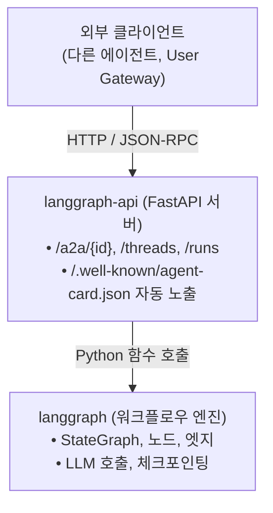

# 에이전트 런타임 / 빌드 전략

본 문서는 **LangGraph 기반 에이전트를 어떻게 개발/빌드/실행하는가** 에 대한
프로젝트 차원 결정 사항을 기록한다. 모든 에이전트(Primary, Architect, Engineer, ...)
가 공통으로 따르는 규약이다.

- 최초 작성 이슈: #18
- 관련 이슈: #6 (Primary 에이전트 구현)
- 관련 문서: [proposal.md](./proposal.md), [infra-setup.md](./infra-setup.md)

---

## 1. 레이어 구분: `langgraph` vs `langgraph-api`

두 패키지는 **독립된 레이어** 다.

| 패키지 | 역할 | 유비 |
|---|---|---|
| `langgraph` | 워크플로우 엔진 (StateGraph, 노드, 엣지, 체크포인팅) — HTTP 서버 아님 | ORM / 엔진 |
| `langgraph-api` | 위 엔진을 HTTP 로 노출하는 FastAPI 기반 서버 | ORM 위에 얹은 FastAPI 앱 |
| `langgraph-cli` | `langgraph dev` / `build` / `dockerfile` 등 개발자 CLI | 개발 도구 |



**핵심 함의**: A2A 서버 / AgentCard / SSE 스트리밍 등은 `langgraph-api` 가
내장 제공한다. 우리가 FastAPI 라우트를 직접 짤 필요가 없다.

---

## 2. 개발 루프: `langgraph dev`

```bash
cd agents/primary
langgraph dev
```

- 호스트에서 바로 실행 (Docker 불필요)
- 포트 2024 에 핫리로드 서버 기동
- LangSmith API 키 **불필요** (OSS 경로)
- 그래프 코드 수정 시 자동 재로드

**용도**: 로컬에서 그래프 로직 반복 수정 시.

---

## 3. 프로덕션: Docker 이미지 빌드 + 실행

### 3.1. 우리 상황

디렉토리 구조:
```
dev-team/
├── shared/              ← 공통 패키지 (모든 에이전트가 import)
└── agents/
    ├── primary/
    ├── architect/
    └── ...
```

이미지 안에는 **`shared/` 와 `agents/{role}/` 둘 다** 들어가야 한다.

### 3.2. 빌드 전략: `langgraph dockerfile` + shared 레이어 추가

**왜 `langgraph build` 가 아니고 `langgraph dockerfile` 인가**:

| 방법 | 결과 | 우리 프로젝트 적합성 |
|---|---|---|
| `langgraph build -t img` | 이미지까지 한 번에 생성 (블랙박스) | ❌ shared 추가 여지 없음 |
| `langgraph dockerfile ./Dockerfile` | Dockerfile 텍스트 파일 생성만 | ⭕ 우리가 편집해서 shared 레이어 끼워넣기 가능 |

### 3.3. 빌드 절차

```bash
# 1. Dockerfile 템플릿 추출 (langgraph.json 변경 시마다 재실행)
cd agents/primary
langgraph dockerfile ./Dockerfile

# 2. 생성된 Dockerfile 편집 — shared 설치 레이어 추가
#    (자세한 내용은 §3.4)

# 3. 레포 루트에서 빌드 (build context 에 shared/ 포함하기 위함)
cd <repo-root>
docker build -f agents/primary/Dockerfile -t primary:latest .
```

### 3.4. Dockerfile 편집 패턴

`langgraph dockerfile` 이 뽑아준 기본 Dockerfile 에 **shared 설치 레이어를 한 단계 추가** 한다:

```dockerfile
FROM langchain/langgraph-api:3.13

# ── [추가 레이어] shared 패키지 ──────────────────────────────
ADD ./shared /deps/shared
RUN pip install -e /deps/shared
# ────────────────────────────────────────────────────────────

# (아래는 langgraph dockerfile 이 생성한 원본 내용)
ADD ./agents/primary /deps/primary
RUN pip install -e /deps/primary
# ENTRYPOINT / CMD 는 베이스 이미지 기본값 사용 (§4 참조)
```

### 3.5. 실행

```bash
docker run --env-file .env primary:latest
```

별도 CMD 불필요 — 베이스 이미지 엔트리포인트가 서버를 자동 기동 (§4).

---

## 4. 컨테이너 엔트리포인트 정책

**베이스 이미지(`langchain/langgraph-api:*`) 기본 엔트리포인트를 그대로 사용한다.**
아래 대안들은 모두 **비권장** 이며, 이유를 기록해 둔다:

| 방식 | 비권장 사유 |
|---|---|
| `CMD ["uvicorn", "langgraph_api.server:app", ...]` | 공식 문서에 없는 경로. 내부 구성 변경 시 깨질 수 있음 |
| `CMD ["langgraph", "dev"]` | 개발 전용 (핫리로드, 싱글워커, LangSmith 의존). 프로덕션 부적합 |
| `CMD ["langgraph", "up"]` | LangSmith **license 필요** — self-host OSS 경로에 부적합 |

---

## 5. A2A / AgentCard 자동 노출

`langgraph-api` 는 **기본적으로 A2A 기능이 활성화** 되어 있다 (`disable_a2a: true` 로만 끌 수 있음).
아래 엔드포인트들이 자동 노출된다:

| 경로 | 내용 |
|---|---|
| `POST /a2a/{assistant_id}` | JSON-RPC 2.0 (SendMessage, GetTask 등) |
| `GET /a2a/{assistant_id}/.well-known/agent-card.json` | assistant 별 AgentCard |
| `GET /.well-known/agent-card.json?assistant_id=<id>` | 동일 (쿼리 기반) |

**assistant_id 매핑**: `langgraph.json` 의 graphs 섹션에 등록한 graph ID
가 그대로 default assistant_id 로 사용된다.

```json
{
  "graphs": {
    "primary": "primary_agent.graph:graph"
  }
}
```
→ `assistant_id = "primary"`

---

## 6. 기동 후 검증

컨테이너가 떴을 때 AgentCard 가 올바로 노출되는지 확인:

```bash
curl http://localhost:8000/.well-known/agent-card.json?assistant_id=primary | jq .
```

기대 응답 (요지):
```json
{
  "name": "primary",
  "description": "...",
  "url": "http://<host>:<port>/...",
  "capabilities": {
    "streaming": true,
    "pushNotifications": false,
    "stateTransitionHistory": false
  },
  "skills": [
    { "id": "primary-main", "name": "primary Capabilities", ... }
  ],
  "version": "<langgraph_api 버전>"
}
```

**검증 포인트**:
- `url` 이 예상한 외부 호스트로 나오는지 (리버스 프록시 뒤면 §7 의 `HOST_OVERRIDE` 필요)
- `skills` 가 최소 1개 이상
- `assistant_id` 가 graph 이름과 일치

---

## 7. 주의할 환경변수

| 변수 | 용도 | 설정 시점 |
|---|---|---|
| `HOST_OVERRIDE` | 리버스 프록시 뒤에서 AgentCard `url` 을 외부 호스트로 교정 | 컨테이너 env |
| `USER_API_URL` | 동일 목적 대체 변수 | 컨테이너 env |
| `DEFAULT_A2A_ASSISTANT_ID` | `/.well-known/agent-card.json` 에서 `assistant_id` 쿼리 생략 시 기본값 | 선택 |
| `ANTHROPIC_API_KEY` | LLM 호출용 | 컨테이너 env |

---

## 8. AgentCard 커스터마이즈 범위 (현 단계)

langgraph-api 가 자동 생성하는 AgentCard 는 다음이 **하드코딩** 되어 있다:

- `capabilities.streaming = True`
- `capabilities.pushNotifications = False` (미구현)
- skill 1개 고정 (`{assistant_id}-main`)
- `skill.tags = ["assistant", "langgraph"]`

현 프로젝트 M2 단계에서는 **자동 카드를 그대로 사용** 한다.
다중 skill 세분화(예: `pm.plan_project`, `pm.review_pr`) 가 필요해지는 시점이
오면 `disable_a2a: true` + 커스텀 라우트로 전환한다 (이때 `shared/a2a/agent_card.py`
의 `build_agent_card()` 가 사용된다).

---

## 9. 결정 요약표

| 항목 | 결정 |
|---|---|
| 개발 루프 | `langgraph dev` (호스트에서) |
| 이미지 빌드 | `langgraph dockerfile` → shared 레이어 추가 → `docker build` |
| 컨테이너 기동 | `docker run` 만. CMD 는 베이스 이미지 기본값 |
| A2A 서버 | langgraph-api 내장 자동 노출 |
| AgentCard | langgraph-api 자동 생성 그대로 사용 (M2 단계) |
| 우리가 작성하는 것 | `graph.py`, `langgraph.json`, `config.yaml`, `Dockerfile` (편집판) |

---

## 10. 불확실 / 향후 재검토

- **OSS license 정책**: `langgraph build` / `langgraph dockerfile` 로 만든 이미지를
  프로덕션에서 구동하는 것에 대한 공식 라이선스 문구를 100% 확인하지 못함.
  자체 배포 전에 `langgraph-api` LICENSE 재확인 필요.
- **AgentCard version 필드**: langgraph-api 가 자기 `__version__` 을 넣음 →
  A2A spec 의 "patch 버전 쓰지 말라" 권고와 충돌 가능. 커스텀 라우트 전환 시점에 오버라이드.
- **Cache-Control / ETag**: langgraph-api 가 AgentCard 엔드포인트에 캐시 헤더를 붙이지 않음.
  필요해지면 리버스 프록시(nginx 등) 계층에서 추가.

---

## 참고 자료

- [LangGraph CLI (공식 docs)](https://docs.langchain.com/langsmith/cli)
- [A2A endpoint in Agent Server (공식 docs)](https://docs.langchain.com/langsmith/server-a2a)
- [A2A Protocol v1.0 Specification](https://a2a-protocol.org/latest/specification/)
- [a2a-samples: python/agents/langgraph](https://github.com/a2aproject/a2a-samples/tree/main/samples/python/agents/langgraph)
