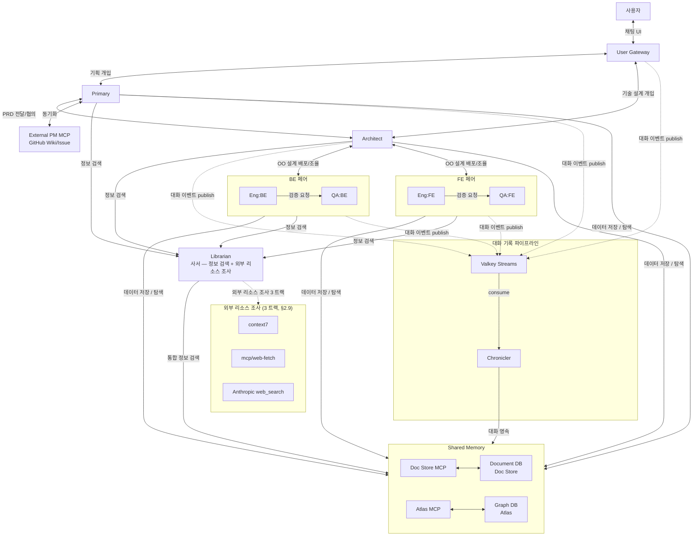

# LangGraph 기반 A2A 멀티 에이전트 협업 시스템

> **문서 버전:** v0.3
> **최초 작성일:** 2026-04-14
> **최종 수정일:** 2026-05-07
> **상태:** 진행 — 주요 설계 확정, 구현 단계 (M3)

본 문서는 시스템의 **큰 컨셉과 전체 흐름** 을 정리한 entry point 다.
세부 디테일은 `docs/proposal/` 하위 sub doc 으로 분할되어 있다 (#66).

## 문서 지도

| 영역 | sub doc |
|---|---|
| User Gateway | [`proposal/architecture-user-gateway.md`](proposal/architecture-user-gateway.md) |
| 단일 에이전트 내부 구조 | [`proposal/architecture-agent-internals.md`](proposal/architecture-agent-internals.md) |
| Role Config 및 MCP 디스커버리 | [`proposal/architecture-role-config.md`](proposal/architecture-role-config.md) |
| Shared Memory 아키텍처 | [`proposal/architecture-shared-memory.md`](proposal/architecture-shared-memory.md) |
| A2A 대화 이벤트 수집 (Valkey + CHR) | [`proposal/architecture-event-pipeline.md`](proposal/architecture-event-pipeline.md) |
| 프로젝트 코드베이스 공유 | [`proposal/architecture-codebase-sharing.md`](proposal/architecture-codebase-sharing.md) |
| Code Agent 실행 전략 | [`proposal/architecture-code-agent.md`](proposal/architecture-code-agent.md) |
| 외부 리소스 조사 (3 트랙) | [`proposal/architecture-external-research.md`](proposal/architecture-external-research.md) |
| 에이전트 역할 정의 | [`proposal/agents-roles.md`](proposal/agents-roles.md) |
| 지식 그래프 모델링 | [`proposal/knowledge-model.md`](proposal/knowledge-model.md) |
| 협업 프로세스 (단계별 상세) | [`proposal/workflow.md`](proposal/workflow.md) |
| 기술 스택 상세 | [`proposal/tech-stack.md`](proposal/tech-stack.md) |
| 프로젝트 구조 | [`proposal/project-structure.md`](proposal/project-structure.md) |

관련 운영/개발 가이드 (별도 docs):
- [`agent-runtime.md`](agent-runtime.md) — 런타임/빌드 전략
- [`infra-setup.md`](infra-setup.md) — 인프라 셋업
- [`doc-store-schema.md`](doc-store-schema.md) — Doc Store 스키마
- [`sse-connection.md`](sse-connection.md) — SSE 연결 관리

---

## 1. 프로젝트 개요

### 1.1. 목적
**LangGraph** 기반 에이전트들이 **A2A(Agent-to-Agent)** 프로토콜을 통해 고도의 소프트웨어 엔지니어링 과업을 수행하는 **자율형 협업 환경**을 구축한다. 각 에이전트는 LLM API로 사고하고, 코드 작업이 필요한 시점에만 **OpenCode CLI**를 도구로 활용한다.

### 1.2. 핵심 컨셉
**"분산된 지능, 중앙 집중형 지식 (Distributed Intelligence, Centralized Knowledge)"**

- **P가 전체 프로젝트를 관리**하고, **A가 객체지향 설계를 통해 전체 개발을 책임**지며, **Eng-QA 페어가 A의 설계를 직접 구현**하는 구조
- 각 에이전트는 독립 컨테이너에서 실행 → 상호 간섭 차단, 역할별 최적화
- **LangGraph**가 에이전트 내부 워크플로우 엔진 + A2A 통신 계층을 담당
- **코드 실행 도구**는 추상화 인터페이스를 통해 교체 가능 (기본 구현: OpenCode CLI)
- 이중 계층 공유 메모리(Atlas + Doc Store)는 각 에이전트가 자기 도메인 데이터를 MCP 통해 직접 write 하며, **Librarian** 은 사서 — 정보 검색 + 외부 리소스 조사 전담
- **사용자는 P와 A 양쪽과 직접 소통**하여 프로젝트 기획/기술 설계 양방향으로 개입 가능
- 모든 A2A 통신이 이벤트로 publish → Chronicler 가 수집 → 사용자가 전체 진행 상황을 추적 가능

### 1.3. 기대 효과

| 영역 | 효과 |
|------|------|
| 의사결정 품질 | 관리/설계 분리로 체계적 설계 패턴 적용, 고품질 코드 생산 |
| 문맥 추적 | 과업-코드 연결 그래프로 변경 이력/의도 완벽 추적 |
| 유지보수 | 인터페이스 중심 설계로 결합도 저하, 설계자 직접 검수로 일관성 유지 |

---

## 2. 시스템 아키텍처

### 2.1. 전체 구성도

**다이어그램 단순화 주석:**

가독성을 위해 페어 단위로 묶거나 추상 라벨로 표기한 부분이 있습니다.

| 단순화 표기 | 의미 / 실제 |
|----------|-----------|
| `PairBE` / `PairFE` 페어 단위 화살표 | 실제로는 각 페어 안의 Eng·QA 가 개별로 연결 (데이터 저장 / 정보 검색 / publish 모두 Eng·QA 각각 수행) |
| `데이터 저장 / 탐색` (한 라벨) | 각 에이전트가 자기 도메인 데이터를 적절한 MCP 에 직접 write 또는 단순 read. 실 호출 대상은 도메인별 (P → DocMCP / A → 양쪽 / Pairs → 양쪽). 디테일은 [shared-memory](proposal/architecture-shared-memory.md) |
| `정보 검색` (L 입력) | DB 정보 검색 + 외부 리소스 조사 모두 포함하는 자연어 위임. L 이 LLM 추론으로 적절한 도구 / 트랙 선택 |
| `통합 정보 검색` (L → SharedMemory) | L 이 Atlas + Doc Store 양쪽 교차 쿼리 (LLM ReAct) |
| `외부 리소스 조사 3 트랙` | context7 / mcp/web-fetch / Anthropic web_search. L 단독 전담 (디테일 [external-research](proposal/architecture-external-research.md)) |
| `대화 이벤트 publish` (점선) | fire-and-forget. UG + 모든 에이전트 → Broker. CHR 가 consume + DocMCP 직접 영속 (L 경유 X). XREADGROUP / XACK 디테일 [event-pipeline](proposal/architecture-event-pipeline.md) |

**표현되지 않은 관계 (의도적 생략):**
- Eng ↔ Eng 직접 통신 X (A 가 다자간 논의 소집 시에만 A 주관)
- A 가 페어 내 Eng / QA 에 동시 배포 (페어 단위 화살표 안에 포함)

### 2.2. User Gateway → [user-gateway](proposal/architecture-user-gateway.md)

사용자 ↔ 에이전트 중계 계층. 채팅 입력을 A2A `SendMessage` / `SendStreamingMessage` 로 변환하여 P 또는 A 로 전달, SSE 스트리밍으로 에이전트 응답을 실시간 UI 렌더링.

### 2.3. 단일 에이전트 내부 구조 → [agent-internals](proposal/architecture-agent-internals.md)

LangGraph 베이스 + LLM Adapter + Code Agent Adapter + MCP 클라이언트 (Shared Memory / External PM / 외부 리서치) + A2A 서버/클라이언트 구조. Role Config 로 페르소나 / 워크플로우 확장 / 활성 클라이언트 결정.

### 2.4. Role Config 및 MCP 디스커버리 → [role-config](proposal/architecture-role-config.md)

이미지 baked-in **Base Config** + 선택적 마운트 **Override Config** deep merge. `persona` / `workflow` / `role` / `specialty` 는 override 금지. API Key 는 override 에서 `${ENV_VAR}` 참조로 주입. 5 종 (P / A / L / Eng:BE / QA:BE) yaml 예시는 sub doc 참조.

### 2.5. Shared Memory 아키텍처 → [shared-memory](proposal/architecture-shared-memory.md)

이중 계층 — Atlas (Semantic / Neo4j) + Doc Store (Episodic / PostgreSQL+JSONB). **분담 모델 (정정 — 2026-05)**: write = 각 에이전트 직접 / 단순 read = 직접 / 정보 검색 = L 통과 / 외부 리소스 조사 = L 단독.

### 2.6. A2A 대화 이벤트 수집 → [event-pipeline](proposal/architecture-event-pipeline.md)

모든 에이전트가 A2A 통신 시 Valkey Streams 에 event publish (fire-and-forget). 경량 Consumer **Chronicler** 가 XREADGROUP / XACK 으로 구독 → Doc Store MCP 로 영속화. CHR 은 LLM/LangGraph 미사용의 인프라 모듈.

### 2.7. 프로젝트 코드베이스 공유 → [codebase-sharing](proposal/architecture-codebase-sharing.md)

호스트 프로젝트 디렉토리를 전 에이전트 컨테이너에 `/workspace` 로 bind mount. 역할별 `workspace.write_scope` (allow list) 로 쓰기 범위 강제, 위반 시 git diff 검증 + 롤백.

### 2.8. Code Agent 실행 전략 (OpenCode CLI) → [code-agent](proposal/architecture-code-agent.md)

OpenCode CLI 를 Python subprocess (non-interactive) 로 기동, one-shot 호출. Eng/QA 는 `permission` 으로 `read/grep/glob = deny` — 전체 코드베이스 스캔 차단, Atlas 정제 컨텍스트만 사용.

### 2.9. 외부 리소스 조사 (3 트랙) → [external-research](proposal/architecture-external-research.md)

L 전담 — context7 (라이브러리 docs), mcp/web-fetch (사용자 URL Playwright), Anthropic web_search (Claude API native). 다른 에이전트는 A2A 자연어로 L 에 위임.

### 2.10. 인프라 컴포넌트 카탈로그

| 컴포넌트 | 기술 | 역할 |
|----------|------|------|
| 워크플로우 엔진 | LangGraph (+ `langgraph-api` ≥ 0.4.21) | 에이전트 내부 상태 머신 + **A2A v1.0 서버 내장** (JSON-RPC 2.0, SSE) |
| 코드 실행 도구 | 추상화 인터페이스 (기본: OpenCode CLI) | 코드 조작 실행 엔진, 추후 교체 가능 |
| 추론 엔진 | LLM API (역할·서브 에이전트별 선택) | 모든 에이전트의 판단/검증 |
| Runtime | Docker (1 Agent = 1 Container) | 격리된 실행 환경 |
| **코드베이스 공유** | **Docker 볼륨 마운트** | **호스트 프로젝트 디렉토리를 전 에이전트에 bind mount** |
| Atlas | 추상화 인터페이스 (기본: Neo4j) | OO 구조 (Semantic Layer), 추후 교체 가능 |
| Doc Store | 추상화 인터페이스 (기본: **PostgreSQL + JSONB**) | 기록/대화/문서 (Episodic Layer), 추후 교체 가능. ※ Postgres 를 선택한 맥락은 [tech-stack §6.4](proposal/tech-stack.md) 참조 |
| Shared Memory 접근 | MCP Server (공유, FIFO 큐잉) | Librarian 및 Chronicler 전용 |
| 도구 연동 | MCP (Model Context Protocol) | 역할별 외부 도구 연동 |
| 외부 PM 도구 | 추상화 인터페이스 (기본: GitHub Wiki/Issue) | PRD/태스크 동기화, 추후 Jira/Confluence 등 지원 |
| **Message Broker** | **Valkey Streams** | **A2A 대화 이벤트 publish용 (단순 구성 유지, 추상화 불필요)** |
| **Chronicler** | **경량 Python Consumer (에이전트 아님)** | **Valkey Streams 구독 → Doc Store 영속화** |

> 본 표 자체에 stale 라인 (`langgraph-api` ≥ 0.4.21 — 폐기 결정 / Shared Memory 접근 = "Librarian 및 Chronicler 전용" — 새 분담 모델 위반) 이 일부 잔존. 본 PR 의 stale reference 정리 단계에서 함께 갱신.

---

## 3. 에이전트 역할 정의 → [agents-roles](proposal/agents-roles.md)

### 3.1. 역할 매트릭스

| 에이전트 | 코드명 | 핵심 역할 | 페르소나 | 주요 상호작용 |
|----------|--------|-----------|----------|--------------|
| **Primary** | **P** | 사용자와 기획 협의, PRD 작성, 외부 PM 도구 동기화, 프로젝트 전체 관리 | PM | 사용자, A, L, 외부 PM 도구 |
| **Architect** | **A** | 사용자와 기술 설계 협의, OO 설계 주도, 설계 결정권 보유, Diff 검증 | 시스템 아키텍트 | 사용자, P, L, 각 Eng+QA 페어 |
| **Librarian** | **L** | Diff 색인, 복잡한 질의 응답, 그래프 무결성 보장 | 지식 관리자 | 전 에이전트 |
| **Engineer** | **Eng:{역할}** | A의 1차 설계 기반 세부 설계·구현·검증 자율 수행, Diff를 L에게 전달 | 역할별 SW 엔지니어 | A, 페어 QA, L, 유관 Eng |
| **QA** | **QA:{역할}** | A의 설계 수신 → 독립적 테스트 코드 작성, 빌드/테스트 실행, 검증 | 역할별 테스트 엔지니어 | A, 페어 Eng, L |

> **에이전트가 아닌 보조 모듈:**
> **Chronicler** — Valkey Streams를 구독하여 A2A 대화 이벤트를 Doc Store에 영속화하는 경량 Consumer. LLM, LangGraph, Role Config를 사용하지 않는 단순 Python 스크립트 수준의 모듈. 에이전트 역할 정의에서 다루지 않으며, 인프라로 취급. ([event-pipeline](proposal/architecture-event-pipeline.md) 참조)

> 본 표의 일부 라인 (L 의 핵심 역할 / Eng 의 Diff 전달) 은 [#63 / #66](https://github.com/vonkernel/dev-team/issues/63) 의 새 분담 모델과 충돌하는 stale 표기. 본 PR 의 stale reference 정리 단계에서 함께 갱신.

상세 (각 에이전트별 책임, A 의 3-서브 에이전트 루프, Eng+QA 페어 구조) → [agents-roles](proposal/agents-roles.md).

---

## 4. 지식 그래프 모델링 → [knowledge-model](proposal/knowledge-model.md)

이중 계층 — **Atlas (Semantic Layer, Neo4j)** 가 OO 구조 (Interface / Class / PublicMethod 노드 + IMPLEMENTS / DEPENDS_ON / BELONGS_TO 관계) + 과업-코드 추적성 (Task / Feature / BugReport) 모델, **Doc Store (Episodic Layer, PostgreSQL+JSONB)** 가 기록/대화/문서 영속.

상세 모델링 → [knowledge-model](proposal/knowledge-model.md).

---

## 5. 협업 프로세스 → [workflow](proposal/workflow.md)

### 5.1. 전체 프로세스 개요

| 단계 | 명칭 | 참여 에이전트 | 핵심 활동 |
|------|------|-------------|-----------|
| 1단계 | 기획 구체화 | 사용자, P, L | 사용자-P 대화, PRD 작성, 외부 PM 도구 동기화 |
| 2단계 | OO 설계 | P, A, 사용자, L | A의 서브 에이전트 루프, 사용자 기술 개입 수용, OO 1차 설계 확정 |
| 3단계 | 병렬 구현·검증 | A, Eng+QA 페어들, L | Eng 자체 루프 + QA 독립 테스트 + Diff 색인 |
| 4단계 | 검수/종료 | A, P, L | A 검수 → P 결과 보고 |

**인간 개입 지점:** 사용자는 단계와 무관하게 언제든 P(기획) 또는 A(기술)에게 직접 메시지를 보낼 수 있다. 개입 시점은 Task/Session/Item으로 기록되어 추적 가능하다.

> "Diff 색인" 항목은 #63 정정 후 M4+ TBD 로 변경 예정 — 본 PR 의 stale reference 정리 단계에서 함께 갱신.

단계별 상세 (1단계~4단계) → [workflow](proposal/workflow.md).

---

## 6. 기술 스택 상세 → [tech-stack](proposal/tech-stack.md)

컨테이너 구성 (Dockerfile / docker-compose), A2A 통신 (A2A Protocol v1.0 의 메시지/태스크 모델, JSON-RPC 2.0 바인딩, AgentCard 스펙), MCP 연동 (공유 / 역할별 분리), 추상화 레이어 (OCP — CodeAgent / Atlas / Doc Store / External PM Tool / LLM Provider 인터페이스).

상세 → [tech-stack](proposal/tech-stack.md).

---

## 7. 프로젝트 구조 → [project-structure](proposal/project-structure.md)

`agents/` (P / A / L / Eng / QA), `mcp/` (공유 MCP 서버), `shared/` (공통 코드: A2A / adapters / config), `infra/` (docker-compose, init scripts) 디렉터리 레이아웃 + monorepo 운영 규약.

상세 → [project-structure](proposal/project-structure.md).

---

## 8. 확정 사항 (Decisions Made)

| # | 항목 | 결정 내용 |
|---|------|----------|
| 1 | 에이전트 내부 구조 | LangGraph(워크플로우 + A2A) + LLM API(판단) + Code Agent(실행, 추상화됨) |
| 2 | Code Agent 위치 | 에이전트의 "두뇌"가 아닌 "손" — 추상화 인터페이스로 교체 가능 (기본: OpenCode CLI) |
| 3 | 사용자 접점 | 사용자는 P(기획)와 A(기술 설계) 양쪽과 상시 직접 소통 가능 |
| 4 | A의 내부 구조 | 메인 설계 / 검증 / 최종 컨펌 3개 서브 에이전트 루프, 각자 다른 LLM 모델 사용 가능 |
| 5 | A2A 통신 | **A2A Protocol v1.0** (Linux Foundation 표준) 준수. `langgraph-api` 내장 A2A 서버 활용 — JSON-RPC 2.0 바인딩 / `SendMessage` / `SendStreamingMessage` (SSE) / `GetTask`. 필드는 camelCase, enum은 SCREAMING_SNAKE_CASE 문자열. 별도 게이트웨이 불필요 |
| 5-1 | Task lifecycle | A2A 표준 `TaskState` 사용 — `TASK_STATE_SUBMITTED`, `TASK_STATE_WORKING`, `TASK_STATE_COMPLETED`, `TASK_STATE_FAILED`, `TASK_STATE_CANCELED`, `TASK_STATE_REJECTED`, **`TASK_STATE_INPUT_REQUIRED`** (인간·상위 에이전트 개입 대기), `TASK_STATE_AUTH_REQUIRED` |
| 5-2 | Agent Card | 각 에이전트 `/.well-known/agent-card.json` 에 [AgentCard](https://a2a-protocol.org/latest/specification/) 스펙 JSON 노출. 필수: `name`, `description`, `supportedInterfaces`, `version`, `capabilities`, `defaultInputModes`, `defaultOutputModes`, `skills`. 시그니처(`signatures[]`)는 향후 과제 |
| 5-3 | 스트리밍 | User Gateway ↔ Primary 사용자 채팅은 `SendStreamingMessage` 기반 SSE. 초기 `Task`/`Message` 이후 `TaskStatusUpdateEvent` / `TaskArtifactUpdateEvent` 이벤트 전달 |
| 6 | Shared Memory 관리 | **각 에이전트가 자기 도메인 데이터를 MCP 직접 write** (CHR 의 직접 패턴 일관 적용). L 은 사서 — 정보 검색 + 외부 리소스 조사 (전담). (정정: 2026-05) |
| 7 | Shared Memory 접근 구조 | write: 에이전트 → MCP → DB / 단순 read: 에이전트 → MCP → DB / 정보 검색 (자연어): 에이전트 → A2A → L → MCP → DB |
| 8 | Librarian 책임 | 사서 — DB 정보 검색 + 외부 리소스 조사 (3 트랙, [external-research](proposal/architecture-external-research.md)). write 도구 미노출 (M4+ Diff 색인 옵션 C 시 추천만). DB 직접 접근 X — MCP 경유 일관 |
| 9 | Eng+QA 페어 구조 | 역할별 Eng+QA 1:1 페어, 프로젝트별 동적 구성, 1 Agent = 1 Container |
| 10 | Eng-QA 협업 방식 | A의 설계를 동시 수신하여 **병렬** 작업 (Eng 구현 / QA 독립 테스트 코드 작성) |
| 11 | Eng 자율성 | 클래스/메소드/서브 패키지 레벨의 세부 설계는 Eng 자율, 상위 설계 수정은 A 주도 |
| 12 | 다자간 논의 | 상위 설계 수정이 유관 Eng에 영향 시 A가 다자간 Session 소집 |
| 13 | 대화 이력 구조 | Task → Session → Item 3계층, `prev_item_id`로 대화 쓰레드 추적 |
| 14 | 이벤트 수집 파이프라인 | Valkey Streams 브로커 + **Chronicler** 경량 Consumer가 Doc Store에 영속화 (Librarian 책임 아님) |
| 14-1 | Chronicler 정체성 | 에이전트가 아닌 인프라 모듈 — LLM/LangGraph/Role Config 미사용, 단순 Python 스크립트 수준 |
| 15 | Diff 기반 색인 (TBD M4+) | M4+ 의 A 도입 시 호출 주체 결정. 후보: A. Eng 직접 / B. Architect 가 매핑 / C. L 이 read-side 추천 + Eng/A 가 final write |
| 16 | 코드베이스 공유 | 호스트 프로젝트 디렉토리를 전 에이전트 컨테이너에 `/workspace`로 bind mount |
| 17 | 설계안 채택 UX | A가 복수 설계안 제시 → 사용자 선택 → 채택안은 코드베이스 `docs/design/`에 md로 저장, 미채택안은 Doc Store |
| 18 | 추상화 (OCP) | Code Agent, Atlas, Doc Store, External PM Tool, LLM Provider 모두 인터페이스로 추상화 |
| 19 | 기본 구현체 | OpenCode CLI / Neo4j / **PostgreSQL + JSONB** / GitHub Wiki+Issue / Claude API |
| 20 | External PM 연동 방식 | 공유 MCP 서버로 외부화 (Atlas/Doc DB MCP와 동일 패턴) |
| 21 | PRD 이중 저장 | Doc Store + External PM MCP 양쪽에 기록 |
| 22 | Docker 이미지 전략 | **에이전트별 독립 이미지** (모듈 분리, 공통 코드는 `shared/` 패키지로 재사용) / Engineer·QA는 specialty별 config로 다수 컨테이너 기동 / MCP 서버·User Gateway·Chronicler: 별도 이미지 |
| 23 | Config 로딩 전략 | **Base Config (이미지 내부 baked-in) + Override Config (선택적 마운트)**를 deep merge. `persona`, `workflow`, `role`, `specialty`는 override 금지 |
| 24 | Specialty 선택 방식 | `CONFIG_PROFILE` 환경변수로 이미지 내부 base config 선택 (예: `CONFIG_PROFILE=be` → `configs/be.yaml` 로드) |
| 25 | LLM 모델 배정 | P: `claude-sonnet-4-6` / A: main_design·verification `claude-opus-4-7`, final_confirm `claude-sonnet-4-6` / L: `claude-sonnet-4-6` / Eng·QA: `claude-sonnet-4-6` |
| 26 | LLM 추상화 | LangChain `BaseChatModel` 사용. config의 `provider` + `model`로 구현체 선택 (`ChatAnthropic`, `ChatOpenAI`, `ChatGoogleGenerativeAI`, 로컬 LLM 등) |
| 27 | API Key 정책 | Base config에는 `api_key: ""`로 비워둠. Override config에서 `${ENV_VAR}` 참조로 주입 필수. 평문 시크릿을 yaml에 쓰지 않음. `.env`는 git ignore |
| 28 | Code Agent 실행 방식 | OpenCode CLI를 Python subprocess(non-interactive)로 기동. 각 호출은 one-shot — 상태 유지가 필요한 긴 작업은 LangGraph가 단계 분할 |
| 29 | 자유 탐색 차단 | OpenCode의 `permission` 필드로 **Eng/QA에서 read/grep/glob = `deny`** — 전체 코드베이스 스캔 방지 (Atlas 정제 컨텍스트만 사용) |
| 30 | Context Assembly | Eng/QA는 OpenCode 호출 전 Librarian.`get_task_context(task_id)`로 편집 대상 + 참조 시그니처 수신 → 프롬프트 조립. 이것이 Atlas의 핵심 활용 지점 |
| 31 | 편집 범위 2중 방어 | 1차: OpenCode permission(탐색 차단) / 2차: 실행 후 `git diff --name-only`를 `workspace.write_scope`와 대조 → 벗어나면 롤백 (Python 래퍼 책임) |
| 32 | Code Agent 이미지 구성 | A/Eng/QA 이미지는 멀티스테이지 Dockerfile로 Bun + OpenCode CLI 베이크. P/Librarian 이미지에는 포함하지 않음 |
| 33 | Diff 본문 포맷 | **git unified diff** 그대로 사용 (자체 포맷 정의 안 함). Eng이 어차피 git으로 변경 추적하므로 생성 비용 없음. 표준 파서 도구 재활용 가능 |

## 9. 미결정 사항 (Open Questions)

| # | 항목 | 설명 | 우선순위 |
|---|------|------|----------|
| 1 | LangGraph 상세 설계 | 에이전트별 내부 노드 구성, 상태 스키마, A의 3-서브 에이전트 그래프 | 높음 |
| 3 | Atlas 스키마 확정 | OO 구조 노드/관계 타입 상세 정의 | 높음 |
| 4 | Diff 전달 메시지 스키마 | diff 본문은 **git unified diff** 그대로. 래핑 메시지(task_id / summary / tech_notes / timestamp)의 필드와 `tech_notes.category` enum 확정 필요 | 중간 |
| 5 | 설계안 선택 UX | A의 복수 설계안 제시 포맷 및 사용자 선택 인터페이스 | 중간 |
| 6 | 공유 MCP 서버 상세 | FIFO 큐잉 구현, 읽기 병렬 정책 | 중간 |
| 7 | 볼륨 마운트 권한 제어 | 에이전트별 쓰기 디렉토리 범위 강제 방법 (OS 레벨 vs 에이전트 레벨) | 중간 |
| 8 | External PM 어댑터 | GitHub Wiki/Issue 첫 구현체의 동기화 시점 및 충돌 해결 전략 | 중간 |
| 9 | 인증/보안 | 에이전트 간 A2A 통신 보안, 시크릿 관리, 외부 PM API 키 | 중간 |
| 10 | 모니터링 | 에이전트 상태 모니터링, 로그 집계 | 낮음 |
| 11 | 스케일링 전략 | 에이전트 수평 확장, 부하 분산 | 낮음 |

---

## 10. 다음 단계 (Next Steps)

1. **프로토타입 범위 확정** — MVP에 포함할 에이전트 및 기능 범위 결정
2. **추상화 인터페이스 설계** — CodeAgent, GraphDB, DocDB, ExternalPmTool, LLM Provider 인터페이스 계약 확정
3. **단일 에이전트 PoC** — LangGraph 기반 공통 베이스 + Role Config 로더 + MCP 클라이언트 동작 검증
4. **A의 서브 에이전트 루프 PoC** — 메인 설계 → 검증 → 최종 컨펌 그래프 구조 검증 (모델 분리 포함)
5. **대화 기록 파이프라인 PoC** — 에이전트 → Valkey Streams → Chronicler → Doc Store 흐름, Task/Session/Item 계층 저장 및 조회 동작 검증
6. **Diff 색인 PoC** — Eng이 전달한 diff를 Librarian이 Atlas에 OO 구조로 색인하는 동작 검증
7. **볼륨 마운트 + 설계안 md 저장 PoC** — A가 채택 설계를 코드베이스에 기록, 에이전트 간 코드 공유 검증
8. **Eng-QA 병렬 구현·검증 PoC** — 1개 페어로 A→(Eng, QA) 동시 설계 전달 후 병렬 작업 검증
9. **Context Assembly + OpenCode 제어 PoC**
    - Librarian `get_task_context` 구현
    - 프롬프트 조립기 구현
    - `opencode run` permission=deny 적용 시 실제 탐색이 차단되는지 검증
    - git diff 화이트리스트 검증 + 롤백 동작 확인

---

## 부록: 향후 검토 메모

### Agent Card 서명

현재 Agent Card 는 **미서명** 상태로 노출. A2A v1.0 의 서명 Agent Card 는 도메인 소유자가 카드 발급을 암호학적으로 보증하는 기능으로, 향후 신규 외부 에이전트가 우리 팀에 동적으로 합류하는 시나리오가 생기면 위변조 방지 목적으로 도입 검토.

### A2A Push Notifications

A2A v1.0 의 Push notifications (웹훅 기반 비동기 콜백) 은 현재 미채택. 현재는 `GetTask` 폴링 + `SendStreamingMessage` SSE 로 충분하다고 판단. 에이전트 간 완전 비동기 완료 통보가 과도한 폴링 부담을 유발할 때 재검토.

### Python 3.14 상향

LangGraph 가 Python 3.14 를 공식 classifier 에 포함하면 버전 상향 검토 (2026-04 기준 3.13 까지만 지원).
