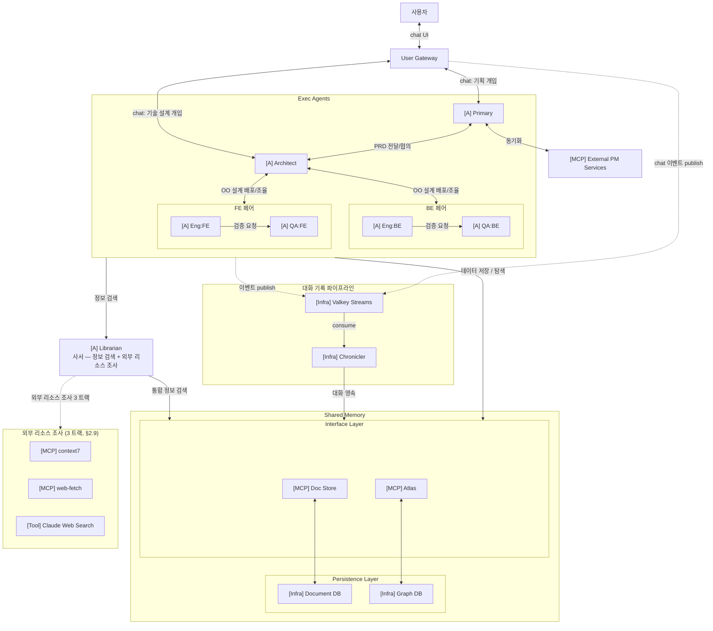

# LangGraph 기반 A2A 멀티 에이전트 협업 시스템

> **문서 버전:** v0.3
> **최초 작성일:** 2026-04-14
> **최종 수정일:** 2026-05-07
> **상태:** 진행 — 주요 설계 확정, 구현 단계 (M3)

본 문서는 시스템의 **큰 컨셉과 전체 흐름** 을 정리한 entry point 다.
세부 디테일은 `docs/proposal/` 하위 sub doc 으로 분할되어 있다 (#66).

## 문서 지도

| 영역 | sub doc |
|---|---|
| User Gateway | [`proposal/architecture-user-gateway.md`](proposal/architecture-user-gateway.md) |
| 단일 에이전트 내부 구조 | [`proposal/architecture-agent-internals.md`](proposal/architecture-agent-internals.md) |
| Role Config 및 MCP 디스커버리 | [`proposal/architecture-role-config.md`](proposal/architecture-role-config.md) |
| Shared Memory 아키텍처 | [`proposal/architecture-shared-memory.md`](proposal/architecture-shared-memory.md) |
| A2A 대화 이벤트 수집 | [`proposal/architecture-event-pipeline.md`](proposal/architecture-event-pipeline.md) |
| 프로젝트 코드베이스 공유 | [`proposal/architecture-codebase-sharing.md`](proposal/architecture-codebase-sharing.md) |
| Code Agent 실행 전략 | [`proposal/architecture-code-agent.md`](proposal/architecture-code-agent.md) |
| 외부 리소스 조사 (3 트랙) | [`proposal/architecture-external-research.md`](proposal/architecture-external-research.md) |
| 에이전트 역할 정의 | [`proposal/agents-roles.md`](proposal/agents-roles.md) |
| 지식 모델링 | [`proposal/knowledge-model.md`](proposal/knowledge-model.md) |
| 협업 프로세스 (단계별 상세) | [`proposal/workflow.md`](proposal/workflow.md) |
| 기술 스택 상세 | [`proposal/tech-stack.md`](proposal/tech-stack.md) |
| 프로젝트 구조 | [`proposal/project-structure.md`](proposal/project-structure.md) |

관련 운영/개발 가이드 (별도 docs):
- [`agent-runtime.md`](agent-runtime.md) — 런타임/빌드 전략
- [`infra-setup.md`](infra-setup.md) — 인프라 셋업
- [`doc-store-schema.md`](doc-store-schema.md) — Doc Store 스키마
- [`sse-connection.md`](sse-connection.md) — SSE 연결 관리

---

## 1. 프로젝트 개요

### 1.1. 목적
**LangGraph** 기반 에이전트들이 **A2A(Agent-to-Agent)** 프로토콜을 통해 고도의 소프트웨어 엔지니어링 태스크를 수행하는 **자율형 협업 환경** 을 구축한다. 각 에이전트는 **LLM API 로 사고** 하고, **PM / Architect / Engineer / QA / Librarian 으로 역할을 나누어 협업** 하며, 코드 작업이 필요한 시점에만 **별도의 코드 실행 도구** 를 활용한다. 협업의 효율은 **Architect 가 인터페이스 중심으로 설계한 의존성 그래프로 작업별 코드 컨텍스트를 정제** 하는 데서 나온다.

### 1.2. 핵심 컨셉
**"분산된 지능, 중앙 집중형 지식 (Distributed Intelligence, Centralized Knowledge)"**

#### Atlas — 컨텍스트 효율을 위한 인터페이스 의존성 그래프

본 시스템의 **핵심은 "Atlas"** — **코드의 모듈 / 인터페이스 / 클래스 / 그들 사이의 의존 관계를 graph 형태로 표현한 지식 자산** 이다.

LLM 기반 개발 에이전트의 가장 큰 약점은 **컨텍스트 길이의 한계** 다. 코드베이스 전체를 입력으로 부으면 토큰이 폭발하고 정확도는 떨어진다. 관련 파일을 단순히 끌어모으는 RAG 방식도 인터페이스 / 의존 관계 같은 계약 정보를 제대로 보존하지 못한다.

**해법** — **인터페이스 중심의 설계** 를 강제하고 (Architect 의 책임), 그 결과 도출되는 OO 의존 관계 (Module/Package · Interface · Class · PublicMethod 사이의 구현 / 의존 / 포함) 를 graph 로 표현한 것이 Atlas. 여기에 **태스크 → 인터페이스 → 클래스 → 파일 경로** 의 추적 관계를 결합하면, 특정 기능 / 변경 태스크에 정말로 필요한 코드 부분만 그래프를 따라가서 선별할 수 있다.

→ Engineer / QA 는 코드 작업 직전에 Atlas 로 **정제된 컨텍스트** (편집 대상 파일 + 의존 인터페이스 시그니처) 만 받아 프롬프트를 조립한다. 코드베이스 탐색은 **Architect 의 통제 하에 선별적으로 허용** 된다. **컨텍스트가 작아지면 LLM 의 정확도가 올라간다 — 이게 본 시스템의 효율 동력.**

자세한 모델링: [knowledge-model](proposal/knowledge-model.md), [code-agent §Context Assembly](proposal/architecture-code-agent.md).

#### 핵심 원칙

- **Primary가 전체 프로젝트를 관리** 하고, **Architect가 객체지향 설계를 통해 전체 개발을 책임** 지며, **Engineer-QA 페어가 Architect의 설계를 직접 구현** 하는 구조
- 각 에이전트는 **독립 컨테이너** 에서 실행 → 상호 간섭 차단, 역할별 최적화
- **LangGraph** 가 에이전트 내부 워크플로우 엔진 + A2A 통신 계층을 담당
- **이중 계층 공유 메모리** — Atlas (코드 의존성) + Doc Store (대화 / 문서 / 기록). 각 에이전트가 자기 도메인 데이터를 직접 영속하며, **Librarian** 은 사서 — 정보 검색 + 외부 리소스 조사 전담
- **사용자는 Primary 와 Architect 양쪽과 직접 소통** 하여 프로젝트 기획 / 기술 설계 양방향으로 개입 가능
- 모든 A2A 통신이 이벤트로 publish → Chronicler 가 수집 → 사용자가 전체 진행 상황을 추적 가능

### 1.3. 기대 효과

| 영역 | 효과 |
|------|------|
| **컨텍스트 효율** | **Atlas 의 인터페이스 의존성 그래프로 작업별 코드 컨텍스트 선별 → LLM 정확도 ↑, 토큰 비용 ↓, 코드베이스 탐색을 Architect 통제 하에 선별 허용** |
| 의사결정 품질 | 관리/설계 분리로 체계적 설계 패턴 적용, 고품질 코드 생산 |
| 문맥 추적 | 태스크-코드 연결 그래프로 변경 이력/의도 완벽 추적 |
| 유지보수 | 인터페이스 중심 설계로 결합도 저하, 설계자 직접 검수로 일관성 유지 |

### 1.4. 에이전트 구성

시스템에는 다음 5 종 에이전트가 협업한다 (자세한 책임 / 페르소나는 [§3 에이전트 역할 정의](proposal/agents-roles.md) 참조):

| 에이전트 | 역할 |
|---|---|
| **Primary** | 프로젝트 매니저 (PM) — 사용자 기획 협의, PRD / 이슈 관리, 외부 PM 도구 동기화, 프로젝트 전체 관리. 사용자와 가장 가까운 에이전트 |
| **Architect** | 시스템 아키텍트 — OO 설계 주도, 설계 결정권 보유, Engineer + QA 페어에 1차 설계 배포 |
| **Engineer** | SW 엔지니어 (역할별 — BE / FE / DevOps / Data 등 specialty) — Architect 의 1차 설계 기반 세부 설계 + 구현 자율 수행 |
| **QA** | 테스트 엔지니어 (Engineer 와 1:1 페어 — `QA:BE` / `QA:FE` 등) — 설계 기반 독립 테스트 코드 작성 + 빌드 / 테스트 실행 |
| **Librarian** | 사서 — DB 정보 검색 (자연어 / 교차 쿼리) + 외부 리소스 조사 (3 트랙) 전담. 다른 에이전트의 호출 대상 |

별도 보조 모듈 — **User Gateway** (사용자 UI ↔ A2A 중계), **Chronicler** (A2A 대화 이벤트 자동 영속) 는 [§2 시스템 아키텍처](#2-시스템-아키텍처) 참조.

---

## 2. 시스템 아키텍처

### 2.1. 전체 구성도

> **두 통신 tier (#75)**: 사용자 ↔ Primary / Architect 의 통신은 **chat protocol** (REST POST + 영속 SSE per session — [architecture-chat-protocol](proposal/architecture-chat-protocol.md)). 에이전트 간 통신은 **A2A** ([messaging.md](../shared/src/dev_team_shared/a2a/messaging.md)). A2A 의 task 위임 어휘를 chat 에 욱여넣는 mismatch 를 피하기 위해 명시 분리. P/A 가 chat 중 합의된 작업을 **Assignment** 로 발급하고 그 실행을 다른 agent 에게 A2A 위임.

**다이어그램 단순화 주석:**

가독성을 위해 그룹 박스로 묶거나 추상 라벨로 표기한 부분이 있습니다. 각 노드의 prefix 는 컴포넌트 종류 — **`[A]`** 에이전트 (LLM 기반), **`[MCP]`** MCP 서버, **`[Infra]`** 비-에이전트 인프라 / 서비스, **`[Tool]`** LLM API native tool.

| 단순화 표기 | 의미 / 실제 |
|----------|-----------|
| `Exec Agents` 박스 | Project Execution Agents — Primary / Architect / BE 페어 / FE 페어 를 묶은 추상. 박스에서 나가는 화살표 (`데이터 저장 / 탐색`, `정보 검색`, `대화 이벤트 publish`) 는 박스 안의 모든 에이전트 각각이 수행. Librarian 도 [Architect] 에이전트지만 사서 역할의 차별성 (다른 에이전트의 호출 대상) 을 살리기 위해 박스 밖 별도 노드로 표시 |
| `PairBE` / `PairFE` 페어 단위 화살표 | 실제로는 각 페어 안의 Engineer·QA 가 개별로 연결 (데이터 저장 / 정보 검색 / publish 모두 Engineer·QA 각각 수행) |
| `Shared Memory` 의 Interface / Persistence Layer 분리 | 외부에서 들어오는 화살표는 모두 **Interface Layer (MCP) 로만** — Persistence (DB) 는 MCP 가 내부적으로만 접근. 추상화 layer 강제 |
| `데이터 저장 / 탐색` (Exec Agents → Interface Layer) | 박스 단위 화살표 1 개로 그렸지만 실제로는 박스 안 에이전트마다 호출 대상 MCP 가 다름: · **Primary** → Doc Store (PRD / 이슈 / wiki) · **Architect** → Doc Store (ADR / wiki) + Atlas (OO 구조) · **Engineer / QA** → Doc Store (작업 산출물) + Atlas (코드 색인 / 테스트 매핑) 모두 자기 도메인 데이터를 **직접 write 또는 단순 read** (Librarian 경유 X). 자세한 권한 매트릭스는 [shared-memory](proposal/architecture-shared-memory.md) 참조 |
| `정보 검색` (Exec Agents → Librarian) | DB 정보 검색 + 외부 리소스 조사 모두 포함하는 자연어 위임. Librarian 이 LLM 추론으로 적절한 도구 / 트랙 선택 |
| `통합 정보 검색` (Librarian → Interface Layer) | Librarian 이 Doc Store + Atlas 양쪽 교차 쿼리 (LLM ReAct) |
| `외부 리소스 조사 3 트랙` | context7 / web-fetch / Claude Web Search. Librarian 단독 전담 (디테일 [external-research](proposal/architecture-external-research.md)) |
| `대화 이벤트 publish` (점선) | fire-and-forget. Exec Agents 박스 + UG → Broker (별도 화살표 2 줄). Chronicler 가 consume + Doc Store 직접 영속 (Librarian 경유 X). XREADGROUP / XACK 디테일 [event-pipeline](proposal/architecture-event-pipeline.md) |

**표현되지 않은 관계 (의도적 생략):**
- Engineer ↔ Engineer 직접 통신 X (Architect 가 다자간 논의 소집 시에만 Architect 주관)
- Architect 가 페어 내 Engineer / QA 에 동시 배포 (페어 단위 화살표 안에 포함)

### 2.2. User Gateway → [user-gateway](proposal/architecture-user-gateway.md)

사용자 ↔ Primary / Architect 중계 계층. **chat protocol** (REST POST + 영속 SSE per session) 으로 사용자 발화를 받아 session 의 `agent_endpoint` 보고 P/A 의 internal chat endpoint 로 forward, 응답 chunk 를 영속 SSE 채널로 FE 에 push. 자세한 spec 은 [architecture-chat-protocol](proposal/architecture-chat-protocol.md).

### 2.3. 단일 에이전트 내부 구조 → [agent-internals](proposal/architecture-agent-internals.md)

LangGraph 베이스 + LLM Adapter + Code Agent Adapter + MCP 클라이언트 (Shared Memory / External PM / 외부 리서치) + A2A 서버/클라이언트 구조. Role Config 로 페르소나 / 워크플로우 확장 / 활성 클라이언트 결정.

### 2.4. Role Config 및 MCP 디스커버리 → [role-config](proposal/architecture-role-config.md)

이미지 baked-in **Base Config** + 선택적 마운트 **Override Config** deep merge. `persona` / `workflow` / `role` / `specialty` 는 override 금지. API Key 는 override 에서 `${ENV_VAR}` 참조로 주입. 5 종 (Primary / Architect / Librarian / Engineer:BE / QA:BE) yaml 예시는 sub doc 참조.

### 2.5. Shared Memory 아키텍처 → [shared-memory](proposal/architecture-shared-memory.md)

이중 계층 — Atlas (Semantic / Neo4j) + Doc Store (Episodic / PostgreSQL). **분담 모델 (정정 — 2026-05)**: write = 각 에이전트 직접 / 단순 read = 직접 / 정보 검색 = Librarian 통과 / 외부 리소스 조사 = Librarian 단독.

### 2.6. 대화 이벤트 수집 → [event-pipeline](proposal/architecture-event-pipeline.md)

UG 의 chat 통신 + 에이전트 간 A2A 통신 양쪽의 lifecycle 이벤트가 Valkey Streams 에 publish (fire-and-forget). 경량 Consumer **Chronicler** 가 XREADGROUP / XACK 으로 구독 → Doc Store MCP 로 영속화. 3 layer (chat / assignment / A2A) 별 processor 분리. CHR 은 LLM/LangGraph 미사용의 인프라 모듈.

### 2.6.1. Chat Protocol → [chat-protocol](proposal/architecture-chat-protocol.md)

UG ↔ P/A 의 별 chat 프로토콜 (REST POST + 영속 SSE per session). A2A 와 분리 (#75) — A2A 의 task 위임 어휘를 chat 에 욱여넣는 mismatch 회피. Session / Chat / Assignment 어휘로 chat tier 표현.

### 2.7. 프로젝트 코드베이스 공유 → [codebase-sharing](proposal/architecture-codebase-sharing.md)

호스트 프로젝트 디렉토리를 전 에이전트 컨테이너에 `/workspace` 로 bind mount. 역할별 `workspace.write_scope` (allow list) 로 쓰기 범위 강제, 위반 시 git diff 검증 + 롤백.

### 2.8. Code Agent 실행 전략 (OpenCode CLI) → [code-agent](proposal/architecture-code-agent.md)

OpenCode CLI 를 Python subprocess (non-interactive) 로 기동, one-shot 호출. Engineer/QA 는 `permission` 으로 `read/grep/glob = deny` — 전체 코드베이스 스캔 차단, Atlas 정제 컨텍스트만 사용.

### 2.9. 외부 리소스 조사 (3 트랙) → [external-research](proposal/architecture-external-research.md)

Librarian 전담 — context7 (라이브러리 docs), mcp/web-fetch (사용자 URL Playwright), Claude Web Search (Claude API native). 다른 에이전트는 A2A 자연어로 Librarian 에 위임.

### 2.10. 인프라 컴포넌트 카탈로그

| 컴포넌트 | 기술 | 역할 |
|----------|------|------|
| 워크플로우 엔진 | LangGraph | 에이전트 내부 상태 머신 (StateGraph / 노드 / 체크포인트) |
| A2A 서버 | 자체 FastAPI 라우트 (`/a2a/{role}`) | A2A v1.0 엔드포인트 호스팅 (JSON-RPC 2.0, SSE) — **에이전트 간 한정** |
| Chat 서버 (P / A 만) | 자체 FastAPI 라우트 (`/chat/send` + `/chat/stream`) | 사용자 ↔ P/A chat protocol 엔드포인트 (REST POST + 영속 SSE — [architecture-chat-protocol](proposal/architecture-chat-protocol.md)) |
| User Gateway | FastAPI 중계 서비스 (별 컨테이너) | 사용자 UI ↔ P/A chat 중계 (REST POST + 영속 SSE per session) |
| 코드 실행 도구 | 추상화 인터페이스 (기본: OpenCode CLI) | 코드 조작 실행 엔진, 추후 교체 가능 |
| 추론 엔진 | LLM API (역할·서브 에이전트별 선택) | 모든 에이전트의 판단/검증 |
| Runtime | Docker (1 Agent = 1 Container) | 격리된 실행 환경 |
| **코드베이스 공유** | **Docker 볼륨 마운트** | **호스트 프로젝트 디렉토리를 전 에이전트에 bind mount** |
| Atlas | 추상화 인터페이스 (기본: Neo4j) | OO 구조 (Semantic Layer), 추후 교체 가능 |
| Doc Store | 추상화 인터페이스 (기본: PostgreSQL — 정형 RDB 스키마, 일부 필드 JSONB) | 기록/대화/문서 (Episodic Layer), 추후 교체 가능. ※ Postgres 를 선택한 맥락은 [tech-stack §6.5](proposal/tech-stack.md) 참조 |
| Shared Memory 접근 | MCP Server (공유, asyncpg pool 기반) | 전 에이전트 자기 도메인 직접 write / read + Chronicler 대화 자동 영속 (분담 모델 — [architecture-shared-memory](proposal/architecture-shared-memory.md)) |
| 도구 연동 | MCP (Model Context Protocol) | 역할별 외부 도구 연동 |
| 외부 PM 도구 | 추상화 인터페이스 (기본: GitHub Wiki/Issue) | PRD/태스크 동기화, 추후 Jira/Confluence 등 지원 |
| 외부 리소스 조사 | context7 (외부 MCP) + 자체 mcp/web-fetch (Playwright) + Claude Web Search (LLM API native tool) | 3 트랙 — 라이브러리 docs / 사용자 URL / 일반 web search. Librarian 단독 전담 ([architecture-external-research](proposal/architecture-external-research.md)) |
| **Message Broker** | **Valkey Streams** | **A2A 대화 이벤트 publish용 (단순 구성 유지, 추상화 불필요)** |
| **Chronicler** | **경량 Python Consumer (에이전트 아님)** | **Valkey Streams 구독 → Doc Store 영속화** |

---

## 3. 에이전트 역할 정의 → [agents-roles](proposal/agents-roles.md)

### 3.1. 역할 매트릭스

| 에이전트 | 핵심 역할 | 페르소나 | 주요 상호작용 (chat / A2A) |
|----------|-----------|----------|--------------|
| **Primary** | 사용자와 기획 협의, Assignment 발급, PRD 작성, 외부 PM 도구 동기화, 프로젝트 전체 관리 | PM | **chat**: 사용자. **A2A**: Architect / Librarian / Engineer / QA / 외부 MCP |
| **Architect** | 사용자와 기술 설계 협의, OO 설계 주도, 설계 결정권 보유, ADR / Atlas 직접 write | 시스템 아키텍트 | **chat**: 사용자. **A2A**: Primary / Librarian / Engineer + QA 페어 |
| **Librarian** | DB 정보 검색 (자연어 / 교차 쿼리) + 외부 리소스 조사 (3 트랙) 전담 | 사서 | **A2A 만**: 전 에이전트 |
| **Engineer:{specialty}** | Architect의 1차 설계 기반 세부 설계·구현 자율 수행, 구현 산출물 Atlas / Doc Store 직접 write | 역할별 SW 엔지니어 | **A2A 만**: Architect / 페어 QA / Librarian / 유관 Engineer |
| **QA:{specialty}** | Architect의 설계 수신 → 독립적 테스트 코드 작성, 빌드/테스트 실행, 검증 산출물 직접 write | 역할별 테스트 엔지니어 | **A2A 만**: Architect / 페어 Engineer / Librarian |

> **에이전트가 아닌 보조 모듈:**
> **Chronicler** — Valkey Streams를 구독하여 A2A 대화 이벤트를 Doc Store에 영속화하는 경량 Consumer. LLM, LangGraph, Role Config를 사용하지 않는 단순 Python 스크립트 수준의 모듈. 에이전트 역할 정의에서 다루지 않으며, 인프라로 취급. ([event-pipeline](proposal/architecture-event-pipeline.md) 참조)

상세 (각 에이전트별 책임, Architect 의 3-서브 에이전트 루프, Engineer+QA 페어 구조) → [agents-roles](proposal/agents-roles.md).

---

## 4. 지식 모델링 → [knowledge-model](proposal/knowledge-model.md)

이중 계층 — **Atlas (Semantic Layer, Neo4j)** 가 OO 구조 (Interface / Class / PublicMethod 노드 + IMPLEMENTS / DEPENDS_ON / BELONGS_TO 관계) + Assignment-코드 추적성 (Assignment / Feature / BugReport) 모델, **Doc Store (Episodic Layer, PostgreSQL)** 가 기록/대화/문서 영속.

Doc Store 컬렉션은 두 통신 tier 분리 (#75) 에 따라 정리:
- **Chat tier** — sessions, chats, assignments (UG↔P/A 영역)
- **A2A tier** — a2a_contexts, a2a_messages, a2a_tasks, a2a_task_status_updates, a2a_task_artifacts (에이전트 간)
- **도메인 산출물** — wiki_pages, issues, technical_notes, design_decisions, prds

상세 모델링 → [knowledge-model](proposal/knowledge-model.md).

---

## 5. 협업 프로세스 → [workflow](proposal/workflow.md)

### 5.1. 전체 프로세스 개요

| 단계 | 명칭 | 참여 에이전트 | 핵심 활동 |
|------|------|-------------|-----------|
| 1단계 | 기획 구체화 | 사용자, Primary | 사용자-Primary chat 대화, PRD 작성, **Assignment 발급**, Primary 가 Doc Store 직접 write + 외부 PM 동기화 |
| 2단계 | OO 설계 | Primary, Architect, 사용자, (필요 시 Librarian) | Architect의 서브 에이전트 루프, 사용자 기술 chat 개입 수용, OO 1차 설계 확정 |
| 3단계 | 병렬 구현·검증 | Architect, Engineer+QA 페어들, (필요 시 Librarian) | Engineer 자체 루프 + QA 독립 테스트. 산출물 직접 write. 자기 변경 코드는 Engineer 자체 색인 (Atlas 직접 write) |
| 4단계 | 검수/종료 | Architect, Primary | Architect 검수 → Primary 결과 chat 으로 사용자 보고 |

**인간 개입 지점:** 사용자는 단계와 무관하게 언제든 Primary (기획) 또는 Architect (기술) 에게 chat 으로 메시지를 보낼 수 있다. 개입은 chat tier 의 Session / Chat 으로 기록되고, 합의된 작업은 Assignment 로 발급되어 A2A tier 로 위임된다.

단계별 상세 (1단계~4단계) → [workflow](proposal/workflow.md).

---

## 6. 기술 스택 상세 → [tech-stack](proposal/tech-stack.md)

컨테이너 구성 (Dockerfile / docker-compose), A2A 통신 (A2A Protocol v1.0 의 메시지/태스크 모델, JSON-RPC 2.0 바인딩, AgentCard 스펙), MCP 연동 (공유 / 역할별 분리), 추상화 레이어 (OCP — CodeAgent / Atlas / Doc Store / External PM Tool / LLM Provider 인터페이스).

상세 → [tech-stack](proposal/tech-stack.md).

---

## 7. 프로젝트 구조 → [project-structure](proposal/project-structure.md)

`agents/` (Primary / Architect / Librarian / Engineer / QA), `mcp/` (공유 MCP 서버), `shared/` (공통 코드: A2A / adapters / config), `infra/` (docker-compose, init scripts) 디렉터리 레이아웃 + monorepo 운영 규약.

상세 → [project-structure](proposal/project-structure.md).

---

## 8. 미결정 사항 / 다음 단계

본 시스템은 M2 ~ M3 단계 (Primary 구현 + Librarian 도입) 까지 진행됨. 아래는 이후 마일스톤 (M4+ Architect / M5+ Engineer · QA) 에서 풀어가야 할 추가 설계 / 구현 항목.

### 추가 논의 / 결정 필요

- **Atlas 스키마 확정** (M4+) — OO 구조 노드 / 관계 타입 상세 정의. Architect 도입 시점에 첫 사용 케이스 따라 확정
- **설계안 선택 UX** — Architect 가 복수 설계안 제시할 때의 포맷 / 사용자 선택 인터페이스 (multi_proposal extension)
- **볼륨 마운트 권한 제어** — `workspace.write_scope` 강제 방법 (OS 레벨 vs 에이전트 레벨 git diff 검증). 현재는 후자 (Python 래퍼) 만 채택 — 1 차 방어 추가 필요 시 검토
- **External PM 어댑터** — GitHub Wiki / Issue 동기화 시점 / 충돌 해결 전략 (M3 [#36](https://github.com/vonkernel/dev-team/issues/36) / [#37](https://github.com/vonkernel/dev-team/issues/37) 진행 중)
- **인증 / 보안** — A2A 통신 보안 / 시크릿 관리 / 외부 API 키 운영. 현재는 내부망 + `.env` 만 — 외부 노출 / 멀티 테넌시 시점에 본격 검토

### 향후 검토

- **Agent Card 서명** — 현재 미서명. 외부 에이전트가 동적으로 합류하는 시나리오가 생기면 위변조 방지 목적으로 도입 검토
- **A2A Push Notifications** — 현재는 `GetTask` 폴링 + `SendStreamingMessage` SSE 로 충분. 비동기 완료 통보가 과도한 폴링 부담 유발 시 재검토
- **Python 3.14 상향** — LangGraph 가 3.14 classifier 포함 시 검토 (2026-04 기준 3.13 까지만 지원)

### 남은 PoC

- **Architect 서브 에이전트 루프 PoC** (M4+) — 메인 설계 → 검증 → 최종 컨펌 그래프 + 모델 분리
- **Engineer 자체 Atlas 색인 PoC** (M5+) — 자기 변경 diff 분석 → Atlas MCP 직접 write
- **볼륨 마운트 + 설계안 md 저장 PoC** (M4+) — Architect 채택 설계 코드베이스 기록, 에이전트 간 코드 공유
- **Engineer-QA 페어 병렬 구현·검증 PoC** (M5+) — 1 페어로 Architect → (Engineer, QA) 동시 설계 전달 후 병렬 작업
- **Context Assembly + OpenCode 제어 PoC** (M5+) — Engineer / QA 가 Atlas 직접 read, 프롬프트 조립, OpenCode `permission=deny` 검증, git diff 화이트리스트
