# OpenCode 기반 A2A 멀티 에이전트 협업 시스템 - 기획서 초안

> **문서 버전:** v0.1 (Draft)  
> **작성일:** 2026-04-14  
> **상태:** 초안 검토 대기

---

## 1. 프로젝트 개요

### 1.1. 목적
**LangGraph** 기반 에이전트들이 **A2A(Agent-to-Agent)** 프로토콜을 통해 고도의 소프트웨어 엔지니어링 과업을 수행하는 **자율형 협업 환경**을 구축한다. 각 에이전트는 LLM API로 사고하고, 코드 작업이 필요한 시점에만 **OpenCode CLI**를 도구로 활용한다.

### 1.2. 핵심 컨셉
**"분산된 지능, 중앙 집중형 지식 (Distributed Intelligence, Centralized Knowledge)"**

- **P가 전체 프로젝트를 관리**하고, **A가 객체지향 설계를 통해 전체 개발을 책임**지며, **Eng-QA 페어가 A의 설계를 직접 구현**하는 구조
- 각 에이전트는 독립 컨테이너에서 실행 → 상호 간섭 차단, 역할별 최적화
- **LangGraph**가 에이전트 내부 워크플로우 엔진 + A2A 통신 계층을 담당
- **코드 실행 도구**는 추상화 인터페이스를 통해 교체 가능 (기본 구현: OpenCode CLI)
- 이중 계층 공유 메모리(Graph DB + Document DB)를 **Librarian**이 관리하여 팀의 메모리/컨텍스트로 활용
- **사용자는 P와 A 양쪽과 직접 소통**하여 프로젝트 기획/기술 설계 양방향으로 개입 가능
- 모든 A2A 통신이 이벤트로 publish → Librarian이 수집 → 사용자가 전체 진행 상황을 추적 가능

### 1.3. 기대 효과

| 영역 | 효과 |
|------|------|
| 의사결정 품질 | 관리/설계 분리로 체계적 설계 패턴 적용, 고품질 코드 생산 |
| 문맥 추적 | 과업-코드 연결 그래프로 변경 이력/의도 완벽 추적 |
| 유지보수 | 인터페이스 중심 설계로 결합도 저하, 설계자 직접 검수로 일관성 유지 |

---

## 2. 시스템 아키텍처

### 2.1. 전체 구성도

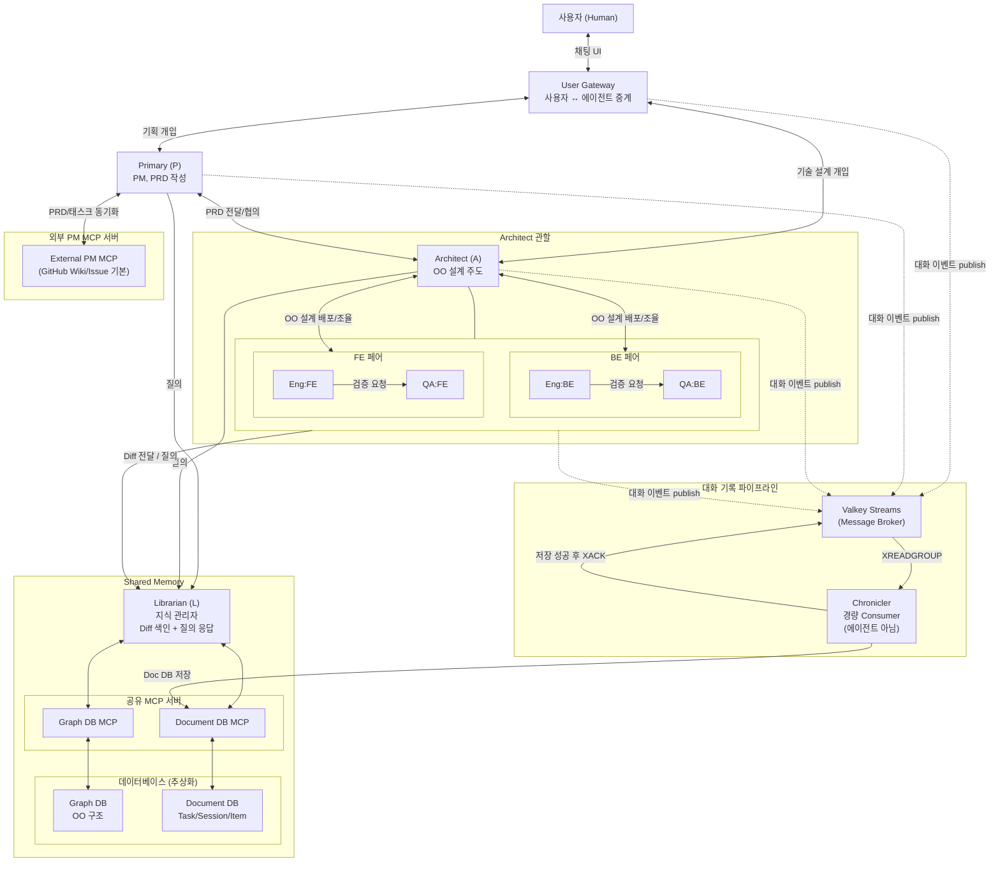

**다이어그램 단순화 주석:**

가독성을 위해 Pairs 서브그래프를 단위로 묶어 그린 엣지가 있습니다. 실제로는 각 페어 내부의 Eng/QA 개별 에이전트가 연결됩니다.

| 다이어그램 표기 | 실제 연결 |
|----------------|----------|
| `A <--> Pairs` (과제 배분/검수) | A ↔ 각 페어의 Eng, QA 각각과 연결 (배분은 Eng/QA 동시 수신) |
| `Pairs --> L` (Diff 전달 / 질의) | Eng: Diff 전달 + 질의, QA: 질의만 (QA는 Diff 없음) |
| `Pairs -.-> Broker` (대화 이벤트 publish) | 각 페어의 Eng, QA 각각이 개별적으로 publish |

**표현되지 않은 관계 (의도적 생략):**
- Eng ↔ Eng 연결은 A가 다자간 논의 소집 시에만 A 주관 하에 이루어짐 (정기 연결 아님)

### 2.2. User Gateway

사용자는 에이전트에 직접 접속하지 않고 **User Gateway**를 통해 소통한다. User Gateway는 사용자 측 UI(웹/CLI/채팅)와 내부 A2A 네트워크를 연결하는 **중계 계층**이다.

**역할:**
- 사용자 채팅 입력을 A2A `message/send` 또는 `message/stream` 으로 변환하여 P 또는 A 에게 전달
- **SSE streaming** 활용 — 에이전트 응답(LLM 토큰, 중간 상태)을 실시간 UI 로 렌더링
- P/A 가 사용자에게 전달할 메시지를 수신하여 UI 로 렌더링
- 긴 작업은 `Task` 객체로 반환받아 `tasks/get` 으로 상태 추적 (`INPUT_REQUIRED` 상태면 사용자 입력 유도 UI 표시)
- 사용자 인증/세션 관리
- 사용자 개입 이벤트도 일반 A2A 이벤트와 동일하게 Valkey Streams 로 publish → Chronicler 가 Document DB 에 기록

**라우팅 규칙:**
- 기획 관련 대화 (요구사항, PRD, 일정 등) → P로 전달
- 기술 관련 대화 (설계, 기술 선택, 구현 조율) → A로 전달
- 사용자가 명시적으로 대상을 지정하면 그쪽으로 전달
- 사용자의 초기 요청은 기본적으로 P로 전달

### 2.3. 단일 에이전트 내부 구조

모든 에이전트는 **"LLM API로 사고하고, 필요할 때만 OpenCode CLI로 행동한다"**는 원칙을 따른다.

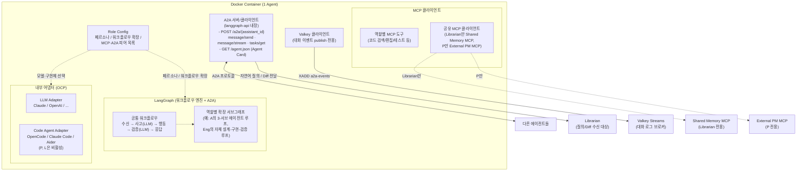

**다이어그램 요지:**
- 각 에이전트는 **모듈별 독립 이미지**로 빌드되지만, **공통 코드는 `shared/` 패키지에서 import**하여 LangGraph 베이스, A2A, MCP 클라이언트 등의 중복을 피한다
- Role Config에 따라 페르소나, 워크플로우 확장, 사용 도구, A2A 피어가 결정된다
- 공통: LangGraph 베이스 워크플로우, LLM 어댑터, A2A 서버/클라이언트, 역할별 MCP 도구
- 역할에 따라 달라짐:
    - **Code Agent Adapter**: P, Librarian은 비활성 / 그 외는 활성
    - **Shared Memory MCP 클라이언트**: Librarian만 활성
    - **External PM MCP 클라이언트**: P만 활성
    - **워크플로우 확장**: A의 3-서브 에이전트 루프, Eng의 자체 루프 등 역할별 서브그래프

#### 에이전트 유형별 구성

| 에이전트 | 두뇌 (판단) | 손 (실행) | 비고 |
|----------|-----------|----------|------|
| P | LLM API | 없음 | 판단/소통만 수행 |
| A | LLM API | OpenCode CLI | 리뷰/검수 시 코드 조작 |
| L | LLM API | 없음 | 지식 해석/그래프 관리 (MCP 경유 DB 접근) |
| Eng:* | LLM API | OpenCode CLI | 코드 구현 |
| QA:* | LLM API | OpenCode CLI | 테스트 작성/실행 |

- **P만 예외적으로 OpenCode CLI 없이 동작** — 코드를 직접 다루지 않으므로
- 판단/검증 노드는 가벼운 LLM API, 실행 노드만 OpenCode CLI 호출
- LangGraph가 내부 상태 머신을 관리하여 단순 1회 응답이 아닌 단계적 과업 수행

### 2.4. Role Config 및 MCP 디스커버리

각 에이전트는 **모듈별 독립 Docker 이미지**로 빌드되지만, 공통 코드(LangGraph 베이스, A2A, MCP 클라이언트, Adapters 등)는 `shared/` 패키지에서 import하여 중복을 최소화한다. 기동 시 **Base Config**(이미지에 baked-in)와 **Override Config**(선택적 마운트)를 병합하여 페르소나, MCP 서버, A2A 피어/허용 클라이언트, 워크플로우 확장 등을 결정한다.

Engineer, QA처럼 specialty만 달라지는 모듈은 하나의 이미지에 여러 base config를 포함하고 `CONFIG_PROFILE` 환경변수로 선택한다 (`agents/engineer/configs/{be,fe}.yaml`).

#### Config 로드 순서 (Base + Override 병합)

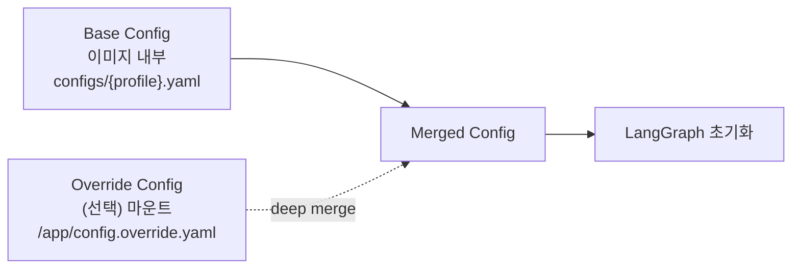

**오버라이드 허용 범위:**

| 필드 | Override 허용 | 이유 |
|------|:----------:|------|
| `llm.model`, `llm.temperature`, `llm.sub_agents.*.model` | **O** | 비용/성능 튜닝은 운영 결정 |
| `mcp_servers[].url` | **O** | 호스팅 환경에 따라 변경 |
| `a2a_peers[].url`, `allowed_clients` | **O** | 배포 토폴로지 변경 |
| `workspace.write_scope`, `workspace.read_only` | **O** | 프로젝트별 파일 구조 대응 |
| `code_agent.type` | **O** | OpenCode ↔ Claude Code CLI 실험 |
| `persona` | **X** | 역할 정체성은 코드와 함께 변경 |
| `workflow.base`, `workflow.extensions` | **X** | 서브그래프 식별자는 코드에 대응 |
| `role`, `specialty` | **X** | 모듈 정체성 고정 |

로더는 병합 시 허용되지 않은 필드의 override가 들어오면 경고 로그와 함께 무시한다.

**Override Config 예시 (1) — 모델 다운그레이드:**

```yaml
# overrides/architect.yaml — dev 환경에서 비용 절감을 위해 모델 다운그레이드
llm:
  sub_agents:
    main_design:
      model: "claude-sonnet-4-6"   # 기본값 claude-opus-4-7 → 변경
    verification:
      model: "claude-sonnet-4-6"
```

이 파일만 마운트하면 나머지 필드는 base config의 값을 그대로 사용한다.

#### LLM 추상화와 API Key 관리

코드 레벨에서는 **LangChain의 `BaseChatModel` 인터페이스**를 사용하며, config에서 `provider`와 `model`을 지정하면 `shared/adapters/llm/` 팩토리가 해당 구현체(`ChatAnthropic`, `ChatOpenAI` 등)를 생성한다.

**API Key는 override config에서 env var 참조로 주입한다:**

```yaml
# overrides/architect.yaml
llm:
  provider: anthropic         # anthropic | openai | google | local
  sub_agents:
    main_design:
      model: "claude-opus-4-7"
      api_key: ${ANTHROPIC_API_KEY}
    verification:
      model: "claude-opus-4-7"
      api_key: ${ANTHROPIC_API_KEY}
    final_confirm:
      model: "claude-sonnet-4-6"
      api_key: ${ANTHROPIC_API_KEY}
```

**보안 원칙:**
- **평문 API key를 yaml에 쓰지 않는다** — 반드시 `${ENV_VAR}` 형태로 참조
- 실제 key는 `.env` 파일 또는 시크릿 매니저에서 docker-compose의 `environment`로 주입
- Override yaml 자체는 시크릿을 포함하지 않으므로 안전하게 git 커밋 가능
- Config 로더가 로드 시 `${...}` 패턴을 env에서 치환

**필수 Override 항목:**
- **`llm.api_key` (또는 서브 에이전트별 `api_key`)** — base config에는 값이 비어 있고 override로 반드시 제공해야 함
- 로더는 기동 시 api_key 누락을 감지하면 즉시 에러로 실패시킴

#### Role Config 공통 스키마

| 필드 | 의미 | 비고 |
|------|------|------|
| `role` | 에이전트 유형 (primary/architect/librarian/engineer/qa) | 필수 |
| `specialty` | Eng/QA의 세부 역할 (backend/frontend/devops/...) | Eng/QA만 |
| `persona` | 시스템 프롬프트로 주입되는 역할 정의 | 필수 |
| `llm` | `provider`, `model`, `temperature`, `api_key` (LangChain `BaseChatModel`). A는 `sub_agents.*`로 분리 지정 | 필수. `api_key`는 override에서 env var 참조로 주입 |
| `code_agent` | `type`(어댑터 구현체 선택) + `opencode.permissions` (read/grep/glob/edit/write/bash = allow·ask·deny) + `opencode.timeout_seconds` | P, L은 생략. 섹션 2.8 참조 |
| `workspace` | 볼륨 마운트된 코드베이스 경로 + 읽기/쓰기 범위 | 코드 다루는 에이전트만 |
| `mcp_servers` | 연결할 MCP 서버 목록 (공유 + 로컬) | 필수 |
| `a2a_peers` | **클라이언트 측 설정** — 내가 먼저 호출(initiate)할 피어의 URL 목록 | 필수 (Librarian 제외) |
| `allowed_clients` | **서버 측 설정** — 내 A2A 서버로의 호출을 허용할 주체 목록 | 필수 |
| `workflow` | LangGraph 서브그래프 선택 — `base`는 공통 그래프, `extensions`는 역할별 서브그래프 모듈 식별자 목록 (`agent/src/graph/extensions/` 아래 코드와 대응) | 필수 |

#### 역할별 Role Config 예시

##### Primary (`configs/primary.yaml`)

```yaml
role: primary

persona: |
  당신은 프로젝트 매니저(PM)입니다.
  사용자와 기획을 논의하여 PRD를 작성·관리하고,
  Architect에게 기술 설계를 의뢰하며, 외부 PM 도구와 동기화합니다.
  외부 PM의 단독 창구이며, 다른 에이전트의 외부 상태 업데이트 요청을 대리 수행합니다.

llm:
  provider: anthropic
  model: "claude-sonnet-4-6"
  temperature: 0.3
  api_key: ""                # override에서 반드시 주입

# P는 코드 작업 없음 → code_agent 비활성
# P는 코드베이스 마운트 불필요 → workspace 없음

mcp_servers:
  - name: external-pm
    url: "http://external-pm-mcp:8080"
    type: shared
    description: "외부 PM 도구 (GitHub Wiki/Issue)"

# 클라이언트 측 — P가 먼저 호출할 피어
a2a_peers:
  - { name: user-gateway, url: "http://user-gateway:9000" }   # 사용자 푸시
  - { name: architect,    url: "http://architect:9000" }      # 설계 요청
  - { name: librarian,    url: "http://librarian:9000" }      # 질의

# 서버 측 — P의 서버로 들어오는 호출을 허용할 주체
allowed_clients:
  - user-gateway   # 사용자 기획 개입 전달
  - architect      # 설계 진행 보고

workflow:
  base: default
  extensions:
    - user_chat          # 사용자 상시 채팅 수용
    - prd_authoring      # PRD 작성/관리
    - external_pm_sync   # 외부 PM 도구 동기화
```

##### Architect (`configs/architect.yaml`)

```yaml
role: architect

persona: |
  당신은 시스템 아키텍트입니다.
  객체지향 관점의 1차 설계를 주도하며, 설계 결정권을 보유합니다.
  복수 설계안을 도출하여 사용자 선택을 받고, Eng+QA 페어에 동시 배포합니다.
  상위 설계 수정 시 유관 Eng을 소집하여 다자간 논의를 주관합니다.

# A는 내부에 3개의 서브 에이전트를 두며 각각 다른 모델을 쓸 수 있음
llm:
  provider: anthropic
  sub_agents:
    main_design:
      model: "claude-opus-4-7"
      temperature: 0.4
      api_key: ""              # override에서 주입
    verification:
      model: "claude-opus-4-7"
      temperature: 0.1
      api_key: ""
    final_confirm:
      model: "claude-sonnet-4-6"
      temperature: 0.2
      api_key: ""

code_agent:
  type: opencode_cli     # 코드 리뷰/검수 시 코드 읽기·검색에 사용
  opencode:
    permissions:         # A는 광범위 읽기 허용, 편집 금지
      read:  "allow"
      grep:  "allow"
      glob:  "allow"
      edit:  "deny"      # 설계 문서 쓰기는 Python 래퍼가 별도 처리
      write: "deny"
      bash:  "deny"
    timeout_seconds: 900

workspace:
  path: /workspace
  write_scope:
    - "docs/design/**"   # 채택 설계 문서만 쓰기 가능
  read_only:
    - "src/**"
    - "lib/**"
    - "tests/**"

# code_agent(OpenCode CLI)가 코드 읽기/검색 기능을 이미 제공하므로
# 별도 로컬 MCP는 기본적으로 불필요. 특수 도구가 필요하면 여기에 추가.
mcp_servers: []

# 클라이언트 측 — A가 먼저 호출할 피어
a2a_peers:
  - { name: user-gateway, url: "http://user-gateway:9000" }   # 설계안 제시/사용자 푸시
  - { name: primary,      url: "http://primary:9000" }        # 설계 보고
  - { name: librarian,    url: "http://librarian:9000" }      # 질의
  - { name: eng-be,       url: "http://eng-be:9000" }         # 과제 배분
  - { name: qa-be,        url: "http://qa-be:9000" }          # 설계 배포
  - { name: eng-fe,       url: "http://eng-fe:9000" }
  - { name: qa-fe,        url: "http://qa-fe:9000" }

# 서버 측 — A의 서버로 들어오는 호출을 허용할 주체
allowed_clients:
  - user-gateway   # 사용자 기술 개입
  - primary        # 설계 의뢰
  - eng-be         # 설계 수정 건의, 완료 보고
  - qa-be          # 테스트 결과 보고
  - eng-fe
  - qa-fe

workflow:
  base: default
  extensions:
    - user_chat              # 사용자 상시 기술 개입 수용
    - three_stage_design     # 메인 설계 → 검증 → 최종 컨펌 루프
    - multi_proposal         # 복수 설계안 생성
    - design_adoption        # 채택안 md 저장 + 미채택안 Doc DB 저장
    - multi_party_mediation  # 다자간 논의 소집
    - diff_review            # Eng diff 기반 검수
```

##### Librarian (`configs/librarian.yaml`)

```yaml
role: librarian

persona: |
  당신은 팀의 지식 관리자(사서)입니다.

  [Diff 색인]
  Engineer가 전달한 diff(변경 파일 목록 + 파일별 변경 내역 + 기술 노트)를 분석하여
  Graph DB에 객체지향 구조 — Interface, Class, PublicMethod(공개 메소드 시그니처) 노드와
  IMPLEMENTS / DEPENDS_ON / BELONGS_TO / CONTAINS 등의 관계 — 로 색인합니다.
  내부 구현(private/protected, 메소드 본문)은 그래프에 포함하지 않습니다.
  동시에 Task-Interface / Task-Method 연결을 갱신하여 과업-코드 추적성을 유지합니다.

  [기술 문서화]
  diff에 포함된 기술 노트(설계 결정, 구현 특이점, 주의사항, TODO, 주요 아이디어)를
  분류하여 Document DB의 technical_notes 컬렉션에 task_id와 함께 저장합니다.

  [질의 응답]
  다른 에이전트의 자연어 질의에 대해 Graph DB + Document DB 교차 조회로 정확한
  답변을 구성하여 반환합니다. (`by_task`, `by_session`, `thread` 등 조회 API 제공)

  [책임 아닌 것]
  A2A 대화 로그 수집은 별도 모듈(Chronicler)의 책임이며, Librarian은 관여하지 않습니다.
  단, 질의 응답 시 Chronicler가 저장한 Document DB의 대화 기록을 조회하여 활용합니다.

llm:
  provider: anthropic
  model: "claude-sonnet-4-6"
  temperature: 0.1      # 구조적 해석이므로 낮은 temperature
  api_key: ""           # override에서 주입

# L은 코드 직접 수정 없음 → code_agent 비활성
# L은 코드베이스 마운트 불필요 → workspace 없음

mcp_servers:
  - name: graph-db
    url: "http://graph-db-mcp:8080"
    type: shared
    description: "OO 구조 그래프 (읽기/쓰기)"
  - name: doc-db
    url: "http://doc-db-mcp:8080"
    type: shared
    description: "문서/대화 (읽기/쓰기)"

# Librarian은 순수 Server — 먼저 호출하는 대상이 없음
a2a_peers: []

# 서버 측 — L의 서버로 들어오는 호출을 허용할 주체 (전 에이전트)
allowed_clients:
  - primary
  - architect
  - eng-be
  - qa-be
  - eng-fe
  - qa-fe

workflow:
  base: default
  extensions:
    - diff_indexing          # Eng diff → Graph/Doc DB 색인
    - nl_query_answering     # 자연어 질의 응답 (대화 이력 포함 교차 조회)
```

##### Engineer:BE (`configs/eng-be.yaml`)

```yaml
role: engineer
specialty: backend

persona: |
  당신은 Backend 개발자입니다.
  API 설계, 서버 로직, DB 스키마, 인증/인가를 담당합니다.
  Architect의 객체지향 1차 설계를 받아 클래스/메소드 레벨의 세부 설계와 구현을 자율 수행합니다.
  상위 설계 수정이 필요하면 Architect에게 건의합니다(결정권은 Architect에게 있음).
  구현 단계 완료 시 Librarian에게 diff를 전달하여 색인을 요청합니다.
  빌드/테스트 실행은 페어 QA의 책임이므로 직접 수행하지 않습니다.

llm:
  provider: anthropic
  model: "claude-sonnet-4-6"
  temperature: 0.2
  api_key: ""           # override에서 주입

code_agent:
  type: opencode_cli
  opencode:
    permissions:         # 탐색 차단 — Graph DB로 정제된 컨텍스트만 사용
      read:  "deny"
      grep:  "deny"
      glob:  "deny"
      edit:  "allow"
      write: "allow"
      bash:  "deny"      # 빌드/테스트는 페어 QA 담당
    timeout_seconds: 1800   # 긴 구현 허용

workspace:
  path: /workspace
  write_scope:
    - "src/backend/**"
    - "src/shared/**"
  read_only:
    - "docs/**"
    - "src/frontend/**"
    - "tests/**"

# code_agent가 코드 편집/검색을 제공하므로 별도 로컬 MCP는 기본 생략.
# 역할 특화 도구(DB 스키마 분석, API 계약 검증 등)가 필요하면 여기에 추가.
mcp_servers: []

# 클라이언트 측 — Eng:BE가 먼저 호출할 피어
a2a_peers:
  - { name: architect, url: "http://architect:9000" }   # 설계 수정 건의, 완료 보고
  - { name: qa-be,     url: "http://qa-be:9000" }       # 스텝 완료 통보 → 검증 요청
  - { name: librarian, url: "http://librarian:9000" }   # diff 전달, 질의

# 서버 측 — Eng:BE의 서버로 들어오는 호출을 허용할 주체
allowed_clients:
  - architect   # 과제 배분, 다자간 논의 소집

# 참고:
# - QA의 결함 리포트/검증 결과는 Eng이 연 대화의 응답으로 전달되므로
#   QA가 Eng을 먼저 호출할 일은 없음 (allowed_clients에서 제외)
# - Eng ↔ Eng 직접 통신은 없음 (A가 다자간 논의 소집 시에만 A 주관)

workflow:
  base: default
  extensions:
    - self_design_loop       # 클래스/메소드 레벨 세부 설계 자율 수행
    - context_assembly       # Librarian.get_task_context → 프롬프트 조립
    - design_escalation      # Architect에 상위 설계 수정 건의
    - diff_delivery          # Librarian에게 diff 전달
```

##### QA:BE (`configs/qa-be.yaml`)

```yaml
role: qa
specialty: backend

persona: |
  당신은 Backend 테스트 엔지니어입니다.
  Architect의 객체지향 1차 설계를 Engineer와 동시에 수신하여,
  Interface/Class/PublicMethod 계약을 근거로 독립적으로 테스트 코드를 작성합니다.
  Engineer 구현 완료 시 빌드를 실행하고, 준비한 테스트로 검증하여 Architect에게 보고합니다.
  설계가 수정되면 테스트 코드도 재작성합니다.

llm:
  provider: anthropic
  model: "claude-sonnet-4-6"
  temperature: 0.2
  api_key: ""           # override에서 주입

code_agent:
  type: opencode_cli     # 테스트 코드 작성/실행
  opencode:
    permissions:         # 탐색 차단 + 테스트 실행용 bash 허용
      read:  "deny"
      grep:  "deny"
      glob:  "deny"
      edit:  "allow"
      write: "allow"
      bash:  "allow"     # 빌드/테스트 실행 필수
    timeout_seconds: 1800

workspace:
  path: /workspace
  write_scope:
    - "tests/backend/**"
  read_only:
    - "src/**"
    - "docs/**"

# code_agent가 편집 기능을 제공. 빌드/테스트 실행 등 특수 도구는 아래에 추가.
mcp_servers:
  - name: test-runner
    type: local
    config: "./mcp-tools/test-runner.json"     # 빌드/테스트 실행 전용 도구

# 클라이언트 측 — QA:BE가 먼저 호출할 피어
a2a_peers:
  - { name: architect, url: "http://architect:9000" }   # 테스트 결과 보고
  - { name: librarian, url: "http://librarian:9000" }   # 질의

# 서버 측 — QA:BE의 서버로 들어오는 호출을 허용할 주체
allowed_clients:
  - architect   # 설계 배포, 수정 통보
  - eng-be      # 페어 Eng의 스텝 완료 통보 → QA는 응답 안에서 검증 결과 반환

workflow:
  base: default
  extensions:
    - context_assembly            # Librarian.get_task_context → 시그니처 기반 테스트 작성
    - independent_test_authoring  # 설계 기반 독립 테스트 작성
    - build_and_test_execution    # 빌드/테스트 실행
    - design_update_adaptation    # 설계 변경 시 테스트 재작성
```

> FE/DevOps 등 다른 페어는 `eng-be.yaml` / `qa-be.yaml`의 **specialty, persona, workspace.write_scope, mcp_servers, a2a_peers**만 교체하면 됨.

#### MCP 디스커버리 흐름

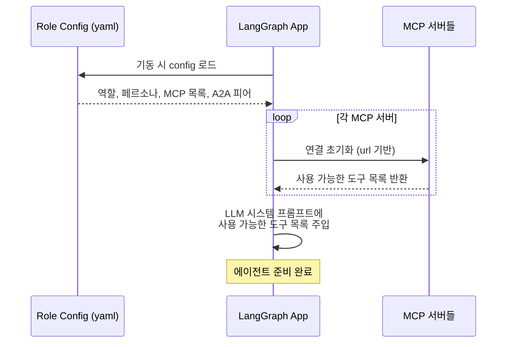

- **Docker 네트워크** 내에서 서비스명(`graph-db-mcp`, `qa-be` 등)으로 접근하므로 URL이 고정됨
- MCP 프로토콜의 표준 디스커버리: 연결 시 서버가 자신의 도구 목록을 반환 → 에이전트가 자동 인지
- 에이전트가 알아야 하는 것은 "어디에 연결할지"(config) 뿐, "무엇을 할 수 있는지"는 MCP 서버가 알려줌

### 2.5. Shared Memory 아키텍처

Shared Memory는 **Librarian(L)**이 관리하며, **공유 MCP 서버**는 DB 접근을 위한 순수 CRUD 계층으로 유지된다.

#### Librarian의 3가지 역할

| 역할 | 입력 | 처리 | 출력 |
|------|------|------|------|
| **Diff 색인** | Eng가 전달한 diff (파일 목록 + 파일 내 변경) | 변경 사항을 OO 구조로 해석 | Graph DB 노드/관계 업데이트 |
| **지식 기록** | 에이전트가 전달한 기술 개념/아이디어/주의사항/TODO | 분류하여 문서화 | Document DB에 태스크 연관 문서 저장 |
| **조회 응답** | 에이전트의 자연어 질의 | Graph DB + Document DB 교차 쿼리 | 정리된 답변 반환 |

> **대화 로그 수집은 Librarian의 역할이 아니다.** 별도의 경량 Consumer인 Chronicler가 Valkey Streams 브로커를 통해 수집·저장한다. (섹션 2.6 참조)

#### 접근 경로

| 경로 | 방식 | 용도 |
|------|------|------|
| **Diff 색인** | Eng → A2A → Librarian → MCP → DB | 구현 완료 후 코드 변경 사항을 Shared Memory에 반영 |
| **자연어 질의** | 에이전트 → A2A → Librarian → MCP → DB | 구조 조회, 교차 참조, 대화 이력 검색 |
| **Task Context 조립** | Eng/QA → A2A → `get_task_context(task_id)` → Graph DB | Code Agent 호출 전 필요한 파일/참조 시그니처 집합 조회 |
| **대화 로그 기록** | 에이전트 → Valkey Streams → Chronicler → MCP → Document DB | A2A 대화 이력 수집 (Librarian 경유하지 않음) |

#### Diff 기반 색인 워크플로우

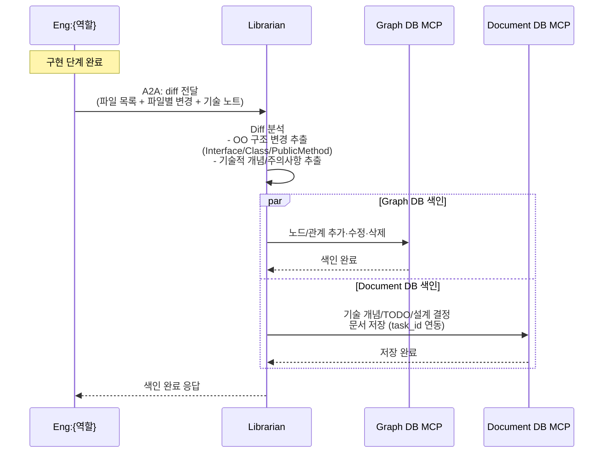

**중요 원칙:** Eng은 diff만 넘긴다. "이 변경이 지식 그래프에 어떻게 반영되어야 하는가"는 전적으로 Librarian의 책임.

#### 접근 권한 매트릭스

| 주체 | MCP 직접 읽기 | MCP 쓰기 | A2A → Librarian | Broker publish |
|------|:------------:|:--------:|:---------------:|:--------------:|
| **Librarian** | O | O (독점) | — | X |
| **Chronicler** | X | O (Doc DB, 대화만) | X | X (구독만) |
| **P** | X | X | 조회, PRD 저장 | O |
| **A** | X | X | 설계 시 구조 조회, Diff 검증 | O |
| **Eng:{역할}** | X | X | **Diff 전달**, 조회 | O |
| **QA:{역할}** | X | X | 조회 | O |

**원칙:** Librarian을 제외한 모든 에이전트는 **Librarian을 통해서만** Shared Memory에 접근한다. DB 스키마/쿼리 지식은 Librarian에 집중되어야 하며, 다른 에이전트는 자연어 수준의 질의만으로 원하는 정보를 얻을 수 있어야 한다. 단, 대화 로그 기록은 Librarian이 아닌 Chronicler가 전담하며, 에이전트는 Broker로 publish만 하면 된다.

**설계 원칙:**
- MCP 서버는 비즈니스 로직 없는 순수 CRUD + FIFO 큐잉만 담당
- Librarian이 지식 해석 계층 — "코드 변경이 그래프/문서에 어떤 의미인지" 판단
- Librarian도 DB에 직접 연결하지 않고 MCP를 경유 → 다른 에이전트와 일관된 접근 패턴 유지
- 읽기는 MCP에서 병렬 허용, 쓰기는 Librarian이 수행하므로 자연히 직렬화됨

### 2.6. A2A 대화 이벤트 수집 (Valkey Streams + Chronicler)

에이전트 간 직접 소통은 A2A(요청-응답)로 이루어지지만, **대화 로그는 Valkey Streams 브로커로 publish**되어 **Chronicler**라는 경량 Consumer가 Document DB에 영속화한다. 이 분리는 다음을 보장한다:

- 에이전트는 로그 기록에 블로킹되지 않음 (fire-and-forget)
- Librarian의 LLM 추론 부하가 대화 기록을 지연시키지 않음
- 향후 다른 구독자(실시간 모니터링, 감사 서비스 등) 추가 시 브로커에 구독만 걸면 됨

#### 구성

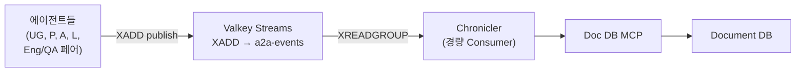

#### Chronicler 모듈 특성

| 항목 | 내용 |
|------|------|
| 정체성 | **에이전트가 아님** — Role Config, LangGraph, LLM, OpenCode CLI 일체 미사용 |
| 구현 | 단일 Python 스크립트 수준 — Valkey 클라이언트(redis-py 호환) + Doc DB MCP 클라이언트만 보유 |
| 책임 | `XREADGROUP`으로 Stream 구독 → 파싱/검증 → Task/Session/Item 컬렉션에 upsert → **저장 성공 시 `XACK`** |
| 재시작 내구성 | 저장 전 장애 시 XACK 미실행 → 메시지는 PEL(Pending Entries List)에 남아 재기동 시 재처리됨 |
| 스케일링 | 필요 시 같은 Consumer Group에 인스턴스 추가만 하면 수평 확장 |

#### 에이전트 측 publish

- 에이전트는 Valkey 클라이언트로 `XADD a2a-events * <field> <value> ...` 호출
- 즉시 반환 (A2A 본연의 요청-응답 흐름 방해 없음)
- 실패 시 로컬 버퍼에 재시도 큐잉 (필수)

#### Task/Session/Item 3계층 구조

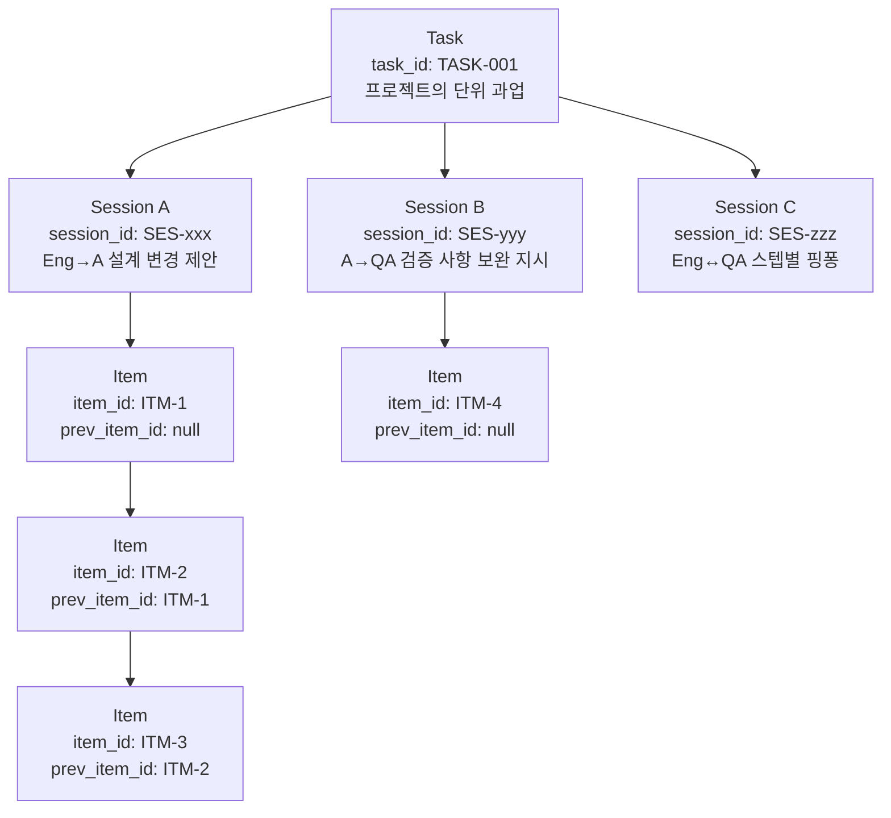

**계층 정의:**
- **Task**: 프로젝트의 단위 과업 (A가 Eng+QA 페어에게 배분한 구현 과제 단위)
- **Session**: 하나의 태스크 내에서 진행되는 **개별 대화 흐름**. 주제별/상황별로 구분됨
    - 예: "Eng:BE가 A에게 인터페이스 설계 변경 제안한 대화", "A가 QA:FE에게 테스트 보완 지시한 대화"
- **Item**: Session 하위의 **개별 메시지**. `prev_item_id`로 대화 순서 추적

**조회 API (Librarian 제공):**
- `by_task(task_id)` → 해당 태스크의 모든 대화
- `by_session(session_id)` → 해당 대화 세션의 전체 맥락
- `by_item(item_id)` → 특정 메시지 단건
- `thread(item_id)` → 해당 메시지를 포함한 대화 쓰레드 (prev_item_id 역추적)

#### 이벤트 publish 포맷

```json
{
  "event": "a2a_message",
  "task_id": "TASK-001",
  "session_id": "SES-xxx",
  "item_id": "ITM-42",
  "prev_item_id": "ITM-41",
  "from": "Eng:BE",
  "to": "A",
  "type": "design_change_proposal",
  "payload": { "...": "..." },
  "timestamp": "2026-04-16T10:00:00Z"
}
```

- 발신 에이전트가 `session_id`, `item_id`, `prev_item_id`를 부여하여 Valkey Streams에 XADD
- Chronicler가 Consumer Group으로 소비하여 Document DB의 sessions/items 컬렉션에 저장
- Session 생성 규칙: 새로운 주제의 첫 대화 시 발신자가 신규 `session_id` 생성, 기존 주제 이어가기는 동일 `session_id` 사용

### 2.7. 프로젝트 코드베이스 공유

여러 에이전트가 각자의 컨테이너에서 동작하지만, **실제 개발 산출물은 동일한 코드베이스에 반영되어야 한다.** Shared Memory(Graph DB + Document DB)는 **개발 과정 산출물의 문서화**를 담당하고, 실제 코드는 **호스트의 프로젝트 디렉토리**를 볼륨으로 마운트하여 공유한다.

#### 볼륨 마운트 구조

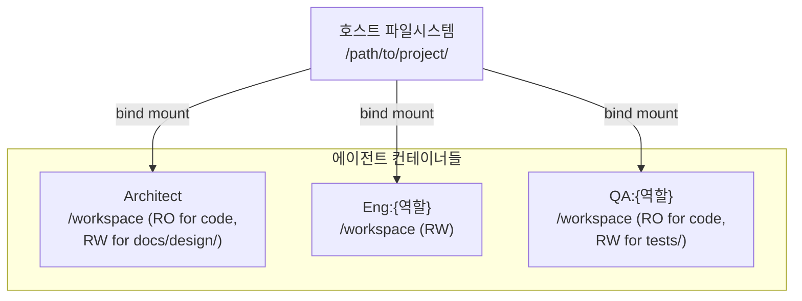

- 모든 에이전트 컨테이너는 프로젝트 루트를 **같은 경로(예: `/workspace`)**로 마운트
- Eng은 코드베이스 전반에 쓰기 권한 보유
- A는 코드 읽기 가능, 설계 문서 디렉토리(예: `docs/design/`)에 쓰기 권한
- QA는 코드 읽기 가능, 테스트 디렉토리(예: `tests/`)에 쓰기 권한
- P, Librarian은 코드베이스 접근 불필요 (Librarian은 Diff를 받기만 함)

#### 산출물의 2가지 저장 위치

| 산출물 유형 | 저장 위치 | 예시 |
|------------|----------|------|
| 실제 코드 | 프로젝트 코드베이스 (마운트된 볼륨) | `.py`, `.ts`, `.tsx` 등 구현 파일 |
| **채택된 설계 문서** | 프로젝트 코드베이스 (마운트된 볼륨) | `docs/design/TASK-001-payment-gateway.md` |
| 테스트 코드 | 프로젝트 코드베이스 (마운트된 볼륨) | `tests/...` |
| 미채택 설계안 | Document DB | 대안 설계 A, B의 상세 내용 |
| 대화 이력 (Task/Session/Item) | Document DB | A2A 이벤트 publish 수집 결과 |
| OO 구조 그래프 | Graph DB | Interface/Class/PublicMethod 노드 |
| PRD | Document DB + 외부 PM 도구 | 기획 내용 전문 |

**핵심 원칙:**
- 개발자가 레포지토리를 clone하면 그 안에 **채택된 설계 문서도 함께** 있어야 한다 → 코드베이스에 포함
- 미채택 설계안은 참고 자료로서 Document DB에 남겨 추후 조회 가능
- 대화/히스토리 같은 메타 정보는 코드와 섞지 않고 Document DB에만 저장

#### 설계안 채택 프로세스

A가 복수 설계안을 도출하면 **사용자가 선택**한다:

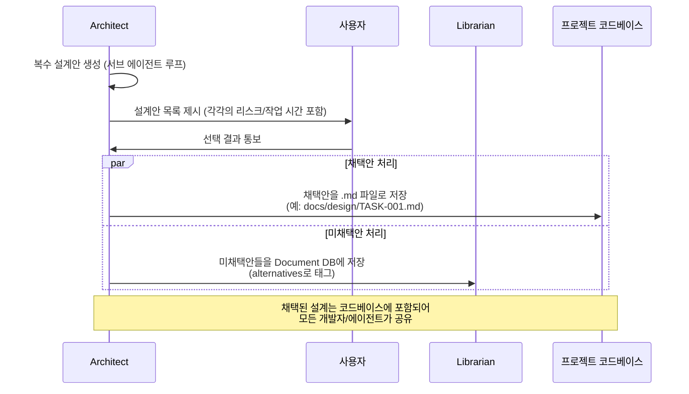

### 2.8. Code Agent 실행 전략 (OpenCode CLI)

Code Agent(기본 구현체 OpenCode CLI)는 에이전트의 "손"이다. 두뇌(LangGraph + LLM API)가 무엇을 할지 결정하면, Code Agent가 지정된 파일만 편집한다. **Graph DB로 컨텍스트를 정제하는 설계 의도를 보존하기 위해 Code Agent는 자유 탐색이 아닌 통제된 실행 환경에서 기동된다.**

#### 실행 방식: Subprocess (Non-Interactive)

OpenCode CLI는 TypeScript + Bun 런타임 기반으로, Python 에이전트가 자식 프로세스로 기동한다.

```python
# shared/adapters/code_agent/opencode_cli.py (의사 코드)
proc = subprocess.Popen(
    ["opencode", "run",
     "--format", "json",
     "--cwd", "/workspace",
     "--file", *target_files,         # 허용된 파일만 컨텍스트로 첨부
     assembled_prompt],
    env={**os.environ, "ANTHROPIC_API_KEY": config.llm.api_key},
    stdout=subprocess.PIPE, stderr=subprocess.PIPE, text=True,
)
stdout, stderr = proc.communicate(timeout=config.timeout)
# 실행 후 git diff로 허용 범위 검증 (2차 방어)
```

- **One-shot 모드**: 매 호출이 독립된 OpenCode 프로세스 — 단순·재현성 높음
- 상태 유지가 필요한 긴 작업은 LangGraph가 외부에서 여러 단계로 분할

#### Tool Permission 제어 (1차 방어)

OpenCode는 `opencode.json`의 `permission` 필드로 도구별 `allow` / `ask` / `deny` 제어를 지원한다. **Eng/QA에서는 탐색 도구(read/grep/glob)를 물리적으로 차단**하여 Graph DB가 정제한 컨텍스트만 사용하도록 강제한다.

```json
// 예: Eng 에이전트의 opencode.json (실행 시 Role Config에서 자동 생성)
{
  "$schema": "https://opencode.ai/config.json",
  "permission": {
    "read":  "deny",
    "grep":  "deny",
    "glob":  "deny",
    "edit":  "allow",
    "write": "allow",
    "bash":  "deny"
  }
}
```

#### 역할별 권한 매트릭스

| 에이전트 | read | grep | glob | edit | write | bash | 운영 의도 |
|---------|:----:|:----:|:----:|:----:|:-----:|:----:|----------|
| **A** (리뷰/검수) | allow | allow | allow | deny | deny | deny | 광범위 읽기 필요, 편집은 설계 문서(docs/design)에만 (Python 래퍼가 경로 가드) |
| **Eng:*** | **deny** | **deny** | **deny** | allow | allow | deny | Graph DB로 정제된 컨텍스트만 사용, 빌드·테스트는 QA 담당 |
| **QA:*** | **deny** | **deny** | **deny** | allow | allow | **allow** | 테스트 작성 + 빌드·테스트 실행 |

#### Context Assembly 흐름

OpenCode 호출 **전에** 에이전트가 Librarian으로부터 정제된 컨텍스트를 받아 프롬프트를 조립한다.

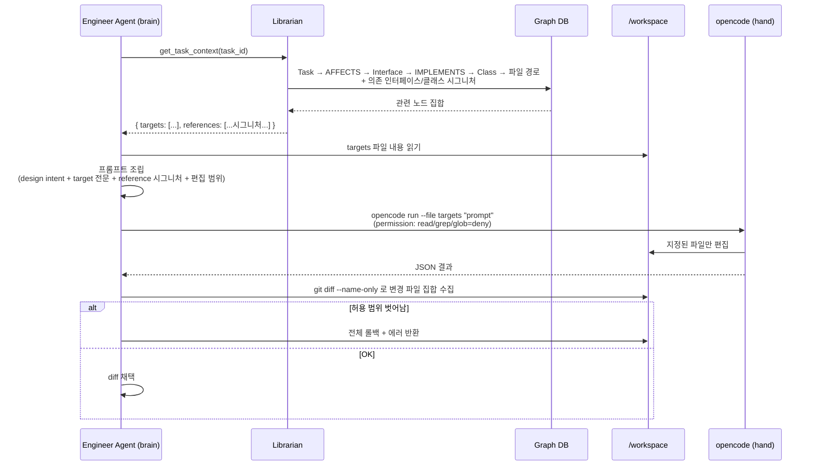

#### 프롬프트 구조 (OpenCode에 전달)

```
[Design Intent]
{Architect가 내린 OO 설계의 해당 부분}

[Target Files — 편집 허용]
=== src/backend/payment/stripe_adapter.py ===
{현재 전체 내용}

=== src/backend/payment/payment_gateway.py ===
{현재 전체 내용}

[Reference Context — 수정 금지]
Interface: PaymentGateway
  public charge(amount, currency, method) -> PaymentResult
  public refund(transaction_id) -> RefundResult
Class: OrderService (src/backend/order/order_service.py)
  uses: PaymentGateway

[Constraints]
- 편집 허용: src/backend/payment/** 만
- 참조 컨텍스트는 수정 금지

[Task]
StripeAdapter.charge()를 구현하라. 멱등성 보장(idempotency key) 포함.
```

#### 2중 방어

| 레이어 | 방법 | 담당 |
|-------|------|------|
| 1차 (탐색 차단) | OpenCode `permission`에서 read/grep/glob = `deny` | OpenCode CLI |
| 2차 (편집 범위 강제) | 실행 후 `git diff --name-only` 결과가 `workspace.write_scope` 밖이면 롤백 | Python 래퍼 (`opencode_cli.py`) |

#### 컨테이너 이미지 구성

Code Agent를 쓰는 에이전트 이미지(A, Eng, QA)는 Bun + OpenCode CLI를 포함한다.

```dockerfile
# 예: agents/engineer/Dockerfile
FROM oven/bun:1 AS opencode-stage
RUN bun install -g opencode-ai

FROM python:3.12-slim
COPY --from=opencode-stage /usr/local/bin/bun /usr/local/bin/
COPY --from=opencode-stage /root/.bun/install/global /root/.bun/install/global
ENV PATH="/root/.bun/bin:${PATH}"

WORKDIR /app
COPY pyproject.toml ./
RUN pip install -e .
COPY src/ ./src/
COPY configs/ ./configs/
CMD ["python", "-m", "engineer_agent.main"]
```

P와 Librarian 이미지는 Code Agent 불필요 → Bun/OpenCode 미설치.

### 2.9. 인프라 레이어

| 컴포넌트 | 기술 | 역할 |
|----------|------|------|
| 워크플로우 엔진 | LangGraph (+ `langgraph-api` ≥ 0.4.21) | 에이전트 내부 상태 머신 + **A2A v1.0 서버 내장** (JSON-RPC 2.0, SSE) |
| 코드 실행 도구 | 추상화 인터페이스 (기본: OpenCode CLI) | 코드 조작 실행 엔진, 추후 교체 가능 |
| 추론 엔진 | LLM API (역할·서브 에이전트별 선택) | 모든 에이전트의 판단/검증 |
| Runtime | Docker (1 Agent = 1 Container) | 격리된 실행 환경 |
| **코드베이스 공유** | **Docker 볼륨 마운트** | **호스트 프로젝트 디렉토리를 전 에이전트에 bind mount** |
| Graph DB | 추상화 인터페이스 (기본: Neo4j) | OO 구조 (Semantic Layer), 추후 교체 가능 |
| Document DB | 추상화 인터페이스 (기본: MongoDB) | 기록/대화/문서 (Episodic Layer), 추후 교체 가능 |
| Shared Memory 접근 | MCP Server (공유, FIFO 큐잉) | Librarian 및 Chronicler 전용 |
| 도구 연동 | MCP (Model Context Protocol) | 역할별 외부 도구 연동 |
| 외부 PM 도구 | 추상화 인터페이스 (기본: GitHub Wiki/Issue) | PRD/태스크 동기화, 추후 Jira/Confluence 등 지원 |
| **Message Broker** | **Valkey Streams** | **A2A 대화 이벤트 publish용 (단순 구성 유지, 추상화 불필요)** |
| **Chronicler** | **경량 Python Consumer (에이전트 아님)** | **Valkey Streams 구독 → Document DB 영속화** |

---

## 3. 에이전트 역할 정의

### 3.1. 역할 매트릭스

| 에이전트 | 코드명 | 핵심 역할 | 페르소나 | 주요 상호작용 |
|----------|--------|-----------|----------|--------------|
| **Primary** | **P** | 사용자와 기획 협의, PRD 작성, 외부 PM 도구 동기화, 프로젝트 전체 관리 | PM | 사용자, A, L, 외부 PM 도구 |
| **Architect** | **A** | 사용자와 기술 설계 협의, OO 설계 주도, 설계 결정권 보유, Diff 검증 | 시스템 아키텍트 | 사용자, P, L, 각 Eng+QA 페어 |
| **Librarian** | **L** | Diff 색인, 복잡한 질의 응답, 그래프 무결성 보장 | 지식 관리자 | 전 에이전트 |
| **Engineer** | **Eng:{역할}** | A의 1차 설계 기반 세부 설계·구현·검증 자율 수행, Diff를 L에게 전달 | 역할별 SW 엔지니어 | A, 페어 QA, L, 유관 Eng |
| **QA** | **QA:{역할}** | A의 설계 수신 → 독립적 테스트 코드 작성, 빌드/테스트 실행, 검증 | 역할별 테스트 엔지니어 | A, 페어 Eng, L |

> **에이전트가 아닌 보조 모듈:**
> **Chronicler** — Valkey Streams를 구독하여 A2A 대화 이벤트를 Document DB에 영속화하는 경량 Consumer. LLM, LangGraph, Role Config를 사용하지 않는 단순 Python 스크립트 수준의 모듈. 에이전트 역할 정의에서 다루지 않으며, 인프라로 취급. (섹션 2.6 참조)

### 3.2. 에이전트별 상세 책임

#### Primary (P) - 프로젝트 매니저

**사용자 접점 (기획 영역):**
- 언제든 사용자와 채팅으로 소통, 작업 도중에도 중간 개입 수용
- 사용자와의 논의를 통해 추상적 요구사항을 구체화하여 **PRD 작성**
- PRD 변경이 발생하면 A와 재협의

**프로젝트 관리:**
- PRD를 Document DB에 기록 + 외부 PM 도구(GitHub Wiki/Issue 등)에도 동기화
- 태스크 분해 후 우선순위 결정
- 전체 진행 상황 추적 (Librarian 조회를 통해 Task/Session/Item 확인)
- 최종 결과물 취합 및 사용자 보고

#### Architect (A) - 시스템 아키텍트

**사용자 접점 (기술 영역):**
- 언제든 사용자와 채팅으로 소통, 기술 설계 및 기술 결정에 대한 중간 개입 수용
- 사용자의 기술적 질의/조율 요청에 대응

**설계 주도:**
- **객체지향 관점의 1차 설계**를 수행하여 Eng+QA 페어에게 동시 전달
- Interface/Class/PublicMethod 레벨의 계약 정의
- 설계 결정권 보유 — Eng의 세부 구현 자율성은 인정하되 상위 설계는 A가 결정

**조율 및 검증:**
- Eng이 상위 설계 수정을 제안할 경우 영향 범위 분석
- 수정이 다른 Eng의 작업에 영향을 미칠 경우 **유관 Eng과 함께 다자간 논의** 주관
- Eng의 Diff 제출 시 L의 색인 결과를 기반으로 설계 적합성 검증
- Eng+QA 페어의 최종 보고서 검수 (Quality Gate)

**A의 내부 서브 에이전트 구조 (자체 피드백 루프):**

A는 단일 LangGraph 내에 3개의 서브 에이전트로 구성된 자체 피드백 루프를 보유한다. 각 서브 에이전트는 **서로 다른 LLM 모델**을 사용할 수 있다.

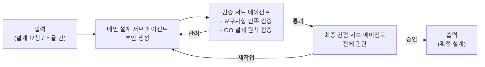

| 서브 에이전트 | 책임 | LLM 모델 선택 예시 |
|-------------|------|-------------------|
| 메인 설계 | 1차 설계 초안 생성 | 코딩/설계 특화 모델 |
| 검증 | 요구사항 충족 여부 + OO 원칙(SOLID 등) 준수 여부 검증 | 추론 특화 모델 |
| 최종 컨펌 | 두 결과를 종합하여 최종 판단 | 균형 잡힌 고성능 모델 |

#### Librarian (L) - 지식 관리자

**Diff 색인 (핵심 책임):**
- Eng의 diff(파일 목록 + 변경 내역 + 기술 노트) 수신
- OO 관점 분석 → Graph DB의 Interface/Class/PublicMethod 노드/관계 업데이트
- 기술적 개념/아이디어/주의사항/TODO 추출 → Document DB 색인
- **Eng은 diff만 전달하면 됨** — 색인 해석 책임은 Librarian에 있음

**지식 기록:**
- 다른 에이전트가 전달한 태스크 정보(목표, 기능, 진행 상태, 히스토리) 기록
- 기술 사항(설계 결정, 구현 특이점) 문서화

**질의 응답:**
- 자연어 질의 수신 → Graph DB + Document DB 교차 쿼리 (Chronicler가 저장한 대화 이력 포함)
- `by_task`, `by_session`, `by_item`, `thread` 등 조회 API 제공
- **`get_task_context(task_id)` — Code Agent 컨텍스트 조립 전용 API**
    - Graph DB 쿼리: Task → AFFECTS → Interface → IMPLEMENTS → Class → 파일 경로
    - 반환: `{ targets: [편집 대상 파일 경로], references: [의존 인터페이스/클래스의 시그니처 수준 메타] }`
    - Eng/QA가 OpenCode 호출 전에 사용 (섹션 2.8 참조)

**책임 아닌 것:**
- A2A 대화 로그 수집은 **Librarian의 책임이 아니다**. Chronicler가 전담.

**기술적 제약:**
- Graph DB의 쓰기 권한자 (+ technical_notes 등 구조화된 문서 쓰기)
- 자신도 MCP를 통해 DB에 접근 (직접 연결 아님) → 다른 에이전트와 일관된 접근 패턴 유지

#### Eng+QA 페어 - 구현/검증 단위

Eng와 QA는 **역할별로 1:1 페어**를 이루지만, A의 1차 설계를 **동시에** 수신하여 각자의 작업을 **병렬로** 수행한다. Eng이 구현을 진행하는 동안 QA는 독립적으로 테스트 코드를 작성한다.

**페어 프리셋 (예시):**

| Eng | QA | 담당 영역 |
|-----|-----|-----------|
| `Eng:BE` | `QA:BE` | API, 서버 로직, DB 스키마, 인증/인가 |
| `Eng:FE` | `QA:FE` | UI 컴포넌트, 클라이언트 상태, UX |
| `Eng:DevOps` | `QA:DevOps` | CI/CD, 인프라, 컨테이너, 모니터링 |
| `Eng:Data` | `QA:Data` | 파이프라인, ETL, 스키마 마이그레이션 |
| `Eng:Mobile` | `QA:Mobile` | iOS/Android, 크로스 플랫폼 |
| `Eng:...` | `QA:...` | 프로젝트별 자유 정의 |

**Engineer (Eng:{역할})의 책임:**

- A의 **객체지향적 1차 설계** 수신 (Interface/Class/PublicMethod 계약)
- **자체 설계-구현-검증 루프 자율 수행:**
    - 클래스/메소드/서브 패키지 레벨의 세부 설계는 Eng이 자율적으로 결정
    - 구현 과정에서 빌드/유닛테스트를 스스로 돌려 내부 검증
- **상위 설계 수정 건의:**
    - 세부 구현 중 상위 설계 변경이 불가피하다고 판단되면 A에게 **의견 전달**
    - 설계 수정의 주도권과 결정권은 A에 있음 (Eng은 건의자)
    - A가 다자간 논의를 소집하면 유관 Eng으로 참여
- **Diff 제출:**
    - 구현 단계 완료 시 Librarian에게 **diff(파일 목록 + 파일별 변경)** 전달
    - 기술적 개념/설계 결정/주의사항/TODO를 함께 첨부
    - Librarian이 색인을 마치면 A에게 구현 완료 보고

**QA (QA:{역할})의 책임:**

- A의 **객체지향적 1차 설계** 수신 (Eng과 동시)
- Interface/Class/PublicMethod 계약을 근거로 **독립적으로 테스트 코드 작성**
    - 주로 유닛 테스트와 outbound 어댑터 목업 테스트
    - Eng의 구현 완료를 기다리지 않고 설계 스펙 기반으로 선행 작성
- Eng의 구현 완료 시:
    - **빌드 실행** → 컴파일/빌드 에러 확인 (인터프리터 언어는 필요 시 스킵)
    - **준비한 테스트 코드 실행** → 통과/실패 판정
- **설계 변경 대응:**
    - A가 설계를 수정하면 QA도 수정된 설계를 수신하여 테스트 코드를 재작성
- 테스트 결과 보고서 작성 → A에게 제출

**동적 구성 원칙:**
- 프로젝트 초기화 시 P가 필요한 역할을 결정 → 역할당 Eng+QA 페어 컨테이너 생성
- 프로젝트 진행 중에도 페어 추가/제거 가능
- 각 에이전트는 독립 컨테이너로 실행 (1 Eng + 1 QA = 2 Containers per 역할)

---

## 4. 지식 그래프 모델링

### 4.1. Semantic Layer (Neo4j)

#### 인터페이스 중심 구현 모델

```
(Class)-[:IMPLEMENTS]->(Interface)
(Class)-[:DEPENDS_ON]->(Interface)
(PublicMethod)-[:BELONGS_TO]->(Interface)
(Module)-[:CONTAINS]->(Class)
```

- **Method 노드는 public 메소드(계약된 인터페이스 시그니처)만 포함** — 내부 구현 상세(private/protected)는 그래프에 포함하지 않음
- 에이전트가 특정 구현체에 종속되지 않고 유연하게 설계 논의
- 인터페이스 매개 객체 간 참조 관계로 변경 영향 범위 즉각 파악

#### 과업-코드 추적성 모델

```
(Task)-[:AFFECTS]->(Interface)
(Task)-[:REALIZED_IN]->(Method)
(Feature)-[:DECOMPOSED_INTO]->(Task)
(BugReport)-[:TRACES_TO]->(Method)
```

- Task, Feature, BugReport 노드가 독립적으로 존재
- 과업과 코드 직접 연결로 비즈니스 문맥 유지

### 4.2. Episodic Layer (Document DB)

#### 저장 대상
- **Task 정보**: 목표, 기능, 진행 상태, 히스토리
- **기술 사항**: 설계 결정, 구현 특이점, 주의사항, TODO
- **설계안**: 채택안(메타 정보, 실제 문서는 코드베이스)/미채택안(전문)
- **PRD**: 사용자-P 협의 결과
- **대화 이력**: Task → Session → Item 3계층

#### Task/Session/Item 컬렉션

**tasks (태스크):**
```json
{
  "_id": "TASK-001",
  "title": "결제 모듈 추가",
  "goal": "Stripe 연동으로 신용카드 결제 지원",
  "status": "in_progress",
  "prd_ref": "PRD-001",
  "design_choice": {
    "selected": "docs/design/TASK-001-payment-gateway.md",
    "alternatives": ["design_alt_1", "design_alt_2"]
  },
  "assignees": ["Eng:BE", "QA:BE"],
  "created_at": "2026-04-16T09:00:00Z",
  "updated_at": "2026-04-16T10:30:00Z"
}
```

**sessions (대화 세션):**
```json
{
  "_id": "SES-xxx",
  "task_id": "TASK-001",
  "topic": "Eng:BE의 PaymentGateway 인터페이스 설계 변경 제안",
  "participants": ["Eng:BE", "A"],
  "started_at": "2026-04-16T10:00:00Z",
  "closed_at": null
}
```

**items (개별 메시지):**
```json
{
  "_id": "ITM-42",
  "task_id": "TASK-001",
  "session_id": "SES-xxx",
  "prev_item_id": "ITM-41",
  "from": "Eng:BE",
  "to": "A",
  "type": "design_change_proposal",
  "payload": { "...": "..." },
  "timestamp": "2026-04-16T10:15:00Z"
}
```

**technical_notes (기술 문서):**
```json
{
  "_id": "TN-007",
  "task_id": "TASK-001",
  "category": "implementation_note",  // design_decision | todo | caution | concept
  "title": "Stripe webhook 재시도 멱등성 보장",
  "content": "...",
  "source_agent": "Eng:BE",
  "source_diff_ref": "DIFF-015"
}
```

**design_alternatives (미채택 설계안):**
```json
{
  "_id": "design_alt_1",
  "task_id": "TASK-001",
  "title": "Adapter 없이 Stripe SDK 직접 호출",
  "risk_score": 0.6,
  "est_hours": 4,
  "content": "...",
  "rejected_at": "2026-04-16T09:30:00Z",
  "rejection_reason": "Stripe 외 다른 PG 지원 어려움"
}
```

#### 조회 쿼리 예시

| 목적 | 쿼리 |
|------|------|
| 태스크 전체 히스토리 | `items.find({ task_id })` 정렬 by timestamp |
| 특정 대화 세션 맥락 | `items.find({ session_id })` 정렬 by prev_item_id 체인 |
| 대화 쓰레드 역추적 | `item_id`에서 `prev_item_id`를 따라 올라가며 재귀 조회 |
| 태스크의 기술 메모 | `technical_notes.find({ task_id })` |
| 태스크의 대안 설계 | `design_alternatives.find({ task_id })` |

---

## 5. 협업 프로세스 (Workflow)

### 5.1. 전체 프로세스 개요

| 단계 | 명칭 | 참여 에이전트 | 핵심 활동 |
|------|------|-------------|-----------|
| 1단계 | 기획 구체화 | 사용자, P, L | 사용자-P 대화, PRD 작성, 외부 PM 도구 동기화 |
| 2단계 | OO 설계 | P, A, 사용자, L | A의 서브 에이전트 루프, 사용자 기술 개입 수용, OO 1차 설계 확정 |
| 3단계 | 병렬 구현·검증 | A, Eng+QA 페어들, L | Eng 자체 루프 + QA 독립 테스트 + Diff 색인 |
| 4단계 | 검수/종료 | A, P, L | A 검수 → P 결과 보고 |

**인간 개입 지점:** 사용자는 단계와 무관하게 언제든 P(기획) 또는 A(기술)에게 직접 메시지를 보낼 수 있다. 개입 시점은 Task/Session/Item으로 기록되어 추적 가능하다.

### 5.2. 단계별 상세

#### 1단계: 기획 구체화 및 PRD 작성
1. 사용자가 P에게 요청 전달
2. P ↔ 사용자: 요구사항 구체화 대화 (필요 시 여러 차례)
3. P: 구체화된 요구사항을 **PRD로 정리**
4. P → L: PRD 문서 저장 요청 (Document DB)
5. P → 외부 PM 도구: 동일 PRD 동기화 (GitHub Wiki/Issue 등)
6. P → A: PRD 전달, 기술 설계 의뢰

#### 2단계: OO 설계 및 확정

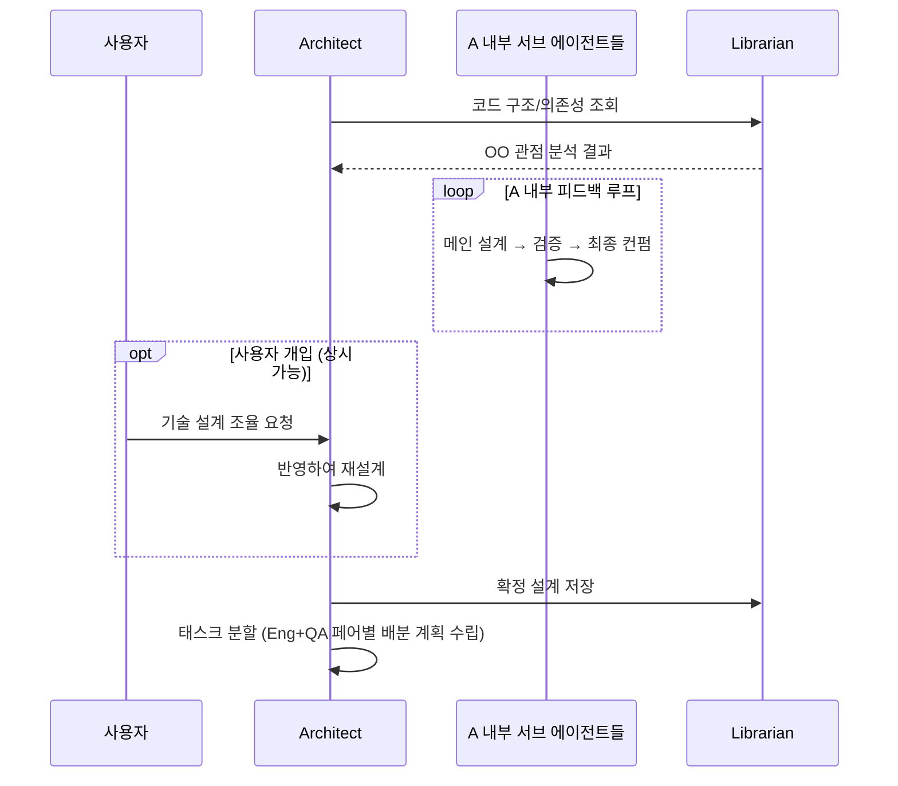

1. A → L: 관련 코드 구조/의존성 질의
2. A 내부: 메인 설계 → 검증 → 최종 컨펌 서브 에이전트 루프 수행
3. A: 정량적 지표(리스크/작업 시간) 포함 **복수 설계안** 도출
4. A → 사용자: 설계안 목록 제시 및 선택 요청
5. (사용자 개입 가능) 사용자 ↔ A: 기술 설계/결정 조율
6. 사용자 → A: 최종 설계안 선택
7. A가 수행하는 후처리:
    - **채택안**: 프로젝트 코드베이스의 `docs/design/`에 md 파일로 저장
    - **미채택안**: Librarian을 통해 Document DB에 alternatives 태그로 저장
8. A → L: 채택 설계의 OO 구조를 Graph DB에 색인 요청
9. A: 태스크를 Eng+QA 페어 단위로 분할

#### 3단계: 병렬 구현·검증

3단계의 핵심은 **Eng과 QA가 병렬로 작업**한다는 점이다. A의 1차 설계가 두 에이전트에게 **동시에** 전달되고, Eng은 구현 루프를, QA는 테스트 코드 작성을 각각 독립적으로 수행한다.

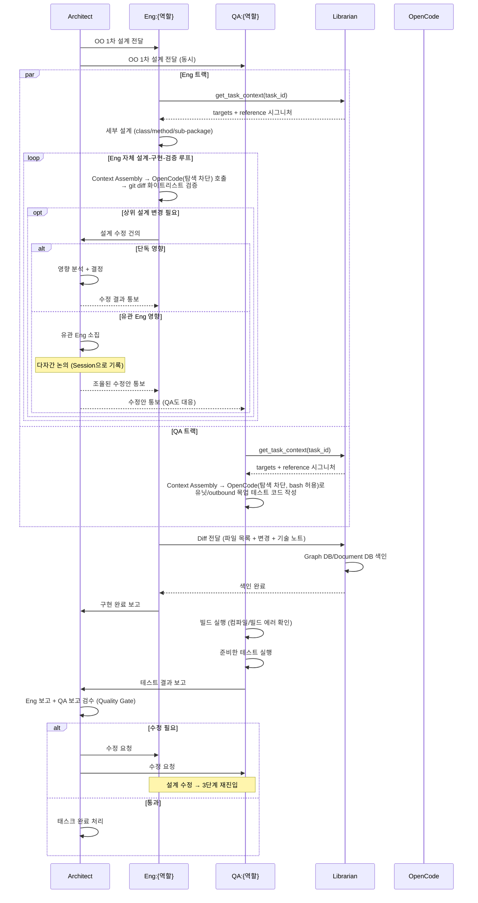

**상세 흐름:**

1. **설계 동시 배포**: A → Eng, QA에게 OO 1차 설계 전달
2. **Context Assembly (각 트랙 공통)**:
    - Eng/QA가 Librarian.`get_task_context(task_id)` 호출 → 편집 대상 파일 목록 + 의존 인터페이스/클래스 시그니처 수신
    - 대상 파일 내용과 참조 시그니처를 결합하여 OpenCode 호출용 프롬프트 조립
    - 전체 코드베이스를 스캔하지 않고 **Graph DB로 정제된 컨텍스트만** 사용
3. **병렬 작업 시작:**
    - **Eng 트랙**: 세부 설계(클래스/메소드/서브 패키지) → Context Assembly → OpenCode(탐색 차단) 호출 → 구현 → `git diff` 화이트리스트 검증
    - **QA 트랙**: 설계 스펙 + 시그니처 컨텍스트 기반으로 테스트 코드(유닛/목업) 독립 작성
4. **상위 설계 수정 처리 (Eng 트랙 중)**:
    - Eng이 상위 설계 수정이 불가피하다고 판단 → A에게 건의
    - A는 영향 범위 분석:
        - **단독 영향**: A가 판단 후 수정 통보
        - **유관 Eng 영향**: A가 유관 Eng을 소집하여 **다자간 논의** (Session으로 기록)
    - 확정된 수정안은 A가 QA에게도 동시 통보 → QA 테스트 코드 재작성 (Context Assembly 재실행)
5. **Diff 색인**: Eng 구현 완료 시 Librarian에게 diff 전달 → Graph DB/Document DB 색인
6. **QA 빌드/테스트 실행**:
    - 빌드 에러 확인 (인터프리터 언어는 필요 시 스킵)
    - 준비한 테스트 실행 → 통과/실패 판정
7. **A 검수 (Quality Gate)**:
    - Eng 보고서 + QA 테스트 결과 + L의 색인 결과를 종합 검토
    - (수정 필요) A → Eng, QA 수정 요청 → 3단계 재진입
    - (통과) 태스크 완료

**Document DB 기록 (자동, Librarian이 이벤트 수집):**
- Eng-A 설계 수정 제안/논의 Session
- 다자간 논의 Session (유관 Eng 포함)
- A-QA 수정 통보 Session
- Eng의 자체 루프 주요 의사결정 (기술 노트로 함께 전달)
- A의 검수 결과 및 수정 요청 이력

#### 4단계: 검수/종료
1. 모든 Eng+QA 페어의 태스크 완료 확인
2. A → P: 전체 검수 완료 보고 (페어별 보고서 + L 색인 결과 종합)
3. P: 외부 PM 도구에 완료 상태 동기화
4. P: 최종 결과물 취합, 사용자에게 보고, 작업 종료

---

## 6. 기술 스택 상세

### 6.1. 컨테이너 구성

```yaml
# 예시: docker-compose 구조
# ${TARGET_PROJECT_PATH} = 작업 대상 프로젝트의 호스트 경로
# 각 에이전트는 독립 모듈이며 각자 Dockerfile로 빌드 (공유 이미지 없음)
services:
  # --- 에이전트 (모듈별 독립 빌드, 공용 코드는 shared/ 에서 import) ---
  # 기본 config은 이미지에 baked-in. 필요 시 override.yaml만 마운트하여 일부 필드 덮어쓰기.
  primary:
    build: ./agents/primary
    volumes:
      - ./overrides/primary.yaml:/app/config.override.yaml   # (선택) override
    depends_on: [doc-db-mcp, external-pm-mcp, valkey]

  architect:
    build: ./agents/architect
    volumes:
      - ./overrides/architect.yaml:/app/config.override.yaml
      - ${TARGET_PROJECT_PATH}:/workspace   # 코드 읽기 + docs/design/ 쓰기

  librarian:
    build: ./agents/librarian
    volumes:
      - ./overrides/librarian.yaml:/app/config.override.yaml

  # BE 페어 — specialty는 CONFIG_PROFILE 환경변수로 선택
  eng-be:
    build: ./agents/engineer
    environment:
      - CONFIG_PROFILE=be       # 이미지 내부의 configs/be.yaml을 base로 사용
    volumes:
      - ./overrides/eng-be.yaml:/app/config.override.yaml
      - ${TARGET_PROJECT_PATH}:/workspace

  qa-be:
    build: ./agents/qa
    environment:
      - CONFIG_PROFILE=be
    volumes:
      - ./overrides/qa-be.yaml:/app/config.override.yaml
      - ${TARGET_PROJECT_PATH}:/workspace

  # FE 페어
  eng-fe:
    build: ./agents/engineer
    environment:
      - CONFIG_PROFILE=fe
    volumes:
      - ./overrides/eng-fe.yaml:/app/config.override.yaml
      - ${TARGET_PROJECT_PATH}:/workspace

  qa-fe:
    build: ./agents/qa
    environment:
      - CONFIG_PROFILE=fe
    volumes:
      - ./overrides/qa-fe.yaml:/app/config.override.yaml
      - ${TARGET_PROJECT_PATH}:/workspace

  # --- User Gateway (사용자 접점) ---
  user-gateway:
    build: ./user-gateway
    ports: ["8080:8080"]              # 사용자 UI 접속용
    depends_on: [primary, architect]

  # --- 공유 MCP 서버 (별도 이미지) ---
  graph-db-mcp:
    build: ./mcp-servers/graph-db
    depends_on: [neo4j]

  doc-db-mcp:
    build: ./mcp-servers/doc-db
    depends_on: [mongodb]

  external-pm-mcp:
    build: ./mcp-servers/external-pm   # 기본 구현: GitHub Wiki + Issue
    environment:
      - GITHUB_TOKEN=${GITHUB_TOKEN}
      - GITHUB_REPO=${GITHUB_REPO}

  # --- 데이터베이스 ---
  neo4j:
    image: dhi.io/neo4j:5
    ports: ["7474:7474", "7687:7687"]

  mongodb:
    image: dhi.io/mongodb:8
    ports: ["27017:27017"]

  # --- 대화 기록 파이프라인 (Valkey Streams + Chronicler) ---
  valkey:
    image: valkey/valkey:9
    command: ["valkey-server", "--appendonly", "yes"]

  chronicler:
    build: ./chronicler
    depends_on: [valkey, doc-db-mcp]
    environment:
      - VALKEY_URL=redis://valkey:6379
      - STREAM_NAME=a2a-events
      - CONSUMER_GROUP=chronicler-cg
      - DOC_DB_MCP_URL=http://doc-db-mcp:8080
```

**에이전트 빌드 원칙:**
- 역할당 **독립 디렉토리 + 독립 Dockerfile** — 각자 python + langgraph 앱으로 빌드
- Engineer/QA처럼 specialty만 다른 경우, 하나의 모듈을 여러 specialty 컨테이너로 띄움 (config 파일로 분화)
- 공통 코드(A2A 클라이언트/서버, MCP 클라이언트, Role Config 로더, 이벤트 publish 등)는 `shared/` 패키지에서 import하여 중복 최소화

**API Key 주입 원칙:**
- `.env` 파일에 `ANTHROPIC_API_KEY`, `GITHUB_TOKEN` 등을 정의 (docker-compose가 자동 로드)
- 각 에이전트 서비스의 `environment` 블록에 필요한 env를 명시적으로 선언 (최소 권한 원칙)
- Override yaml의 `${ANTHROPIC_API_KEY}` 같은 참조는 로더가 기동 시 치환
- `.env`는 `.gitignore`에 포함, 리포지토리에는 `.env.example` 템플릿만 커밋

```yaml
# 예시: agents/primary 서비스에 API key env 주입
primary:
  build: ./agents/primary
  env_file: [.env]
  environment:
    - ANTHROPIC_API_KEY       # .env에서 로드된 값을 컨테이너에 전달
```

**볼륨 마운트 원칙:**
- 코드 작업이 필요한 에이전트(A, Eng, QA)는 **같은 호스트 경로**를 `/workspace`에 마운트 → 동일 코드베이스 공유
- 쓰기 범위는 에이전트 내부 로직 + Role Config에서 허용 디렉토리를 명시하여 제한
- P와 Librarian은 코드베이스를 마운트하지 않음 (불필요)

### 6.2. A2A 통신 (A2A Protocol v1.0)

에이전트 간 통신은 **[A2A Protocol v1.0](https://a2a-protocol.org/latest/)** (Linux Foundation 표준) 을 따른다. 구현은 **`langgraph-api` ≥ 0.4.21** 이 내장 제공하는 A2A 서버를 활용한다. 각 에이전트의 LangGraph 인스턴스가 `/a2a/{assistant_id}` 엔드포인트를 직접 노출하므로 별도의 A2A Gateway 구축은 불필요하다.

#### 지원 RPC 메서드 (JSON-RPC 2.0)

| RPC | 설명 | 우리 용도 |
|-----|------|----------|
| `message/send` | 동기 요청-응답 | 일반 에이전트 간 대화 (기본 경로) |
| `message/stream` | SSE 스트리밍 | **User Gateway ↔ Primary** 사용자 채팅 실시간 렌더링, 장시간 실행 응답의 점진 전달 |
| `tasks/get` | 이전 task 상태·결과 조회 | 비동기 긴 작업(Eng 구현, QA 테스트)의 상태 추적 |

#### Task Lifecycle

긴 작업과 인간·상위 에이전트 개입을 A2A 표준 상태로 매핑한다:

| 상태 | 의미 | 우리 시스템 매핑 예 |
|------|------|-------------------|
| `SUBMITTED` | 요청 수신 | 태스크 배분 직후 |
| `WORKING` | 실행 중 | Eng 구현 중, QA 테스트 중 |
| `INPUT_REQUIRED` | 개입 대기 | Eng 이 Architect 에게 설계 수정 건의 후 응답 대기 / 사용자 기술 조율 요청 대기 / 다자간 논의 소집 중 |
| `AUTH_REQUIRED` | 인증 필요 | (예비) 외부 시스템 인증 요구 시 |
| `COMPLETED` | 정상 종료 | |
| `FAILED` / `CANCELED` / `REJECTED` | 비정상 종료 | 빌드 실패, 상위 설계 반려 등 |

`INPUT_REQUIRED` 를 적극 활용하여 LangGraph 의 내부 상태가 외부 인터럽션 때문에 블로킹되지 않도록 한다.

#### Agent Card

각 에이전트는 `/agent.json` 경로에 **Agent Card** 를 노출한다. Role Config 의 공개 가능한 부분을 표준 JSON 포맷으로 제공:

```json
{
  "name": "architect",
  "description": "시스템 아키텍트 — OO 설계 주도, 설계 결정권 보유",
  "url": "http://architect:9000",
  "capabilities": {
    "streaming": true,
    "pushNotifications": false
  },
  "skills": [
    { "id": "design_proposal", "description": "복수 설계안 생성" },
    { "id": "code_review",     "description": "Quality Gate 검수" }
  ],
  "defaultInputModes": ["text"],
  "defaultOutputModes": ["text"]
}
```

- **시그니처 지원**은 향후 과제(v1.0 의 서명 Agent Card) — 초기는 미서명
- 신규 에이전트 합류 시 자기 소개 표준이 됨

#### A2A 메시지 포맷 (JSON-RPC 2.0)

`message/send` 요청 예:

```json
{
  "jsonrpc": "2.0",
  "id": "req-001",
  "method": "message/send",
  "params": {
    "message": {
      "role": "user",
      "parts": [
        { "kind": "text", "text": "결제 모듈 설계안 검토 부탁드립니다." }
      ],
      "taskId": "TASK-001",
      "contextId": "SES-xxx",
      "messageId": "ITM-42"
    }
  }
}
```

응답으로 즉시 완료되는 짧은 작업은 결과를, 긴 작업은 `Task` 객체(`SUBMITTED`/`WORKING` 상태)를 반환. 후자는 `tasks/get` 으로 상태 폴링 또는 `message/stream` 으로 SSE 구독.

### 6.3. MCP 연동 계획

MCP 서버는 두 종류로 나뉜다:

**공유 MCP 서버 (N:1, 에이전트 외부):**
- Graph DB MCP — 코드-과업 관계 그래프 접근, FIFO 큐잉으로 쓰기 직렬 처리
- Document DB MCP — 실행 기록/의사결정 근거 접근, FIFO 큐잉으로 쓰기 직렬 처리

**역할별 MCP 도구 (1:1, 에이전트 내부):**

| 에이전트 | Shared Memory MCP | External PM MCP | 역할별 MCP 도구 |
|----------|:-----------------:|:---------------:|---------------|
| P | X (Librarian 경유) | **O (단독 창구)** | — |
| A | X (Librarian 경유) | X (P에게 요청) | 코드 읽기/검색, 리뷰 도구 |
| L | O (읽기/쓰기 모두) | X | 없음 |
| Eng:* | X (Librarian 경유) | X (A→P 경로로 전달) | 코드 편집/빌드/테스트 |
| QA:* | X (Librarian 경유) | X (A→P 경로로 전달) | 테스트 실행/리포트 |

**원칙:** 외부 PM은 프로젝트 관리 영역이므로 P가 단독 소유. 다른 에이전트가 외부 PM에 반영할 내용(상태 변경, 이슈 댓글 등)이 있다면 A→P 경로로 전달하여 P가 대리 수행한다.

### 6.4. 추상화 레이어 (OCP 원칙)

시스템의 핵심 외부 의존성은 **인터페이스 계약**을 먼저 정의하고, 실제 구현체는 교체 가능하도록 구성한다. **초기 구현체**는 아래 "기본 구현" 컬럼을 따르되, 인터페이스를 통해 추후 다른 구현을 추가할 수 있도록 한다(Open-Closed Principle).

| 추상화 대상 | 인터페이스 목적 | 기본 구현 | 대체 가능 예시 | 연동 방식 |
|------------|---------------|----------|--------------|---------|
| **Code Agent** | 코드 편집/빌드/테스트 실행 | OpenCode CLI | Claude Code CLI, Aider CLI, Cursor CLI | 에이전트 내부 어댑터 |
| **Graph DB** | OO 구조(Interface/Class/PublicMethod) 저장/조회 | Neo4j | ArangoDB, JanusGraph, Neptune | 공유 MCP 서버 |
| **Document DB** | PRD/문서/대화(Task/Session/Item) 저장/조회 | MongoDB | CouchDB, DocumentDB, Elasticsearch | 공유 MCP 서버 |
| **External PM Tool** | PRD/태스크 외부 공유 및 동기화 | GitHub Wiki + GitHub Issue | Jira, Confluence, Linear, Notion | **공유 MCP 서버** |
| **LLM Provider** | 추론 엔진 | Claude API (ChatAnthropic) | OpenAI / Gemini / 로컬 LLM (ChatOpenAI, ChatGoogleGenerativeAI 등) | **LangChain `BaseChatModel` 인터페이스 사용** — config의 `provider` + `model`로 구현체 선택 |

**DB/외부 도구 연동 통일:** Shared Memory(Graph/Document DB)뿐 아니라 External PM Tool도 **공유 MCP 서버**로 래핑한다. 에이전트 입장에서는 모든 외부 시스템이 MCP라는 동일 인터페이스로 추상화되며, 구현체 교체는 MCP 서버를 바꿔치기하는 것으로 끝난다.

#### 인터페이스 예시

**CodeAgent 인터페이스 (의사 코드):**
```python
class CodeAgent(ABC):
    @abstractmethod
    def edit_file(self, path: str, instruction: str) -> Diff: ...
    @abstractmethod
    def run_build(self) -> BuildResult: ...
    @abstractmethod
    def run_tests(self, pattern: str = "*") -> TestResult: ...

class OpenCodeCliAgent(CodeAgent): ...
class ClaudeCodeCliAgent(CodeAgent): ...
class AiderCliAgent(CodeAgent): ...
```

**External PM MCP 서버 (도구 시그니처 예시):**
```yaml
# MCP 서버가 노출하는 도구들
tools:
  - name: upsert_prd
    inputs: { prd: PRD }
    outputs: { ref: PmDocRef }
  - name: upsert_task
    inputs: { task: Task }
    outputs: { ref: PmDocRef }
  - name: update_status
    inputs: { ref: PmDocRef, status: Status }
  - name: get_issue
    inputs: { ref: PmDocRef }
    outputs: { issue: Issue }
```

구현체는 `github-wiki-issue-mcp`, `jira-confluence-mcp`, `linear-mcp` 등으로 별도 컨테이너로 빌드된다. 에이전트는 config에서 MCP URL만 지정하면 된다.

#### 구현체 선택 메커니즘

- Role Config의 각 추상화 필드(`code_agent.type`, `external_pm.type` 등)에서 구현체 이름을 지정
- 에이전트 기동 시 팩토리가 해당 구현체를 로드
- 새 구현체를 추가하려면 인터페이스를 구현하고 팩토리에 등록만 하면 됨 (기존 코드 수정 불필요 = OCP)

---

## 7. 프로젝트 구조 (예상)

```
dev-team/
├── docs/
│   ├── proposal-draft.md          # 본 기획서
│   └── architecture/              # 아키텍처 상세 문서
│
├── shared/                        # 공통 파이썬 패키지 (모든 에이전트가 import)
│   ├── pyproject.toml             # 로컬 editable 설치로 각 에이전트가 의존
│   └── src/dev_team_shared/
│       ├── langgraph_base/        # 공통 베이스 그래프 (수신→사고→행동→검증→응답)
│       ├── a2a/                   # A2A 서버/클라이언트 공통 구현
│       ├── mcp_client/            # MCP 클라이언트 초기화 유틸
│       ├── broker/                # Valkey Streams publish 헬퍼
│       ├── adapters/              # 추상화 인터페이스 + 구현체 (OCP)
│       │   ├── code_agent/        # OpenCode, Claude Code, Aider...
│       │   └── llm/               # Claude, OpenAI, Gemini...
│       ├── config_loader/         # Role Config 로더/스키마
│       ├── factory/               # adapter 팩토리
│       └── models/                # 공통 데이터 모델 (A2A 메시지, 이벤트, PRD 등)
│
├── agents/                        # 에이전트 모듈 (각자 독립 빌드)
│   ├── primary/
│   │   ├── Dockerfile
│   │   ├── pyproject.toml         # shared를 의존성으로 포함
│   │   ├── src/primary_agent/
│   │   │   ├── main.py
│   │   │   └── extensions/        # P 전용 서브그래프 (prd_authoring, external_pm_sync 등)
│   │   └── config.yaml            # Role Config
│   ├── architect/
│   │   ├── Dockerfile
│   │   ├── pyproject.toml
│   │   ├── src/architect_agent/
│   │   │   ├── main.py
│   │   │   └── extensions/        # 3-서브 에이전트 루프, multi_proposal 등
│   │   └── config.yaml
│   ├── librarian/
│   │   ├── Dockerfile
│   │   ├── pyproject.toml
│   │   ├── src/librarian_agent/
│   │   │   ├── main.py
│   │   │   └── extensions/        # diff_indexing, nl_query_answering
│   │   └── config.yaml
│   ├── engineer/                  # 모듈 하나를 specialty별 컨테이너로 기동
│   │   ├── Dockerfile
│   │   ├── pyproject.toml
│   │   ├── src/engineer_agent/
│   │   │   ├── main.py
│   │   │   └── extensions/        # self_design_loop, design_escalation, diff_delivery
│   │   └── configs/               # 기본(baked-in) config — 이미지에 포함
│   │       ├── be.yaml
│   │       └── fe.yaml
│   └── qa/
│       ├── Dockerfile
│       ├── pyproject.toml
│       ├── src/qa_agent/
│       │   ├── main.py
│       │   └── extensions/        # independent_test_authoring, build_and_test_execution
│       └── configs/               # 기본(baked-in) config — 이미지에 포함
│           ├── be.yaml
│           └── fe.yaml
│
├── overrides/                     # (선택) 환경/운영별 override config 파일 (마운트용)
│   ├── primary.yaml               # 예: dev 환경 모델 downgrade
│   ├── eng-be.yaml
│   └── qa-be.yaml
│
├── user-gateway/                  # 사용자 UI + A2A 중계 서버
│   ├── Dockerfile
│   └── src/
├── chronicler/                    # 대화 로그 Consumer (에이전트 아님, 경량 모듈)
│   ├── Dockerfile
│   └── src/
│       └── main.py                # Valkey Streams 구독 → Doc DB MCP 저장
├── mcp-servers/                   # 공유 MCP 서버 (각각 별도 이미지 빌드)
│   ├── graph-db/                  # Graph DB MCP (기본: Neo4j)
│   ├── doc-db/                    # Document DB MCP (기본: MongoDB)
│   └── external-pm/               # External PM MCP (기본: GitHub Wiki+Issue)
│
├── infra/
│   ├── docker-compose.yml         # 컨테이너 오케스트레이션
│   └── configs/                   # 환경별 설정
└── tests/
    ├── integration/               # 에이전트 간 통합 테스트
    └── e2e/                       # 전체 워크플로우 E2E 테스트
```

**모듈 구조 원칙:**
- **에이전트별 독립 모듈** — 각자 pyproject.toml과 Dockerfile을 갖고 독립 빌드됨
- **`shared/` 공통 패키지** — LangGraph 베이스, A2A, MCP, Broker, Adapters 등 공통 로직을 모아두고 각 에이전트가 editable 의존성으로 import
- **Role Config는 각 모듈 내부**에 위치 (`agents/{role}/config.yaml` 또는 specialty별 여러 개)
- **Engineer, QA는 모듈 하나**로 개발하되 specialty별로 config를 분리하여 서로 다른 컨테이너로 기동

**참고:** 이 구조는 `dev-team` 시스템 자체의 구조이며, **실제 개발 대상 프로젝트는 별도의 호스트 경로**(`${TARGET_PROJECT_PATH}`)에서 각 에이전트 컨테이너에 `/workspace`로 마운트된다.

---

## 8. 확정 사항 (Decisions Made)

| # | 항목 | 결정 내용 |
|---|------|----------|
| 1 | 에이전트 내부 구조 | LangGraph(워크플로우 + A2A) + LLM API(판단) + Code Agent(실행, 추상화됨) |
| 2 | Code Agent 위치 | 에이전트의 "두뇌"가 아닌 "손" — 추상화 인터페이스로 교체 가능 (기본: OpenCode CLI) |
| 3 | 사용자 접점 | 사용자는 P(기획)와 A(기술 설계) 양쪽과 상시 직접 소통 가능 |
| 4 | A의 내부 구조 | 메인 설계 / 검증 / 최종 컨펌 3개 서브 에이전트 루프, 각자 다른 LLM 모델 사용 가능 |
| 5 | A2A 통신 | **A2A Protocol v1.0** (Linux Foundation 표준) 준수. `langgraph-api` 내장 A2A 서버 활용 — JSON-RPC 2.0 / `message/send` / `message/stream` (SSE) / `tasks/get`. 별도 게이트웨이 불필요 |
| 5-1 | Task lifecycle | A2A 표준 상태 사용 — `SUBMITTED`, `WORKING`, `COMPLETED`, `FAILED`, `CANCELED`, `REJECTED`, **`INPUT_REQUIRED`** (인간·상위 에이전트 개입 대기), `AUTH_REQUIRED` |
| 5-2 | Agent Card | 각 에이전트 `/agent.json` 에 표준 JSON 메타 노출 (name, description, skills, capabilities 포함). 서명 Agent Card 는 향후 과제 |
| 5-3 | 스트리밍 | User Gateway ↔ Primary 사용자 채팅은 `message/stream` 기반 SSE. LLM 응답 실시간 렌더링 |
| 6 | Shared Memory 관리 | Librarian(L)이 전담 — 쓰기 독점, Diff 색인, 대화 수집, 조회 응답 |
| 7 | Shared Memory 접근 구조 | 쓰기·복잡한 질의: A2A → Librarian → MCP → DB / 단순 읽기: 에이전트 → MCP → DB (보조) |
| 8 | Librarian DB 접근 | Librarian도 MCP 경유 (직접 연결 아님) → 다른 에이전트와 일관된 접근 패턴 |
| 9 | Eng+QA 페어 구조 | 역할별 Eng+QA 1:1 페어, 프로젝트별 동적 구성, 1 Agent = 1 Container |
| 10 | Eng-QA 협업 방식 | A의 설계를 동시 수신하여 **병렬** 작업 (Eng 구현 / QA 독립 테스트 코드 작성) |
| 11 | Eng 자율성 | 클래스/메소드/서브 패키지 레벨의 세부 설계는 Eng 자율, 상위 설계 수정은 A 주도 |
| 12 | 다자간 논의 | 상위 설계 수정이 유관 Eng에 영향 시 A가 다자간 Session 소집 |
| 13 | 대화 이력 구조 | Task → Session → Item 3계층, `prev_item_id`로 대화 쓰레드 추적 |
| 14 | 이벤트 수집 파이프라인 | Valkey Streams 브로커 + **Chronicler** 경량 Consumer가 Document DB에 영속화 (Librarian 책임 아님) |
| 14-1 | Chronicler 정체성 | 에이전트가 아닌 인프라 모듈 — LLM/LangGraph/Role Config 미사용, 단순 Python 스크립트 수준 |
| 15 | Diff 기반 색인 | Eng은 diff만 Librarian에 전달, 지식 그래프/문서 반영은 Librarian 책임 |
| 16 | 코드베이스 공유 | 호스트 프로젝트 디렉토리를 전 에이전트 컨테이너에 `/workspace`로 bind mount |
| 17 | 설계안 채택 UX | A가 복수 설계안 제시 → 사용자 선택 → 채택안은 코드베이스 `docs/design/`에 md로 저장, 미채택안은 Document DB |
| 18 | 추상화 (OCP) | Code Agent, Graph DB, Document DB, External PM Tool, LLM Provider 모두 인터페이스로 추상화 |
| 19 | 기본 구현체 | OpenCode CLI / Neo4j / MongoDB / GitHub Wiki+Issue / Claude API |
| 20 | External PM 연동 방식 | 공유 MCP 서버로 외부화 (Graph DB/Doc DB MCP와 동일 패턴) |
| 21 | PRD 이중 저장 | Document DB + External PM MCP 양쪽에 기록 |
| 22 | Docker 이미지 전략 | **에이전트별 독립 이미지** (모듈 분리, 공통 코드는 `shared/` 패키지로 재사용) / Engineer·QA는 specialty별 config로 다수 컨테이너 기동 / MCP 서버·User Gateway·Chronicler: 별도 이미지 |
| 23 | Config 로딩 전략 | **Base Config (이미지 내부 baked-in) + Override Config (선택적 마운트)**를 deep merge. `persona`, `workflow`, `role`, `specialty`는 override 금지 |
| 24 | Specialty 선택 방식 | `CONFIG_PROFILE` 환경변수로 이미지 내부 base config 선택 (예: `CONFIG_PROFILE=be` → `configs/be.yaml` 로드) |
| 25 | LLM 모델 배정 | P: `claude-sonnet-4-6` / A: main_design·verification `claude-opus-4-7`, final_confirm `claude-sonnet-4-6` / L: `claude-sonnet-4-6` / Eng·QA: `claude-sonnet-4-6` |
| 26 | LLM 추상화 | LangChain `BaseChatModel` 사용. config의 `provider` + `model`로 구현체 선택 (`ChatAnthropic`, `ChatOpenAI`, `ChatGoogleGenerativeAI`, 로컬 LLM 등) |
| 27 | API Key 정책 | Base config에는 `api_key: ""`로 비워둠. Override config에서 `${ENV_VAR}` 참조로 주입 필수. 평문 시크릿을 yaml에 쓰지 않음. `.env`는 git ignore |
| 28 | Code Agent 실행 방식 | OpenCode CLI를 Python subprocess(non-interactive)로 기동. 각 호출은 one-shot — 상태 유지가 필요한 긴 작업은 LangGraph가 단계 분할 |
| 29 | 자유 탐색 차단 | OpenCode의 `permission` 필드로 **Eng/QA에서 read/grep/glob = `deny`** — 전체 코드베이스 스캔 방지 (Graph DB 정제 컨텍스트만 사용) |
| 30 | Context Assembly | Eng/QA는 OpenCode 호출 전 Librarian.`get_task_context(task_id)`로 편집 대상 + 참조 시그니처 수신 → 프롬프트 조립. 이것이 Graph DB의 핵심 활용 지점 |
| 31 | 편집 범위 2중 방어 | 1차: OpenCode permission(탐색 차단) / 2차: 실행 후 `git diff --name-only`를 `workspace.write_scope`와 대조 → 벗어나면 롤백 (Python 래퍼 책임) |
| 32 | Code Agent 이미지 구성 | A/Eng/QA 이미지는 멀티스테이지 Dockerfile로 Bun + OpenCode CLI 베이크. P/Librarian 이미지에는 포함하지 않음 |
| 33 | Diff 본문 포맷 | **git unified diff** 그대로 사용 (자체 포맷 정의 안 함). Eng이 어차피 git으로 변경 추적하므로 생성 비용 없음. 표준 파서 도구 재활용 가능 |

## 9. 미결정 사항 (Open Questions)

| # | 항목 | 설명 | 우선순위 |
|---|------|------|----------|
| 1 | LangGraph 상세 설계 | 에이전트별 내부 노드 구성, 상태 스키마, A의 3-서브 에이전트 그래프 | 높음 |
| 3 | Graph DB 스키마 확정 | OO 구조 노드/관계 타입 상세 정의 | 높음 |
| 4 | Diff 전달 메시지 스키마 | diff 본문은 **git unified diff** 그대로. 래핑 메시지(task_id / summary / tech_notes / timestamp)의 필드와 `tech_notes.category` enum 확정 필요 | 중간 |
| 5 | 설계안 선택 UX | A의 복수 설계안 제시 포맷 및 사용자 선택 인터페이스 | 중간 |
| 6 | 공유 MCP 서버 상세 | FIFO 큐잉 구현, 읽기 병렬 정책 | 중간 |
| 7 | 볼륨 마운트 권한 제어 | 에이전트별 쓰기 디렉토리 범위 강제 방법 (OS 레벨 vs 에이전트 레벨) | 중간 |
| 8 | External PM 어댑터 | GitHub Wiki/Issue 첫 구현체의 동기화 시점 및 충돌 해결 전략 | 중간 |
| 9 | 인증/보안 | 에이전트 간 A2A 통신 보안, 시크릿 관리, 외부 PM API 키 | 중간 |
| 10 | 모니터링 | 에이전트 상태 모니터링, 로그 집계 | 낮음 |
| 11 | 스케일링 전략 | 에이전트 수평 확장, 부하 분산 | 낮음 |

---

## 10. 다음 단계 (Next Steps)

1. **프로토타입 범위 확정** — MVP에 포함할 에이전트 및 기능 범위 결정
2. **추상화 인터페이스 설계** — CodeAgent, GraphDB, DocDB, ExternalPmTool, LLM Provider 인터페이스 계약 확정
3. **단일 에이전트 PoC** — LangGraph 기반 공통 베이스 + Role Config 로더 + MCP 클라이언트 동작 검증
4. **A의 서브 에이전트 루프 PoC** — 메인 설계 → 검증 → 최종 컨펌 그래프 구조 검증 (모델 분리 포함)
5. **대화 기록 파이프라인 PoC** — 에이전트 → Valkey Streams → Chronicler → Document DB 흐름, Task/Session/Item 계층 저장 및 조회 동작 검증
6. **Diff 색인 PoC** — Eng이 전달한 diff를 Librarian이 Graph DB에 OO 구조로 색인하는 동작 검증
7. **볼륨 마운트 + 설계안 md 저장 PoC** — A가 채택 설계를 코드베이스에 기록, 에이전트 간 코드 공유 검증
8. **Eng-QA 병렬 구현·검증 PoC** — 1개 페어로 A→(Eng, QA) 동시 설계 전달 후 병렬 작업 검증
9. **Context Assembly + OpenCode 제어 PoC**
    - Librarian `get_task_context` 구현
    - 프롬프트 조립기 구현
    - `opencode run` permission=deny 적용 시 실제 탐색이 차단되는지 검증
    - git diff 화이트리스트 검증 + 롤백 동작 확인

---

## 부록: 향후 검토 메모

### Agent Card 서명

현재 Agent Card 는 **미서명** 상태로 노출. A2A v1.0 의 서명 Agent Card 는 도메인 소유자가 카드 발급을 암호학적으로 보증하는 기능으로, 향후 신규 외부 에이전트가 우리 팀에 동적으로 합류하는 시나리오가 생기면 위변조 방지 목적으로 도입 검토.

### A2A Push Notifications

A2A v1.0 의 Push notifications (웹훅 기반 비동기 콜백) 은 현재 미채택. 현재는 `tasks/get` 폴링 + `message/stream` SSE 로 충분하다고 판단. 에이전트 간 완전 비동기 완료 통보가 과도한 폴링 부담을 유발할 때 재검토.

### Python 3.14 상향

LangGraph 가 Python 3.14 를 공식 classifier 에 포함하면 버전 상향 검토 (2026-04 기준 3.13 까지만 지원).
