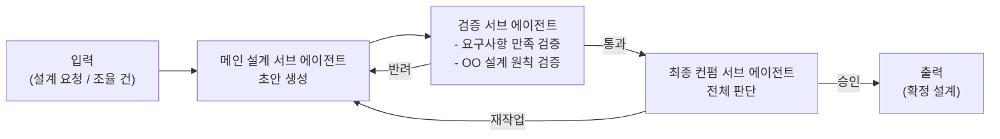

# 에이전트 역할 정의

> 본 문서는 [`proposal-main.md`](../proposal-main.md) §3 에서 분리. (#66)

### 3.1. 역할 매트릭스

| 에이전트 | 코드명 | 핵심 역할 | 페르소나 | 주요 상호작용 |
|----------|--------|-----------|----------|--------------|
| **Primary** | **P** | 사용자와 기획 협의, PRD 작성, 외부 PM 도구 동기화, 프로젝트 전체 관리 | PM | 사용자, A, L, 외부 PM 도구 |
| **Architect** | **A** | 사용자와 기술 설계 협의, OO 설계 주도, 설계 결정권 보유, Diff 검증 | 시스템 아키텍트 | 사용자, P, L, 각 Eng+QA 페어 |
| **Librarian** | **L** | Diff 색인, 복잡한 질의 응답, 그래프 무결성 보장 | 지식 관리자 | 전 에이전트 |
| **Engineer** | **Eng:{역할}** | A의 1차 설계 기반 세부 설계·구현·검증 자율 수행, Diff를 L에게 전달 | 역할별 SW 엔지니어 | A, 페어 QA, L, 유관 Eng |
| **QA** | **QA:{역할}** | A의 설계 수신 → 독립적 테스트 코드 작성, 빌드/테스트 실행, 검증 | 역할별 테스트 엔지니어 | A, 페어 Eng, L |

> **에이전트가 아닌 보조 모듈:**
> **Chronicler** — Valkey Streams를 구독하여 A2A 대화 이벤트를 Doc Store에 영속화하는 경량 Consumer. LLM, LangGraph, Role Config를 사용하지 않는 단순 Python 스크립트 수준의 모듈. 에이전트 역할 정의에서 다루지 않으며, 인프라로 취급. (섹션 2.6 참조)

### 3.2. 에이전트별 상세 책임

## Primary (P) - 프로젝트 매니저

**사용자 접점 (기획 영역):**
- 언제든 사용자와 채팅으로 소통, 작업 도중에도 중간 개입 수용
- 사용자와의 논의를 통해 추상적 요구사항을 구체화하여 **PRD 작성**
- PRD 변경이 발생하면 A와 재협의

**프로젝트 관리:**
- PRD를 Doc Store에 기록 + 외부 PM 도구(GitHub Wiki/Issue 등)에도 동기화
- 태스크 분해 후 우선순위 결정
- 전체 진행 상황 추적 (Librarian 조회를 통해 Task/Session/Item 확인)
- 최종 결과물 취합 및 사용자 보고

## Architect (A) - 시스템 아키텍트

**사용자 접점 (기술 영역):**
- 언제든 사용자와 채팅으로 소통, 기술 설계 및 기술 결정에 대한 중간 개입 수용
- 사용자의 기술적 질의/조율 요청에 대응

**설계 주도:**
- **객체지향 관점의 1차 설계**를 수행하여 Eng+QA 페어에게 동시 전달
- Interface/Class/PublicMethod 레벨의 계약 정의
- 설계 결정권 보유 — Eng의 세부 구현 자율성은 인정하되 상위 설계는 A가 결정

**조율 및 검증:**
- Eng이 상위 설계 수정을 제안할 경우 영향 범위 분석
- 수정이 다른 Eng의 작업에 영향을 미칠 경우 **유관 Eng과 함께 다자간 논의** 주관
- Eng의 Diff 제출 시 L의 색인 결과를 기반으로 설계 적합성 검증
- Eng+QA 페어의 최종 보고서 검수 (Quality Gate)

**A의 내부 서브 에이전트 구조 (자체 피드백 루프):**

A는 단일 LangGraph 내에 3개의 서브 에이전트로 구성된 자체 피드백 루프를 보유한다. 각 서브 에이전트는 **서로 다른 LLM 모델**을 사용할 수 있다.

| 서브 에이전트 | 책임 | LLM 모델 선택 예시 |
|-------------|------|-------------------|
| 메인 설계 | 1차 설계 초안 생성 | 코딩/설계 특화 모델 |
| 검증 | 요구사항 충족 여부 + OO 원칙(SOLID 등) 준수 여부 검증 | 추론 특화 모델 |
| 최종 컨펌 | 두 결과를 종합하여 최종 판단 | 균형 잡힌 고성능 모델 |

## Librarian (L) - 지식 관리자

**Diff 색인 (핵심 책임):**
- Eng의 diff(파일 목록 + 변경 내역 + 기술 노트) 수신
- OO 관점 분석 → Atlas의 Interface/Class/PublicMethod 노드/관계 업데이트
- 기술적 개념/아이디어/주의사항/TODO 추출 → Doc Store 색인
- **Eng은 diff만 전달하면 됨** — 색인 해석 책임은 Librarian에 있음

**지식 기록:**
- 다른 에이전트가 전달한 태스크 정보(목표, 기능, 진행 상태, 히스토리) 기록
- 기술 사항(설계 결정, 구현 특이점) 문서화

**질의 응답:**
- 자연어 질의 수신 → Atlas + Doc Store 교차 쿼리 (Chronicler가 저장한 대화 이력 포함)
- `by_task`, `by_session`, `by_item`, `thread` 등 조회 API 제공
- **`get_task_context(task_id)` — Code Agent 컨텍스트 조립 전용 API**
    - Atlas 쿼리: Task → AFFECTS → Interface → IMPLEMENTS → Class → 파일 경로
    - 반환: `{ targets: [편집 대상 파일 경로], references: [의존 인터페이스/클래스의 시그니처 수준 메타] }`
    - Eng/QA가 OpenCode 호출 전에 사용 (섹션 2.8 참조)

**책임 아닌 것:**
- A2A 대화 로그 수집은 **Librarian의 책임이 아니다**. Chronicler가 전담.

**기술적 제약:**
- Atlas의 쓰기 권한자 (+ technical_notes 등 구조화된 문서 쓰기)
- 자신도 MCP를 통해 DB에 접근 (직접 연결 아님) → 다른 에이전트와 일관된 접근 패턴 유지

## Eng+QA 페어 - 구현/검증 단위

Eng와 QA는 **역할별로 1:1 페어**를 이루지만, A의 1차 설계를 **동시에** 수신하여 각자의 작업을 **병렬로** 수행한다. Eng이 구현을 진행하는 동안 QA는 독립적으로 테스트 코드를 작성한다.

**페어 프리셋 (예시):**

| Eng | QA | 담당 영역 |
|-----|-----|-----------|
| `Eng:BE` | `QA:BE` | API, 서버 로직, DB 스키마, 인증/인가 |
| `Eng:FE` | `QA:FE` | UI 컴포넌트, 클라이언트 상태, UX |
| `Eng:DevOps` | `QA:DevOps` | CI/CD, 인프라, 컨테이너, 모니터링 |
| `Eng:Data` | `QA:Data` | 파이프라인, ETL, 스키마 마이그레이션 |
| `Eng:Mobile` | `QA:Mobile` | iOS/Android, 크로스 플랫폼 |
| `Eng:...` | `QA:...` | 프로젝트별 자유 정의 |

**Engineer (Eng:{역할})의 책임:**

- A의 **객체지향적 1차 설계** 수신 (Interface/Class/PublicMethod 계약)
- **자체 설계-구현-검증 루프 자율 수행:**
    - 클래스/메소드/서브 패키지 레벨의 세부 설계는 Eng이 자율적으로 결정
    - 구현 과정에서 빌드/유닛테스트를 스스로 돌려 내부 검증
- **상위 설계 수정 건의:**
    - 세부 구현 중 상위 설계 변경이 불가피하다고 판단되면 A에게 **의견 전달**
    - 설계 수정의 주도권과 결정권은 A에 있음 (Eng은 건의자)
    - A가 다자간 논의를 소집하면 유관 Eng으로 참여
- **Diff 제출:**
    - 구현 단계 완료 시 Librarian에게 **diff(파일 목록 + 파일별 변경)** 전달
    - 기술적 개념/설계 결정/주의사항/TODO를 함께 첨부
    - Librarian이 색인을 마치면 A에게 구현 완료 보고

**QA (QA:{역할})의 책임:**

- A의 **객체지향적 1차 설계** 수신 (Eng과 동시)
- Interface/Class/PublicMethod 계약을 근거로 **독립적으로 테스트 코드 작성**
    - 주로 유닛 테스트와 outbound 어댑터 목업 테스트
    - Eng의 구현 완료를 기다리지 않고 설계 스펙 기반으로 선행 작성
- Eng의 구현 완료 시:
    - **빌드 실행** → 컴파일/빌드 에러 확인 (인터프리터 언어는 필요 시 스킵)
    - **준비한 테스트 코드 실행** → 통과/실패 판정
- **설계 변경 대응:**
    - A가 설계를 수정하면 QA도 수정된 설계를 수신하여 테스트 코드를 재작성
- 테스트 결과 보고서 작성 → A에게 제출

**동적 구성 원칙:**
- 프로젝트 초기화 시 P가 필요한 역할을 결정 → 역할당 Eng+QA 페어 컨테이너 생성
- 프로젝트 진행 중에도 페어 추가/제거 가능
- 각 에이전트는 독립 컨테이너로 실행 (1 Eng + 1 QA = 2 Containers per 역할)
