# 단일 에이전트 내부 구조

> 본 문서는 [`proposal-main.md`](../proposal-main.md) §2.3 에서 분리. (#66)

모든 에이전트는 "**LLM API로 사고하고, 필요할 때만 OpenCode CLI로 행동한다**"는 원칙을 따른다.

```mermaid
graph TD
    subgraph Container["Docker Container (1 Agent)"]
        direction TB
        RoleConfig["Role Config<br/>페르소나 / 워크플로우 확장 /<br/>MCP·A2A 피어 목록"]

        subgraph LG["LangGraph (워크플로우 엔진 + A2A)"]
            Base["공통 워크플로우<br/>수신 → 사고(LLM) → 행동 → 검증(LLM) → 응답"]
            Ext["역할별 확장 서브그래프<br/>(예: A의 3-서브 에이전트 루프,<br/>Eng의 자체 설계-구현-검증 루프)"]
            Base -.-> Ext
        end

        subgraph Adapters["내부 어댑터 (OCP)"]
            LLMAdapter["LLM Adapter<br/>Claude / OpenAI / ..."]
            CodeAdapter["Code Agent Adapter<br/>OpenCode / Claude Code / Aider<br/>(P, L 은 비활성)"]
        end

        subgraph LocalMCP["MCP 클라이언트"]
            RoleMCP["역할별 MCP 도구<br/>(코드 검색/편집/테스트 등)"]
            SharedMemClient["Shared Memory MCP 클라이언트<br/>(전 에이전트 — write / read 직접)"]
            ExtPmClient["External PM MCP 클라이언트<br/>(P 만)"]
            ResearchClient["외부 리소스 조사 MCP 클라이언트<br/>(context7 / web-fetch — L 만)"]
        end

        A2A["A2A 서버/클라이언트<br/>(langgraph-api 내장)<br/>- POST /a2a/{assistant_id}<br/>&nbsp;&nbsp;SendMessage · SendStreamingMessage · GetTask<br/>- GET /.well-known/agent-card.json"]
        BrokerClient["Valkey 클라이언트<br/>(대화 이벤트 publish 전용)"]
    end

    Peers["다른 에이전트들"]
    Librarian["Librarian<br/>(정보 검색 / 외부 조사 위임 대상)"]
    Broker["Valkey Streams<br/>(대화 로그 브로커)"]
    SharedMemMCP["Shared Memory MCP<br/>(Doc Store / Atlas)"]
    ExtPmMCP["External PM MCP"]
    ResearchMCP["외부 리소스 조사 MCP<br/>(context7 / web-fetch)"]

    RoleConfig -.페르소나 / 워크플로우 확장.-> LG
    RoleConfig -.모델·구현체 선택.-> Adapters
    %% LocalMCP, A2A는 RoleConfig의 목록을 읽어 초기화 (자명하므로 엣지 생략)
    %% BrokerClient는 RoleConfig와 무관 — 환경변수로 Valkey 설정 주입

    A2A <-->|A2A 프로토콜| Peers
    A2A -->|자연어 정보 검색 / 외부 조사 위임| Librarian
    BrokerClient -->|XADD a2a-events| Broker
    SharedMemClient -->|MCP 호출| SharedMemMCP
    ExtPmClient -.P만.-> ExtPmMCP
    ResearchClient -.L만.-> ResearchMCP
```

**다이어그램 요지:**
- 각 에이전트는 **모듈별 독립 이미지**로 빌드되지만, **공통 코드는 `shared/` 패키지에서 import**하여 LangGraph 베이스, A2A, MCP 클라이언트 등의 중복을 피한다
- Role Config에 따라 페르소나, 워크플로우 확장, 사용 도구, A2A 피어가 결정된다
- 공통: LangGraph 베이스 워크플로우, LLM 어댑터, A2A 서버/클라이언트, 역할별 MCP 도구
- 역할에 따라 달라짐:
    - **Code Agent Adapter**: P, L 은 비활성 / 그 외는 활성
    - **Shared Memory MCP 클라이언트**: 전 에이전트 활성 (write / read 직접 — [architecture-shared-memory](architecture-shared-memory.md) 분담 모델 정정)
    - **External PM MCP 클라이언트**: P 만 활성
    - **외부 리소스 조사 MCP 클라이언트** (context7 / web-fetch): L 만 활성 ([architecture-external-research](architecture-external-research.md))
    - **워크플로우 확장**: A의 3-서브 에이전트 루프, Eng의 자체 루프 등 역할별 서브그래프

## 에이전트 유형별 구성

| 에이전트 | 두뇌 (판단) | 손 (실행) | 비고 |
|----------|-----------|----------|------|
| P | LLM API | 없음 | 판단/소통만 수행 |
| A | LLM API | OpenCode CLI | 리뷰/검수 시 코드 조작 |
| L | LLM API | 없음 | 사서 — DB 정보 검색 + 외부 리소스 조사 (전담). 자연어 요청을 도구 호출로 매핑 |
| Eng:* | LLM API | OpenCode CLI | 코드 구현 |
| QA:* | LLM API | OpenCode CLI | 테스트 작성/실행 |

- **P만 예외적으로 OpenCode CLI 없이 동작** — 코드를 직접 다루지 않으므로
- 판단/검증 노드는 가벼운 LLM API, 실행 노드만 OpenCode CLI 호출
- LangGraph가 내부 상태 머신을 관리하여 단순 1회 응답이 아닌 단계적 과업 수행
