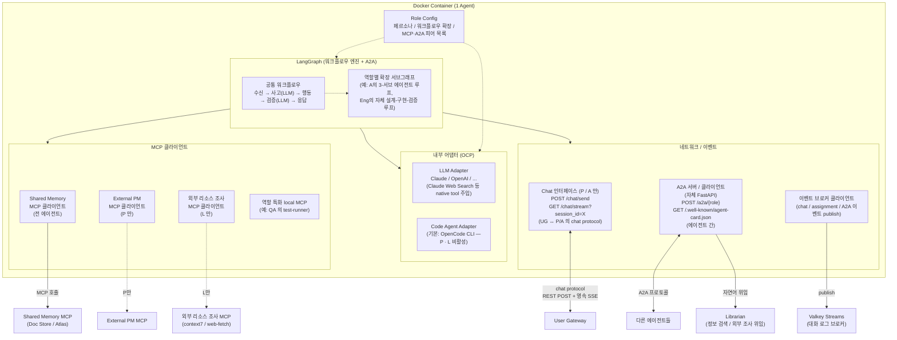

# 단일 에이전트 내부 구조

> 본 문서는 [`proposal-main.md`](../proposal-main.md) §2.3 에서 분리. (#66)

모든 에이전트는 "**LLM API로 사고하고, 필요할 때만 OpenCode CLI로 행동한다**"는 원칙을 따른다.

**다이어그램 요지:**
- 각 에이전트는 **모듈별 독립 이미지**로 빌드되지만, **공통 코드는 `shared/` 패키지에서 import**하여 LangGraph 베이스, A2A, MCP 클라이언트 등의 중복을 피한다
- Role Config에 따라 페르소나, 워크플로우 확장, 사용 도구, 통신 인터페이스가 결정된다
- 공통: LangGraph 베이스 워크플로우, LLM 어댑터, A2A 서버/클라이언트, 역할별 MCP 도구
- **통신 인터페이스 두 종류** — chat protocol (UG ↔ P/A 한정) / A2A (에이전트 간). 사용자와 직접 chat 하는 P · A 만 chat endpoint 노출 ([architecture-chat-protocol](architecture-chat-protocol.md))
- 역할에 따라 달라짐:
    - **Code Agent Adapter**: Primary, Librarian 은 비활성 / 그 외는 활성
    - **Shared Memory MCP 클라이언트**: 전 에이전트 활성 (write / read 직접 — [architecture-shared-memory](architecture-shared-memory.md) 분담 모델 정정)
    - **External PM MCP 클라이언트**: Primary 만 활성
    - **외부 리소스 조사 MCP 클라이언트** (context7 / web-fetch): Librarian 만 활성 ([architecture-external-research](architecture-external-research.md))
    - **그래프 토폴로지 — building blocks 조립** (#75 PR 3 정정): 각 agent 의
      `graph.py` 가 `shared/agent_graph/` (ReAct llm_call / tool_node /
      should_continue) + `shared/a2a/decision.py` (A2A 응답 shape 결정)
      의 building blocks 를 import 해 자기 그래프를 명시적으로 조립.
      옛 디자인의 **config-driven extension dispatch** (`workflow.base +
      workflow.extensions` 로 config 가 base 그래프 + 얹을 sub-graph 모듈을
      선언 → 코드가 dynamic compose) 는 채택하지 않음 — 추상화 과잉 위험.
      agent 별 차별화는 `graph.py` 의 `add_node` 호출 (어떤 노드 / edge 로
      구성할지) 로 표현.
    - **LangGraph subgraph feature 는 별 사안 — 사용 가능**: 위 결정은
      *config 가 dispatch 하는 패턴* 거부일 뿐, LangGraph 자체의 subgraph
      (`StateGraph` 안 `StateGraph`) composition 은 자유롭게 사용 가능.
      예: Architect 의 three-stage design (설계 → 검증 → 컨펌) 같이 자연스러운
      subgraph 단위는 `build_graph()` 안에서 `builder.add_node("stage1",
      build_stage1_subgraph())` 식으로 명시적으로 끼움. config 가 아닌 **코드
      가 결정** — 옵션 D 의 정신 그대로.
    - **agent 별 능력 (추후 노드로 분화될 책임 영역)**: 정체성 / 행동 원칙은
      `config/base.yaml` 의 `persona`, 도메인 워크플로 가이드는
      `agents/<name>/resources/*.md`. 대표 책임:
        - **Primary** — 사용자 chat, PRD 작성·관리, 외부 PM 동기화
        - **Architect** (M4+) — 3-stage design (설계 → 검증 → 컨펌), 복수 설계안, 채택 / 미채택 영속, 다자간 논의 소집
        - **Librarian** — 자연어 질의 응답, 외부 리소스 조사 3 트랙 dispatch
        - **Engineer** (M5+) — 세부 설계 자율 루프, 컨텍스트 정제, 상위 설계 escalation, atlas 색인
        - **QA** (M5+) — 컨텍스트 정제, 독립 테스트 작성, 빌드 / 테스트 실행, 설계 변경 적응
        - 책임이 별 그래프 노드로 분화될 필요가 명확해지면 그때 graph.py 에 노드 추가. 지금은 persona 가이드 + ReAct 루프로 흡수

## 에이전트 유형별 구성

| 에이전트 | 두뇌 (판단) | 손 (실행) | 비고 |
|----------|-----------|----------|------|
| Primary | LLM API | 없음 | 판단/소통만 수행 |
| Architect | LLM API | OpenCode CLI | 리뷰/검수 시 코드 조작 |
| Librarian | LLM API | 없음 | 사서 — DB 정보 검색 + 외부 리소스 조사 (전담). 자연어 요청을 도구 호출로 매핑 |
| Engineer:* | LLM API | OpenCode CLI | 코드 구현 |
| QA:* | LLM API | OpenCode CLI | 테스트 작성/실행 |

- **Primary만 예외적으로 OpenCode CLI 없이 동작** — 코드를 직접 다루지 않으므로
- 판단/검증 노드는 가벼운 LLM API, 실행 노드만 OpenCode CLI 호출
- LangGraph가 내부 상태 머신을 관리하여 단순 1회 응답이 아닌 단계적 과업 수행
