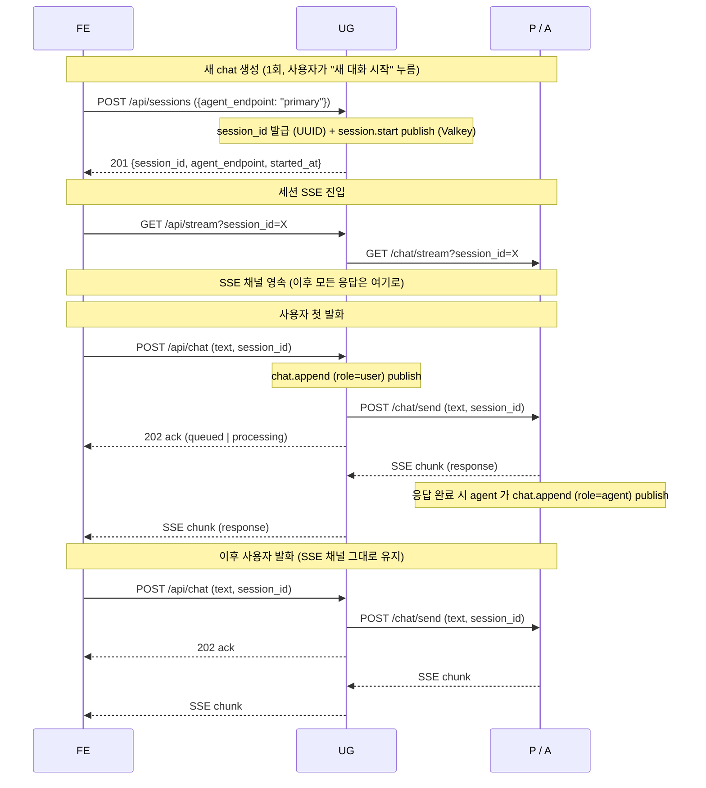

# Chat Protocol — UG ↔ Primary / Architect

> #75 — 사용자 ↔ 에이전트 통신 영역에 대한 자체 프로토콜 정의.

사용자와 Primary / Architect 간 통신을 위한 별도 프로토콜. A2A 가 아닌 자체
정의. A2A 는 에이전트 간 통신 한정으로 사용 ([messaging.md](../../shared/src/dev_team_shared/a2a/messaging.md)).

## 1. 왜 별도 프로토콜인가

**사용자 ↔ 에이전트 통신은 에이전트 ↔ 에이전트 통신과 다른 영역**.
A2A (Agent-to-Agent) 는 이름 그대로 에이전트 사이의 협상 / 위임 / 자동화된
협업을 위한 프로토콜이다. 사용자가 인터페이스 너머에서 자연어로 발화하는
chat 은 그 영역과 본질적으로 다른 사용 사례 — 별도로 정의하는 게 자연스럽다.

A2A 스펙 자체는 chat 류 사용도 허용한다 — `Message` 만 주고받는 trivial
interaction 모드가 명시되어 있다 ([A2A 공식 가이드](https://discuss.google.dev/t/a2a-protocol-demystifying-tasks-vs-messages/255879):
"Messages for Trivial Interactions" / "Tasks for Stateful Interactions").
즉 A2A 위에서 chat 을 굴리는 게 스펙 위반은 아님.

다만:
- **우리 현재 구현이 모든 SendMessage 응답을 Task 로 자동 wrap** 한다
  (`graph_handlers/factories.py` 의 `make_*_task` 만 사용) — 이는 단순화
  이지 스펙 요구사항 아님. 그 결과 사용자의 단순 발화 ("안녕", "뭐 있어?")
  마다 A2A Task 객체가 만들어지고, agent_tasks 가 chronicler-fallback 으로만
  채워지는 등의 운영 어색함 발생 (#69).
- **이 자동 Task wrap 을 풀어 trivial / stateful 분기를 해도** chat 은
  어차피 사용자-에이전트 영역이라 (에이전트 간 아님) A2A 의 어휘 (Context /
  Message / Task) 를 그대로 쓰는 것보다 사용자-에이전트 인터랙션에 적합한
  자체 어휘 (Session / Chat / Assignment) 로 정의하는 게 의미상 깔끔.

→ 사용자 ↔ Primary / Architect 의 chat 은 자체 chat protocol 로 분리 정의.
P/A 는 chat 중 합의된 작업을 **Assignment 로 발급** 하고, 그 실행을 다른
agent 에게 A2A 로 위임 (에이전트 간 협상은 A2A 로 자연스럽게 처리).

## 2. 어휘

| 객체 | 정의 |
|---|---|
| **Session** | 한 대화창 단위 (UG↔P/A). server-side 영속 (Doc Store `sessions` 테이블). 한 session = 한 agent_endpoint (`primary` / `architect`) |
| **Chat** | Session 안에서 주고받은 한 발화. server-side 영속 (Doc Store `chats` 테이블). `prev_chat_id` 로 시간순 chain |
| **Assignment** | Chat 중 합의된 도메인 work item. P/A 가 발급 (Doc Store `assignments`). 한 Assignment 안에서 여러 A2A Task 발생 가능 |

자세한 schema 는 [knowledge-model](knowledge-model.md) §4.2.

## 3. 통신 layer — Pattern A (영속 SSE per session)

### 흐름



**Session lifecycle**:
- `session.start` publish 는 **`POST /api/sessions` 처리 시점 1회만**. 후속 `POST /api/chat` 호출은 `chat.append` 만 publish (`session.start` 재발화 X)
- session 은 종료 개념 없음 — `session.end` event / `sessions.ended_at` 컬럼 두지 않음. 사용자가 언제든 재개 가능 (Slack DM / ChatGPT 류)
- archive 가 필요해지면 별도 컬럼 (`archived_at`) — 본 protocol 범위 밖

**이유**:
- POST 와 응답 channel 분리 → semantic 깔끔 (request != response stream)
- 영속 SSE 라 server-initiated push 미래 자연 (외부 이슈 변경 알림 같은 unprompted 이벤트)
- 큐 처리 자연 — POST 즉시 ack, 응답은 SSE 분리 도착
- 기존 SSE 인프라 (라우터 / keepalive / disconnect 폴링) 재사용

대안 (per-POST SSE) 은 multi-POST while busy 시 응답 분배 모호 — 채택 안 함.

### Endpoint 매트릭스

| Endpoint | 위치 | 호출자 | 책임 |
|---|---|---|---|
| `POST /api/sessions` | UG | FE | **새 chat session 생성**. body: `{agent_endpoint: "primary" \| "architect"}`. UG 가 session_id (UUID) 발급 → `session.start` publish → 응답: 201 `{session_id, agent_endpoint, started_at}` |
| `GET /api/sessions` | UG | FE | chat list 조회 (사이드바 hydrate) |
| `GET /api/history?session_id=X` | UG | FE | 새로고침 / 새 탭 시 chats hydrate |
| `POST /api/chat` | UG | FE | 사용자 발화 제출. body: `{session_id, text}`. UG 가 `chat.append` (role=user) publish → agent forward. 응답: 202 + `{queued \| processing}` |
| `GET /api/stream?session_id=X` | UG | FE | 영속 SSE 채널. 모든 응답 / queued ack / lifecycle 이벤트 receive |
| `POST /chat/send` (내부) | 각 agent (P / A) | UG | UG 가 forward. agent 가 응답 생성 시 `chat.append` (role=agent) publish |
| `GET /chat/stream?session_id=X` (내부) | 각 agent (P / A) | UG | UG 가 SSE 중계 |

### Publish 분담 (Valkey Streams `a2a-events`)

| Event | publisher | 트리거 |
|---|---|---|
| `session.start` | UG | `POST /api/sessions` 처리 시점 1회 |
| `chat.append` (role=user) | UG | `POST /api/chat` 받은 시점 |
| `chat.append` (role=agent) | agent (P / A) | agent 가 응답 생성 직후 (자기 발화는 자기가 — UG 가 대신 publish 안 함) |
| `assignment.create / update` | agent (P / A) | chat 중 합의된 work item 발급 시점 |
| `a2a.*` | agent A2A handler | 에이전트 간 통신 (별 layer, 본 protocol 범위 밖) |

### Routing

UG 가 session 의 `agent_endpoint` 컬럼 보고 해당 agent 의 internal endpoint
호출. 한 FE-facing SSE 가 한 agent-side SSE 와 1:1 매칭.

## 4. FE 측 영속 / 상태 관리

server `sessions` 테이블이 source of truth. FE 의 localStorage 는 chat list
표시 / active session 빠른 전환을 위한 **cache 역할만**:

```
localStorage:
  activeSessionId   ← 현재 열려 있는 chat 의 session_id
  sessions          ← chat list cache (id, title, agent_endpoint, last_chat_at)
```

페이지 로드 시:
1. localStorage 에서 `activeSessionId` 복원
2. `GET /api/sessions` 로 chat list refresh
3. `GET /api/history?session_id=<active>` 로 활성 session 의 chats hydrate
4. `GET /api/stream?session_id=<active>` 로 영속 SSE 재연결

새 chat 시작 → 새 session 생성 (`POST /api/sessions`) → 활성 전환.

> UI 구체 (chat list 를 사이드바로 표시할지 / 드롭다운 / 별도 화면 등) 는 FE
> 구현 영역. 본 protocol spec 은 server-FE 데이터 흐름과 localStorage 의
> 캐시 구조만 정의.

### SSE 재연결 정책 (page reload / network drop / sleep 후 깨어남)

**옵션 B 채택**: `GET /api/history` hydrate + 새 SSE 연결 (gap 허용).

```
SSE 끊김 감지
   ↓
재시도 backoff
   ↓
GET /api/history?session_id=X  — 끊긴 사이 영속된 chats hydrate
   ↓
GET /api/stream?session_id=X   — 새 SSE 연결 (현재 시점부터)
```

이유:
- 끊긴 사이 *완료된* `chat.append` 는 chronicler 가 `chats` row 로 영속화 — `GET /api/history` 가 확실히 받음
- 끊긴 사이 *streaming 중* 이던 chunks 만 잃음 (완료되면 다음 history 조회 시 받음). 사용자 시점에서 "다시 봤을 때 빠진 게 채워져 있으면 OK"
- 인프라 추가 없음 (ring buffer / pub/sub 같은 추가 store 불필요)
- 추후 부족 시 SSE 표준 `Last-Event-ID` 헤더 + server ring buffer 로 진화 가능

### `sessions.metadata` 표준 키

`sessions.metadata` (JSONB) 의 표준 키 셋 (FE / agent 일관 사용):

| 키 | 타입 | 채우는 주체 | 용도 |
|---|---|---|---|
| `title` | string | 메인 응답 LLM 의 structured output (첫 turn 후) 또는 사용자 명시 rename | 사이드바 chat list 표시 |
| `last_chat_at` | timestamp | Chronicler (매 `chat.append` 처리 시 갱신) | 사이드바 정렬 |
| `pinned` | bool | 사용자 액션 (`PATCH /api/sessions/{id}`) | 사이드바 고정 |
| `unread_count` | int | FE (SSE 끊긴 동안 누적, 다시 볼 때 0 reset) | 사이드바 unread 표시 |

JSONB 라 비표준 키 자유 추가 가능 (extensibility). 표준은 위 4개에만.

> `participants` / `agent_endpoint` 는 metadata 에 넣지 않음 — 컬럼 (`agent_endpoint`) 이 이미 표현. 향후 multi-party chat 가능해지면 재검토.

## 5. 메시지 큐 — Primary / Architect 측 책임 (#72)

사용자와 chat 하는 에이전트 (P / A — M4+ 부터 A 도 포함) 의 chat handler 가
thread-level 동시성 관리:

- **idle**: 즉시 graph 호출 → SSE 로 chunk
- **busy**: in-process 큐에 적재 → POST 응답 `queued` ack + SSE 로 `queued`
  이벤트 (FE 가 사용자 발화 버블에 "큐에 적재됨" 표시)
- 처리 끝나면 큐 drain → 누적 메시지 batch 로 단일 user message 합쳐 graph
  호출. Separator 로 timestamp 메타 포함:
  ```
  사용자 첫 발화

  [N초 뒤 추가 발화]
  사용자 둘째 발화
  ```

### 의미 판단은 main LLM 에 위임

오타 noise / 정정 / 보충 / 명시 cancel 의도 같은 **의미 판단은 P / A 의
main LLM 이 persona 가이드** 로 처리. UG 는 인터페이스만, 의미 영역은 agent
책임 (SOLID / SRP — UG 가 LLM 가지지 않음).

persona 가이드 (P / A 공통 패턴):
> 사용자가 응답 도중 추가 발화한 메시지가 batch 로 들어올 수 있다.
> separator `[N초 뒤 추가 발화]` 가 보이면 다음과 같이 판단:
> - 의미 없는 오타 / 1~2 글자 noise → 무시하고 본 의도에 응답
> - 보충 / 정정 → 통합해서 응답
> - 명시 중단 의도 ("멈춰", "그만", "다시") → 진행 방향 재검토

자세한 정책 / 구현은 #72.

### In-memory ChatEvent 버퍼 정책 (#75 PR 4)

agent 의 chat handler 가 한 session 당 보유하는 in-memory 버퍼는
`shared/chat_protocol/session_runtime.py` 의 `SessionRuntime` 으로 통일 (P / A
공통). 정책:

| 항목 | 정책 |
|---|---|
| Send | **non-blocking** — graph 의 forward progress 가 SSE consumer 상태와 결합되지 않음. consumer 끊긴 채여도 graph 가 멈추지 X (LLM call 노드 종료 → AIMessage state append → checkpoint snapshot 보장) |
| Buffer overflow drop 단위 | **message** — backlog 가 `MAX_BACKLOG_MESSAGES` (기본 5) 초과 시 oldest message 의 chunks 통째 atomic drop. partial message 가 buffer 에 남지 X |
| TTL evict | **마지막 send 시각 기준 idle** — `IDLE_TTL_S` (기본 30분) 초과 시 background sweeper 가 SessionRuntime evict + 진행 중 task `cancel()`. message 흐르는 동안엔 evict X (매 send 가 timer 갱신) |

알려진 한계:
- 단일 process in-memory — 다중 instance scale-out 시 sticky routing 필요 (M3
  scope 가정)
- TTL evict 가 진행 task 를 cancel — 그 시점까지의 graph state 는 LangGraph
  checkpoint 에 보존되므로 다음 POST 가 이어 받을 수 있음 (손실 X)
- Subscriber 1명 (FE 한 탭) 가정 — multi-tab broadcast 필요해지면 v2

## 6. Cancel / Stop

### 자연어 cancel ("그만", "멈춰" 등)

- 큐에 적재되어 main LLM 까지 전달됨
- LLM 이 의미 판단해서 다음 turn 에서 사과 / 재시도
- 단점: 응답 chunk 이미 흘러간 후라 즉시 중단 못 함

### 명시 Stop (Stop 버튼)

- FE 의 명시 cancel UI — 영속 SSE 의 별 RPC 호출 (`POST /api/stop?session_id=X`)
- UG 가 agent 에게 cancel 신호 forward (예: WebSocket close 또는 명시 `POST /chat/cancel`)
- agent 는 graph 즉시 cancel + 큐 폐기

## 7. 영속 / Chronicler

UG / agent 가 chat lifecycle 이벤트를 Valkey Streams 로 publish:

| 이벤트 | 트리거 | publisher |
|---|---|---|
| `session.start` | `POST /api/sessions` 처리 시점 (사용자가 새 chat 명시 생성) | UG |
| `chat.append` | 사용자 / agent 의 발화 | UG (user 발화) / agent (agent 발화) |

**session 은 종료 개념이 없다.** chat 대화창은 사용자가 언제든 재개할 수
있는 namespace (Slack DM / ChatGPT 류) — `session.end` 이벤트 / `sessions.
ended_at` 컬럼 모두 두지 않는다. archive / delete 가 필요해지면 그땐 별도
컬럼 (예: `archived_at`) 으로.

Chronicler 가 consume 해 Doc Store `sessions` / `chats` 컬렉션에 영속화
([architecture-event-pipeline](architecture-event-pipeline.md)).

P/A 의 Assignment 발급은 별도 이벤트 (`assignment.create` / `assignment.update`).

## 8. A2A 와의 경계

| 항목 | Chat tier | A2A tier |
|---|---|---|
| 통신 주체 | 사용자 ↔ Primary / Architect | 에이전트 ↔ 에이전트 |
| Transport | REST POST + 영속 SSE per session | JSON-RPC 2.0 over HTTP, SSE for streaming |
| 식별자 | `session_id` (서버 발급 UUID) | `contextId` (A2A wire), `traceId` (트리 join) |
| 메시지 객체 | Chat (Doc Store `chats`) | A2A Message (Doc Store `a2a_messages`) |
| 작업 단위 | Assignment (Doc Store `assignments`) | A2A Task (Doc Store `a2a_tasks`) |
| Lifecycle | Session start (종료 없음) + Chat append | A2A Context start/end (agent 결정) + Task SUBMITTED→COMPLETED |
| Spec | 자체 정의 (본 문서) | [A2A v1.0](https://a2a-protocol.org/latest/specification/) |

A2A Context 가 chat session 에서 비롯되는 경우 `a2a_contexts.parent_session_id` /
`parent_assignment_id` 로 source 추적 ([knowledge-model](knowledge-model.md) §4.2).

## 9. 관련

- 본 프로토콜 도입 시발: #75 (UG↔P/A chat tier 분리 재설계)
- Doc Store schema: [knowledge-model](knowledge-model.md) §4.2
- A2A 프로토콜 (대비): [shared/a2a/messaging.md](../../shared/src/dev_team_shared/a2a/messaging.md)
- UG 측 책임: [architecture-user-gateway](architecture-user-gateway.md)
- Primary / Architect 큐 정책: #72
- FE multi-chat UI: #70
- Stop 버튼 / streaming flag: #71
