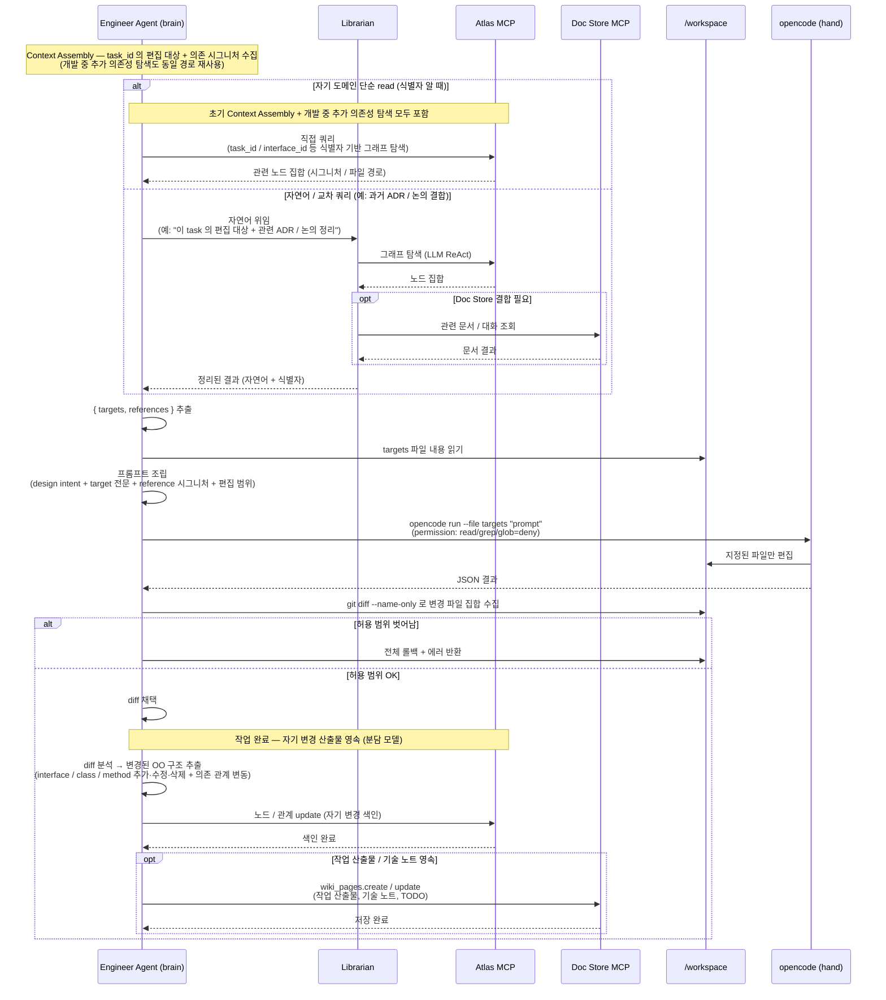

# Code Agent 실행 전략 (OpenCode CLI)

> 본 문서는 [`proposal-main.md`](../proposal-main.md) §2.8 에서 분리. (#66)

Code Agent(기본 구현체 OpenCode CLI)는 에이전트의 "손"이다. 두뇌(LangGraph + LLM API)가 무엇을 할지 결정하면, Code Agent가 지정된 파일만 편집한다. **Atlas로 컨텍스트를 정제하는 설계 의도를 보존하기 위해 Code Agent는 자유 탐색이 아닌 통제된 실행 환경에서 기동된다.**

## 실행 방식: Subprocess (Non-Interactive)

OpenCode CLI는 TypeScript + Bun 런타임 기반으로, Python 에이전트가 자식 프로세스로 기동한다.

```python
# shared/adapters/code_agent/opencode_cli.py (의사 코드)
proc = subprocess.Popen(
    ["opencode", "run",
     "--format", "json",
     "--cwd", "/workspace",
     "--file", *target_files,         # 허용된 파일만 컨텍스트로 첨부
     assembled_prompt],
    env={**os.environ, "ANTHROPIC_API_KEY": config.llm.api_key},
    stdout=subprocess.PIPE, stderr=subprocess.PIPE, text=True,
)
stdout, stderr = proc.communicate(timeout=config.timeout)
# 실행 후 git diff로 허용 범위 검증 (2차 방어)
```

- **One-shot 모드**: 매 호출이 독립된 OpenCode 프로세스 — 단순·재현성 높음
- 상태 유지가 필요한 긴 작업은 LangGraph가 외부에서 여러 단계로 분할

## Tool Permission 제어 (1차 방어)

OpenCode는 `opencode.json`의 `permission` 필드로 도구별 `allow` / `ask` / `deny` 제어를 지원한다. **Eng/QA에서는 탐색 도구(read/grep/glob)를 물리적으로 차단**하여 Atlas가 정제한 컨텍스트만 사용하도록 강제한다.

```json
// 예: Eng 에이전트의 opencode.json (실행 시 Role Config에서 자동 생성)
{
  "$schema": "https://opencode.ai/config.json",
  "permission": {
    "read":  "deny",
    "grep":  "deny",
    "glob":  "deny",
    "edit":  "allow",
    "write": "allow",
    "bash":  "deny"
  }
}
```

## 역할별 권한 매트릭스

| 에이전트 | read | grep | glob | edit | write | bash | 운영 의도 |
|---------|:----:|:----:|:----:|:----:|:-----:|:----:|----------|
| **A** (리뷰/검수) | allow | allow | allow | deny | deny | deny | 광범위 읽기 필요, 편집은 설계 문서(docs/design)에만 (Python 래퍼가 경로 가드) |
| **Eng:*** | **deny** | **deny** | **deny** | allow | allow | deny | Atlas로 정제된 컨텍스트만 사용, 빌드·테스트는 QA 담당 |
| **QA:*** | **deny** | **deny** | **deny** | allow | allow | **allow** | 테스트 작성 + 빌드·테스트 실행 |

## Context Assembly 흐름

OpenCode 호출 **전에** 에이전트가 정제된 컨텍스트를 수집해 프롬프트를 조립한다. 컨텍스트 수집 경로는 두 가지 — **자기 도메인의 단순 read** (초기 Context Assembly + 개발 중 추가 의존성 탐색 포함) 는 Atlas MCP 직접, **자연어 / 교차 쿼리** (예: 과거 ADR · 논의 / Doc Store 와의 결합) 는 Librarian 에 자연어 위임 (분담 모델 — [shared-memory](architecture-shared-memory.md) 참조). **작업 완료 후** 에는 자기 변경의 OO 구조를 Atlas MCP 에 직접 색인 update — Eng 자체 색인 패턴 (`#63` L 역할 정리 시점에 확정).



**다이어그램 보강 노트:**

- **컨텍스트 수집 분기 기준** — 식별자 (task_id / interface_id / class_id 등) 를 알고 있는 deterministic 그래프 탐색은 "자기 도메인 단순 read" 로 분류해 Atlas MCP 직접 호출. 자연어 표현 / 교차 쿼리 / Doc Store 와의 결합이 필요한 경우만 Librarian 에 자연어 위임 (LLM ReAct 매핑).
- **개발 중 추가 의존성 탐색** — Eng 이 구현 중 새로 필요한 인터페이스 / 클래스를 발견했을 때, **두 경로 모두 적용**:
    - 식별자가 명시된 lookup (예: "Y interface 의 시그니처 / 의존 관계") → "자기 도메인 단순 read" 경로 (Atlas MCP 직접)
    - 식별자 모호 / 자연어 / 교차 쿼리 (예: "이 기능 관련 과거 ADR · 논의", "이 인터페이스를 쓰는 다른 클래스의 구현 패턴") → "자연어 / 교차 쿼리" 경로 (Librarian 자연어 위임)
    - Context Assembly 단계 이후에도 동일 분기 재사용
- **`허용 범위 벗어남` 처리** — 1차 방어 (OpenCode `permission`) 와 2차 방어 (`git diff --name-only` 로 `workspace.write_scope` 검증) 의 조합. 위반 시 전체 롤백 (`git restore`) + 에러로 brain 에 반환. **단, 변경이 꼭 필요하다고 판단되면 Eng 이 Architect 에 설계 수정 건의 (스코프 자체 조정 / 페어 구조 변경 등 다자간 논의로 이어질 수 있음).** 일방적으로 스코프를 우회하지 않는다.
- **작업 완료 후 색인** — diff 채택 직후 Eng 이 자기 변경의 OO 구조를 Atlas MCP 에 직접 update. **Eng 자체 색인 패턴 (#63 L 역할 정리 시점에 확정)** — 다른 에이전트의 역할 (A / Pairs / QA) 도 동일하게 자기 산출물을 직접 영속.

## 프롬프트 구조 (OpenCode에 전달)

```
[Design Intent]
{Architect가 내린 OO 설계의 해당 부분}

[Target Files — 편집 허용]
=== src/backend/payment/stripe_adapter.py ===
{현재 전체 내용}

=== src/backend/payment/payment_gateway.py ===
{현재 전체 내용}

[Reference Context — 수정 금지]
Interface: PaymentGateway
  public charge(amount, currency, method) -> PaymentResult
  public refund(transaction_id) -> RefundResult
Class: OrderService (src/backend/order/order_service.py)
  uses: PaymentGateway

[Constraints]
- 편집 허용: src/backend/payment/** 만
- 참조 컨텍스트는 수정 금지

[Task]
StripeAdapter.charge()를 구현하라. 멱등성 보장(idempotency key) 포함.
```

## 2중 방어

OpenCode 의 자율 동작을 신뢰하지 않고 **두 단계로 차단**:

| 레이어 | 차단 대상 | 방법 | 담당 |
|-------|----------|------|------|
| 1차 (자유 탐색 차단) | OpenCode 가 prompt 에 명시되지 않은 파일을 자율 탐색 (다른 파일 read / 코드베이스 grep / glob 으로 파일 발견) | OpenCode `permission` 에서 `read / grep / glob = deny`. 편집 자체 (`write` / `edit`) 는 target 파일에 한해 허용 | OpenCode CLI |
| 2차 (편집 범위 강제) | OpenCode 의 결과 diff 가 `workspace.write_scope` 밖의 파일을 변경한 경우 | 실행 후 `git diff --name-only` 결과를 Role Config 의 `workspace.write_scope` 와 대조. 위반 시 `git restore` 로 전체 롤백 + 에러 반환 | Python 래퍼 (`opencode_cli.py`) |

**1차 의도** — OpenCode 가 [Atlas 로 정제된 컨텍스트](#context-assembly-흐름) 만 사용하도록 강제. 자유 탐색이 허용되면 (a) Atlas 기반 컨텍스트 효율 설계 자체가 무력화되고, (b) OpenCode 가 무관한 코드를 자기 LLM 컨텍스트에 부풀려 정확도가 떨어진다. 즉 차단 대상은 "편집 행위" 가 아니라 "편집 전 탐색 행위".

**2차 의도** — 1차 가 우회되거나 (LLM 의 창의적 우회 / OpenCode 동작 버그) 부수효과 (포매터 / linter 가 인접 파일 변경) 로 의도치 않은 파일이 변경된 경우를 **git 으로 사후 검증**. atomicity 가 깨진 상황이므로 부분 복구가 아닌 **전체 롤백** 후 재시도. **꼭 필요한 변경이라 판단되면 Eng 이 Architect 에 스코프 조정 / 설계 수정 건의** — 일방적으로 우회하지 않는다.

## 컨테이너 이미지 구성

Code Agent를 쓰는 에이전트 이미지(A, Eng, QA)는 Bun + OpenCode CLI를 포함한다.

```dockerfile
# 예: agents/engineer/Dockerfile
FROM oven/bun:1 AS opencode-stage
RUN bun install -g opencode-ai

FROM python:3.12-slim
COPY --from=opencode-stage /usr/local/bin/bun /usr/local/bin/
COPY --from=opencode-stage /root/.bun/install/global /root/.bun/install/global
ENV PATH="/root/.bun/bin:${PATH}"

WORKDIR /app
COPY pyproject.toml ./
RUN pip install -e .
COPY src/ ./src/
COPY configs/ ./configs/
CMD ["python", "-m", "engineer_agent.main"]
```

P와 Librarian 이미지는 Code Agent 불필요 → Bun/OpenCode 미설치.
