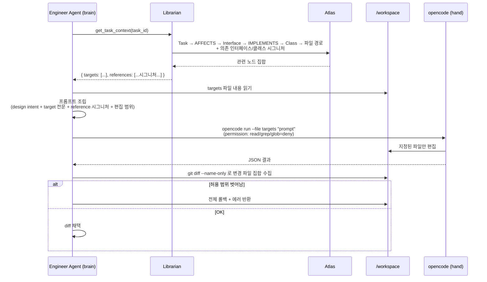

# Code Agent 실행 전략 (OpenCode CLI)

> 본 문서는 [`proposal-main.md`](../proposal-main.md) §2.8 에서 분리. (#66)

Code Agent(기본 구현체 OpenCode CLI)는 에이전트의 "손"이다. 두뇌(LangGraph + LLM API)가 무엇을 할지 결정하면, Code Agent가 지정된 파일만 편집한다. **Atlas로 컨텍스트를 정제하는 설계 의도를 보존하기 위해 Code Agent는 자유 탐색이 아닌 통제된 실행 환경에서 기동된다.**

## 실행 방식: Subprocess (Non-Interactive)

OpenCode CLI는 TypeScript + Bun 런타임 기반으로, Python 에이전트가 자식 프로세스로 기동한다.

```python
# shared/adapters/code_agent/opencode_cli.py (의사 코드)
proc = subprocess.Popen(
    ["opencode", "run",
     "--format", "json",
     "--cwd", "/workspace",
     "--file", *target_files,         # 허용된 파일만 컨텍스트로 첨부
     assembled_prompt],
    env={**os.environ, "ANTHROPIC_API_KEY": config.llm.api_key},
    stdout=subprocess.PIPE, stderr=subprocess.PIPE, text=True,
)
stdout, stderr = proc.communicate(timeout=config.timeout)
# 실행 후 git diff로 허용 범위 검증 (2차 방어)
```

- **One-shot 모드**: 매 호출이 독립된 OpenCode 프로세스 — 단순·재현성 높음
- 상태 유지가 필요한 긴 작업은 LangGraph가 외부에서 여러 단계로 분할

## Tool Permission 제어 (1차 방어)

OpenCode는 `opencode.json`의 `permission` 필드로 도구별 `allow` / `ask` / `deny` 제어를 지원한다. **Eng/QA에서는 탐색 도구(read/grep/glob)를 물리적으로 차단**하여 Atlas가 정제한 컨텍스트만 사용하도록 강제한다.

```json
// 예: Eng 에이전트의 opencode.json (실행 시 Role Config에서 자동 생성)
{
  "$schema": "https://opencode.ai/config.json",
  "permission": {
    "read":  "deny",
    "grep":  "deny",
    "glob":  "deny",
    "edit":  "allow",
    "write": "allow",
    "bash":  "deny"
  }
}
```

## 역할별 권한 매트릭스

| 에이전트 | read | grep | glob | edit | write | bash | 운영 의도 |
|---------|:----:|:----:|:----:|:----:|:-----:|:----:|----------|
| **A** (리뷰/검수) | allow | allow | allow | deny | deny | deny | 광범위 읽기 필요, 편집은 설계 문서(docs/design)에만 (Python 래퍼가 경로 가드) |
| **Eng:*** | **deny** | **deny** | **deny** | allow | allow | deny | Atlas로 정제된 컨텍스트만 사용, 빌드·테스트는 QA 담당 |
| **QA:*** | **deny** | **deny** | **deny** | allow | allow | **allow** | 테스트 작성 + 빌드·테스트 실행 |

## Context Assembly 흐름

OpenCode 호출 **전에** 에이전트가 Librarian으로부터 정제된 컨텍스트를 받아 프롬프트를 조립한다.



## 프롬프트 구조 (OpenCode에 전달)

```
[Design Intent]
{Architect가 내린 OO 설계의 해당 부분}

[Target Files — 편집 허용]
=== src/backend/payment/stripe_adapter.py ===
{현재 전체 내용}

=== src/backend/payment/payment_gateway.py ===
{현재 전체 내용}

[Reference Context — 수정 금지]
Interface: PaymentGateway
  public charge(amount, currency, method) -> PaymentResult
  public refund(transaction_id) -> RefundResult
Class: OrderService (src/backend/order/order_service.py)
  uses: PaymentGateway

[Constraints]
- 편집 허용: src/backend/payment/** 만
- 참조 컨텍스트는 수정 금지

[Task]
StripeAdapter.charge()를 구현하라. 멱등성 보장(idempotency key) 포함.
```

## 2중 방어

| 레이어 | 방법 | 담당 |
|-------|------|------|
| 1차 (탐색 차단) | OpenCode `permission`에서 read/grep/glob = `deny` | OpenCode CLI |
| 2차 (편집 범위 강제) | 실행 후 `git diff --name-only` 결과가 `workspace.write_scope` 밖이면 롤백 | Python 래퍼 (`opencode_cli.py`) |

## 컨테이너 이미지 구성

Code Agent를 쓰는 에이전트 이미지(A, Eng, QA)는 Bun + OpenCode CLI를 포함한다.

```dockerfile
# 예: agents/engineer/Dockerfile
FROM oven/bun:1 AS opencode-stage
RUN bun install -g opencode-ai

FROM python:3.12-slim
COPY --from=opencode-stage /usr/local/bin/bun /usr/local/bin/
COPY --from=opencode-stage /root/.bun/install/global /root/.bun/install/global
ENV PATH="/root/.bun/bin:${PATH}"

WORKDIR /app
COPY pyproject.toml ./
RUN pip install -e .
COPY src/ ./src/
COPY configs/ ./configs/
CMD ["python", "-m", "engineer_agent.main"]
```

P와 Librarian 이미지는 Code Agent 불필요 → Bun/OpenCode 미설치.
