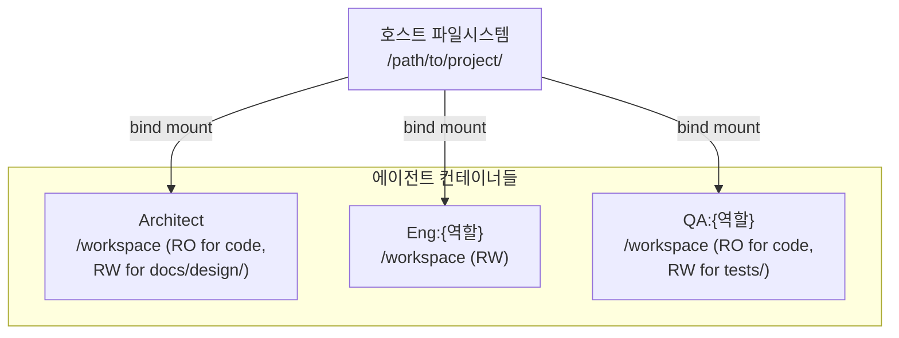
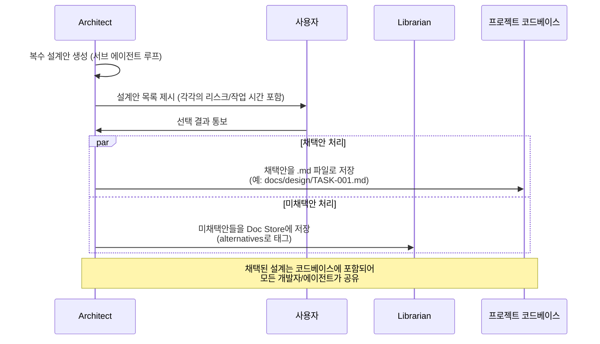

# 프로젝트 코드베이스 공유

> 본 문서는 [`proposal-main.md`](../proposal-main.md) §2.7 에서 분리. (#66)

여러 에이전트가 각자의 컨테이너에서 동작하지만, **실제 개발 산출물은 동일한 코드베이스에 반영되어야 한다.** Shared Memory(Atlas + Doc Store)는 **개발 과정 산출물의 문서화**를 담당하고, 실제 코드는 **호스트의 프로젝트 디렉토리**를 볼륨으로 마운트하여 공유한다.

## 볼륨 마운트 구조

- 모든 에이전트 컨테이너는 프로젝트 루트를 **같은 경로**(예: `/workspace`)로 마운트
- Eng은 코드베이스 전반에 쓰기 권한 보유
- A는 코드 읽기 가능, 설계 문서 디렉토리(예: `docs/design/`)에 쓰기 권한
- QA는 코드 읽기 가능, 테스트 디렉토리(예: `tests/`)에 쓰기 권한
- P, Librarian은 코드베이스 접근 불필요 (Librarian은 Diff를 받기만 함)

## 산출물의 2가지 저장 위치

| 산출물 유형 | 저장 위치 | 예시 |
|------------|----------|------|
| 실제 코드 | 프로젝트 코드베이스 (마운트된 볼륨) | `.py`, `.ts`, `.tsx` 등 구현 파일 |
| **채택된 설계 문서** | 프로젝트 코드베이스 (마운트된 볼륨) | `docs/design/TASK-001-payment-gateway.md` |
| 테스트 코드 | 프로젝트 코드베이스 (마운트된 볼륨) | `tests/...` |
| 미채택 설계안 | Doc Store | 대안 설계 A, B의 상세 내용 |
| 대화 이력 (Task/Session/Item) | Doc Store | A2A 이벤트 publish 수집 결과 |
| OO 구조 그래프 | Atlas | Interface/Class/PublicMethod 노드 |
| PRD | Doc Store + 외부 PM 도구 | 기획 내용 전문 |

**핵심 원칙:**
- 개발자가 레포지토리를 clone하면 그 안에 **채택된 설계 문서도 함께** 있어야 한다 → 코드베이스에 포함
- 미채택 설계안은 참고 자료로서 Doc Store에 남겨 추후 조회 가능
- 대화/히스토리 같은 메타 정보는 코드와 섞지 않고 Doc Store에만 저장

## 설계안 채택 프로세스

A가 복수 설계안을 도출하면 **사용자가 선택**한다:

