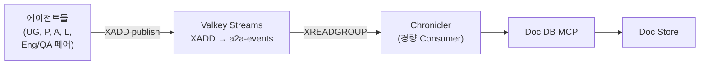
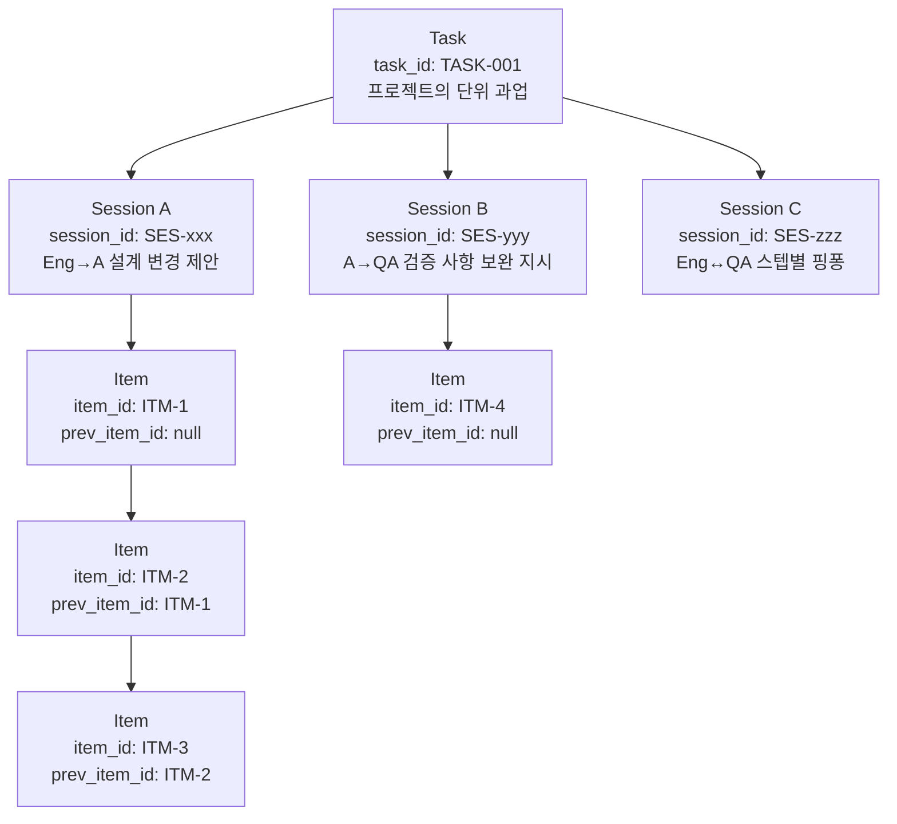

# A2A 대화 이벤트 수집

> 본 문서는 [`proposal-main.md`](../proposal-main.md) §2.6 에서 분리. (#66)

에이전트 간 직접 소통은 A2A(요청-응답)로 이루어지지만, **대화 로그는 Valkey Streams 브로커로 publish**되어 **Chronicler**라는 경량 Consumer가 Doc Store에 영속화한다. 이 분리는 다음을 보장한다:

- 에이전트는 로그 기록에 블로킹되지 않음 (fire-and-forget)
- Librarian의 LLM 추론 부하가 대화 기록을 지연시키지 않음
- 향후 다른 구독자(실시간 모니터링, 감사 서비스 등) 추가 시 브로커에 구독만 걸면 됨

## 구성



## Chronicler 모듈 특성

| 항목 | 내용 |
|------|------|
| 정체성 | **에이전트가 아님** — Role Config, LangGraph, LLM, OpenCode CLI 일체 미사용 |
| 구현 | 단일 Python 스크립트 수준 — Valkey 클라이언트(redis-py 호환) + Doc DB MCP 클라이언트만 보유 |
| 책임 | `XREADGROUP`으로 Stream 구독 → 파싱/검증 → Task/Session/Item 컬렉션에 upsert → **저장 성공 시 `XACK`** |
| 재시작 내구성 | 저장 전 장애 시 XACK 미실행 → 메시지는 PEL(Pending Entries List)에 남아 재기동 시 재처리됨 |
| 스케일링 | 필요 시 같은 Consumer Group에 인스턴스 추가만 하면 수평 확장 |

## 에이전트 측 publish

- 에이전트는 Valkey 클라이언트로 `XADD a2a-events * <field> <value> ...` 호출
- 즉시 반환 (A2A 본연의 요청-응답 흐름 방해 없음)
- 실패 시 로컬 버퍼에 재시도 큐잉 (필수)

## Task/Session/Item 3계층 구조



**계층 정의:**
- **Task**: 프로젝트의 단위 과업 (Architect가 Engineer+QA 페어에게 배분한 구현 과제 단위)
- **Session**: 하나의 태스크 내에서 진행되는 **개별 대화 흐름**. 주제별/상황별로 구분됨
    - 예: "Engineer:BE가 Architect에게 인터페이스 설계 변경 제안한 대화", "Architect가 QA:FE에게 테스트 보완 지시한 대화"
- **Item**: Session 하위의 **개별 메시지**. `prev_item_id`로 대화 순서 추적

**조회 API (Librarian 제공):**
- `by_task(task_id)` → 해당 태스크의 모든 대화
- `by_session(session_id)` → 해당 대화 세션의 전체 맥락
- `by_item(item_id)` → 특정 메시지 단건
- `thread(item_id)` → 해당 메시지를 포함한 대화 쓰레드 (prev_item_id 역추적)

## 이벤트 publish 포맷

```json
{
  "event": "a2a_message",
  "task_id": "TASK-001",
  "session_id": "SES-xxx",
  "item_id": "ITM-42",
  "prev_item_id": "ITM-41",
  "from": "Eng:BE",
  "to": "A",
  "type": "design_change_proposal",
  "payload": { "...": "..." },
  "timestamp": "2026-04-16T10:00:00Z"
}
```

- 발신 에이전트가 `session_id`, `item_id`, `prev_item_id`를 부여하여 Valkey Streams에 XADD
- Chronicler가 Consumer Group으로 소비하여 Doc Store의 sessions/items 테이블(JSONB)에 저장
- Session 생성 규칙: 새로운 주제의 첫 대화 시 발신자가 신규 `session_id` 생성, 기존 주제 이어가기는 동일 `session_id` 사용
