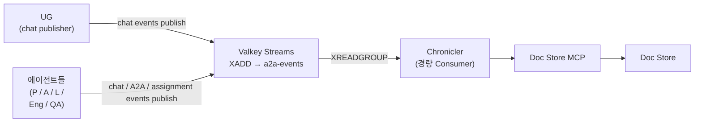

# 대화 이벤트 수집 (Chronicler)

> 본 문서는 [`proposal-main.md`](../proposal-main.md) §2.6 에서 분리. (#66)
> 두 tier 분리 / 어휘 정렬 반영 (#75).

UG ↔ P/A 의 chat 통신 (REST POST + 영속 SSE per session) 과 에이전트 간 A2A
통신 양쪽의 **lifecycle 이벤트가 Valkey Streams 브로커로 publish**되어
**Chronicler** 라는 경량 Consumer 가 Doc Store 에 영속화한다. 이 분리는 다음을 보장한다:

- Publisher 는 로그 기록에 블로킹되지 않음 (fire-and-forget)
- 향후 다른 구독자 (실시간 모니터링 / 감사 서비스 등) 추가 시 브로커에 구독만 걸면 됨

## 구성



## Chronicler 모듈 특성

| 항목 | 내용 |
|---|---|
| 정체성 | **에이전트가 아님** — Role Config, LangGraph, LLM, OpenCode CLI 일체 미사용 |
| 구현 | 단일 Python 스크립트 수준 — Valkey 클라이언트(redis-py 호환) + Doc Store MCP 클라이언트만 보유 |
| 책임 | `XREADGROUP` 으로 Stream 구독 → 파싱/검증 → 해당 layer 컬렉션에 upsert → **저장 성공 시 `XACK`** |
| 재시작 내구성 | 저장 전 장애 시 XACK 미실행 → 메시지는 PEL(Pending Entries List)에 남아 재기동 시 재처리됨 |
| 스케일링 | 필요 시 같은 Consumer Group 에 인스턴스 추가만 하면 수평 확장 |
| Idempotency | 이벤트마다 `event_id` (publisher 발급 UUID). 처리 시점 dedup 으로 중복 흡수 |

## 이벤트 종류 — 3 layer

publisher 가 정확히 어느 layer 의 이벤트인지 명시. Chronicler 는 layer 별
processor 로 분기 (OCP — 새 layer 추가 = 새 processor + 등록 1줄).

### 1. Chat layer (UG↔P/A 영역)

UG 와 agent (P/A) 양쪽이 publish — 자기 발화는 자기가.

| 이벤트 | 트리거 | publisher | 적재처 |
|---|---|---|---|
| `session.start` | 사용자가 새 chat session 시작 | UG | `sessions` row 생성 |
| `chat.append` (role=user) | 사용자 발화 | UG | `chats` row 생성 |
| `chat.append` (role=agent) | agent 발화 | agent (P/A) | `chats` row 생성 |

**session 은 종료 개념 없음.** chat 대화창은 사용자가 언제든 재개할 수 있는
namespace — `session.end` 이벤트 / `sessions.ended_at` 컬럼 두지 않는다.

### 2. Assignment layer (도메인 work item)

Primary / Architect 가 publish (chat 중 합의 시점).

| 이벤트 | 트리거 | 적재처 |
|---|---|---|
| `assignment.create` | P/A 가 새 work item 발급 | `assignments` row 생성 |
| `assignment.update` | status 변경 / metadata 갱신 | `assignments` row update |

### 3. A2A layer (에이전트 간 통신)

각 에이전트가 publish (자기 incoming / outgoing A2A 호출).

| 이벤트 | 트리거 | 적재처 |
|---|---|---|
| `a2a.context.start` | counterpart 가 incoming A2A 첫 호출 받음 | `a2a_contexts` row 생성 |
| `a2a.message.append` | A2A Message 송수신 | `a2a_messages` row 생성 |
| `a2a.task.create` | A2A Task 생성 (stateful 작업 응답 시) | `a2a_tasks` row 생성 |
| `a2a.task.status_update` | Task state 전환 | `a2a_task_status_updates` row 생성 + `a2a_tasks.state` 갱신 |
| `a2a.task.artifact` | Task 산출물 추가 | `a2a_task_artifacts` row 생성 |
| `a2a.context.end` | **agent 가 inter-agent 대화 마무리 판단 시** (계속 대기 X / 작업 완료 등) | `a2a_contexts.ended_at` 갱신 |

`a2a.context.end` 트리거는 RPC 라이프사이클이 아니다 — 한 contextId 위에
여러 RPC (Task / Message) 가 누적되며, agent 가 자기 판단으로 "이 두 에이전트
사이 대화는 끝" 이라고 결정한 시점에만 발화. 발화 위치는 agent 의 graph /
handler 안 (시점은 agent 통합 PR 에서 결정).

## 어휘 / 객체 모델

| 차원 | 객체 | 정의 |
|---|---|---|
| **Chat tier** | Session | UG↔P/A 한 대화창 |
| | Chat | session 안 발화 |
| | Assignment | chat 중 합의된 도메인 work item |
| **A2A tier** | Context | A2A `contextId` — 두 에이전트 사이 대화 namespace |
| | Message | A2A `Message` (parts / role / messageId), optional `taskId` |
| | A2A Task | A2A `Task` (state lifecycle / artifacts / history). Message 와 응답 형식 alternative |

세부 schema 정의 + 관계 그림은 [knowledge-model](knowledge-model.md) §4.2.

## 자주 헷갈리는 점

- **Domain Assignment ≠ A2A Task**:
  - Assignment = 도메인 work item (open → done). Doc Store `assignments`.
  - A2A Task = wire-level 진행 추적 (SUBMITTED → COMPLETED). Doc Store `a2a_tasks`.
  - 한 Assignment 는 **1 개 이상의 A2A Task** 로 구성 가능 (위임 다회).
- **Session ↔ A2A Context**:
  - Session 은 UG↔P/A chat 단위 (사용자 → P/A 의 endpoint).
  - A2A Context 는 에이전트 간 단위. session 발일 수도 있고 (대부분), system trigger 발 standalone 일 수도.
  - `a2a_contexts.parent_session_id` / `parent_assignment_id` 로 source 추적.
- **A2A Message ↔ A2A Task**:
  - 응답 형식 alternative. Trivial 은 Message, stateful 은 Task ([messaging.md](../../shared/src/dev_team_shared/a2a/messaging.md)).
  - Task commit 후 관련 Message 들은 Task.history 에 누적 → DB 에선 `a2a_messages.a2a_task_id` 로 backlink.

## 조회 API (Librarian 제공)

| 목적 | 쿼리 |
|---|---|
| 한 chat session 의 대화 | `chats.find({ session_id })` |
| 한 session 에서 파생된 모든 assignment | `assignments.find({ root_session_id })` |
| 한 assignment 의 모든 A2A context | `a2a_contexts.find({ parent_assignment_id })` |
| 한 A2A context 의 모든 message | `a2a_messages.find({ a2a_context_id })` |
| 한 A2A task 의 history | `a2a_messages.find({ a2a_task_id })` |
| 한 trace 의 전체 시스템 흐름 | `a2a_contexts.find({ trace_id })` 시간순 |

자연어 / 교차 컬렉션 쿼리는 Librarian 자연어 위임 ([architecture-shared-memory](architecture-shared-memory.md)).

## 이벤트 publish 포맷

각 이벤트는 Pydantic 모델로 정의 (publisher / consumer 가 공유 contract —
`shared/src/dev_team_shared/event_bus/events.py`). 공통 필드:

```json
{
  "event_id": "<UUID — idempotency key>",
  "timestamp": "2026-04-16T10:00:00Z",
  "event_type": "<chat.append | a2a.message.append | ...>",
  "trace_id": "<옵션, A2A layer 만 채움>"
}
```

layer 별 필드는 각 event 모델 정의 참조 (`SessionStartEvent` /
`ChatAppendEvent` / `AssignmentCreateEvent` / `A2AContextStartEvent` /
`A2AMessageAppendEvent` / `A2ATaskCreateEvent` / 등).
