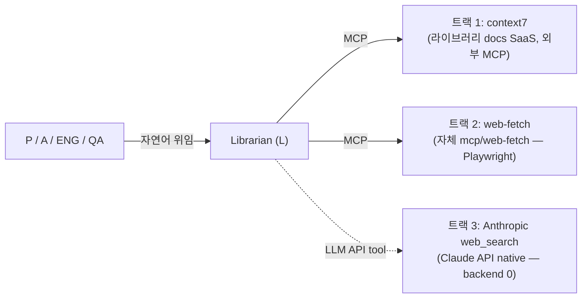

# 외부 리소스 조사 (3 트랙)

> 본 문서는 [`proposal-main.md`](../proposal-main.md) §2.9 에서 분리. (#66)

에이전트가 작업 도중 외부 정보를 조회해야 할 때 (라이브러리 사용법, 사용자
제공 URL 의 페이지 내용, 일반 web 검색 등) **L 이 전담** 하며 내부적으로
**3 트랙**으로 분담:

| 트랙 | backend | 용도 | L 의 호출 방식 |
|------|---------|------|----------|
| **1. context7** | Upstash SaaS (이미 MCP 노출, `https://mcp.context7.com/mcp`) | 라이브러리 / 프레임워크 공식 docs | L 의 lifespan 에서 외부 MCP 에 connect (wrapper 0) |
| **2. web-fetch (Playwright)** | 자체 컨테이너 `mcp/web-fetch/` — chromium headless + trafilatura | 사용자 제공 URL 의 페이지 내용 파악 (JS-heavy / SPA 까지) | L 의 lifespan 에서 connect, LangChain tool 로 노출 |
| **3. Anthropic web_search** | Anthropic SaaS — Claude API 의 [`web_search_20250305`](https://platform.claude.com/docs/en/agents-and-tools/tool-use/web-search-tool) tool | 일반 web search (사용자 의도 / 시장 조사 / 외부 정보) | L 의 LLM 호출 시 `tools` 배열에 추가 — backend 0 |

**호출 주체**: L 단독. 다른 에이전트 (P / A / ENG / QA) 가 외부 정보 필요하면
A2A 자연어로 L 에게 위임 — L 이 LLM 추론으로 적절한 트랙 선택 + 호출 + 응답 정리.

**비-스코프 (별 작업)**:
- 일반 web search 의 추가 backend (Brave / Tavily / Serper 등) — 트랙 3 부족 시 M5+ 별 이슈
- Google 직접 scrape (Playwright + Google) — bot detection / ToS risk 로 회피
- L 의 운영 지침 (`agents/librarian/resources/external-research-guide.md`) — L wiring 후속 이슈에서 작성 (LLM 컨텍스트 embed)

상세 설계 / 결정 근거: 별 docs (예: `docs/external-research.md`) — backend 작업 시점 (M6) 에 작성.
