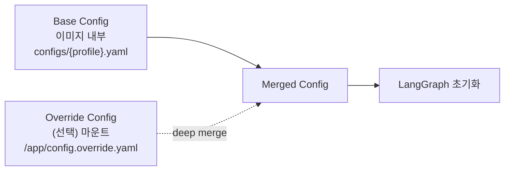
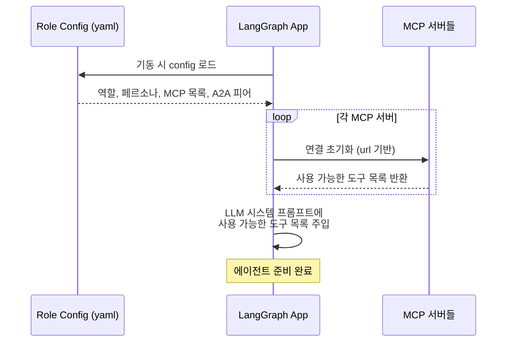

# Role Config 및 MCP 디스커버리

> 본 문서는 [`proposal-main.md`](../proposal-main.md) §2.4 에서 분리. (#66)

각 에이전트는 **모듈별 독립 Docker 이미지**로 빌드되지만, 공통 코드(LangGraph 베이스, A2A, MCP 클라이언트, Adapters 등)는 `shared/` 패키지에서 import하여 중복을 최소화한다. 기동 시 **Base Config**(이미지에 baked-in)와 **Override Config**(선택적 마운트)를 병합하여 페르소나, MCP 서버, A2A 피어/허용 클라이언트, 워크플로우 확장 등을 결정한다.

Engineer, QA처럼 specialty만 달라지는 모듈은 하나의 이미지에 여러 base config를 포함하고 `CONFIG_PROFILE` 환경변수로 선택한다 (`agents/engineer/configs/{be,fe}.yaml`).

## Config 로드 순서 (Base + Override 병합)



**오버라이드 허용 범위:**

| 필드 | Override 허용 | 이유 |
|------|:----------:|------|
| `llm.model`, `llm.temperature`, `llm.sub_agents.*.model` | **O** | 비용/성능 튜닝은 운영 결정 |
| `mcp_servers[].url` | **O** | 호스팅 환경에 따라 변경 |
| `a2a_peers[].url`, `allowed_clients` | **O** | 배포 토폴로지 변경 |
| `workspace.write_scope`, `workspace.read_only` | **O** | 프로젝트별 파일 구조 대응 |
| `code_agent.type` | **O** | OpenCode ↔ Claude Code CLI 실험 |
| `persona` | **X** | 역할 정체성은 코드와 함께 변경 |
| `workflow.base`, `workflow.extensions` | **X** | 서브그래프 식별자는 코드에 대응 |
| `role`, `specialty` | **X** | 모듈 정체성 고정 |

로더는 병합 시 허용되지 않은 필드의 override가 들어오면 경고 로그와 함께 무시한다.

**Override Config 예시 (1) — 모델 다운그레이드:**

```yaml
# overrides/architect.yaml — dev 환경에서 비용 절감을 위해 모델 다운그레이드
llm:
  sub_agents:
    main_design:
      model: "claude-sonnet-4-6"   # 기본값 claude-opus-4-7 → 변경
    verification:
      model: "claude-sonnet-4-6"
```

이 파일만 마운트하면 나머지 필드는 base config의 값을 그대로 사용한다.

## LLM 추상화와 API Key 관리

코드 레벨에서는 **LangChain의 `BaseChatModel` 인터페이스**를 사용하며, config에서 `provider`와 `model`을 지정하면 `shared/adapters/llm/` 팩토리가 해당 구현체(`ChatAnthropic`, `ChatOpenAI` 등)를 생성한다.

**API Key는 override config에서 env var 참조로 주입한다:**

```yaml
# overrides/architect.yaml
llm:
  provider: anthropic         # anthropic | openai | google | local
  sub_agents:
    main_design:
      model: "claude-opus-4-7"
      api_key: ${ANTHROPIC_API_KEY}
    verification:
      model: "claude-opus-4-7"
      api_key: ${ANTHROPIC_API_KEY}
    final_confirm:
      model: "claude-sonnet-4-6"
      api_key: ${ANTHROPIC_API_KEY}
```

**보안 원칙:**
- **평문 API key를 yaml에 쓰지 않는다** — 반드시 `${ENV_VAR}` 형태로 참조
- 실제 key는 `.env` 파일 또는 시크릿 매니저에서 docker-compose의 `environment`로 주입
- Override yaml 자체는 시크릿을 포함하지 않으므로 안전하게 git 커밋 가능
- Config 로더가 로드 시 `${...}` 패턴을 env에서 치환

**필수 Override 항목:**
- **`llm.api_key` (또는 서브 에이전트별 `api_key`)** — base config에는 값이 비어 있고 override로 반드시 제공해야 함
- 로더는 기동 시 api_key 누락을 감지하면 즉시 에러로 실패시킴

## Role Config 공통 스키마

| 필드 | 의미 | 비고 |
|------|------|------|
| `role` | 에이전트 유형 (primary/architect/librarian/engineer/qa) | 필수 |
| `specialty` | Engineer/QA의 세부 역할 (backend/frontend/devops/...) | Engineer/QA만 |
| `persona` | 시스템 프롬프트로 주입되는 역할 정의 | 필수 |
| `llm` | `provider`, `model`, `temperature`, `api_key` (LangChain `BaseChatModel`). Architect는 `sub_agents.*`로 분리 지정 | 필수. `api_key`는 override에서 env var 참조로 주입 |
| `code_agent` | `type`(어댑터 구현체 선택) + `opencode.permissions` (read/grep/glob/edit/write/bash = allow·ask·deny) + `opencode.timeout_seconds` | Primary, Librarian은 생략. [architecture-code-agent](architecture-code-agent.md) 참조 |
| `workspace` | 볼륨 마운트된 코드베이스 경로 + 읽기/쓰기 범위 | 코드 다루는 에이전트만 |
| `mcp_servers` | 연결할 MCP 서버 목록 (공유 + 로컬) | 필수 |
| `a2a_peers` | **클라이언트 측 설정** — 내가 먼저 호출(initiate)할 피어의 URL 목록 | 필수 (Librarian 제외) |
| `allowed_clients` | **서버 측 설정** — 내 A2A 서버로의 호출을 허용할 주체 목록 | 필수 |
| `workflow` | (현재 미사용) — graph 토폴로지는 각 agent 의 `graph.py` 가 `shared/agent_graph/` 의 building blocks 를 명시적으로 조립 (옵션 D, #75 PR 3). config 의 `workflow` 필드는 향후 base/extensions 분리가 정말 필요해질 때 재도입 검토 (현재는 코드가 곧 워크플로 정의) | 미사용 (override denylist 만 등록) |

## 역할별 Role Config 예시

> **`workflow` 필드 정정** (#75 PR 3, 2026-05): 아래 예시들의 `workflow.base
> + extensions` 블록은 **초기 디자인 의도 기록** 으로만 남겨두며 현재 코드
> 는 사용하지 않는다. graph 토폴로지는 각 agent 의 `graph.py` 가
> `shared/agent_graph/` 의 building blocks 를 명시적으로 조립 (옵션 D).
> 아래 extensions 목록은 *agent 가 가져야 할 능력* 을 나열한 의도 기록 — 향후
> base/extensions 분리가 정말 필요해질 때 재구조화 검토.

### Primary (`configs/primary.yaml`)

```yaml
role: primary

persona: |
  당신은 프로젝트 매니저(PM)입니다.
  사용자와 기획을 논의하여 PRD를 작성·관리하고,
  Architect에게 기술 설계를 의뢰하며, 외부 PM 도구와 동기화합니다.
  PM 영역의 데이터(PRD / Epic / Story / wiki_pages / issues)는 Doc Store MCP에 **직접 write** 합니다 (분담 모델).
  외부 PM 도구 동기화도 본인이 직접 수행하며, 다른 에이전트의 외부 상태 업데이트 요청을 대리 수행합니다.
  정보 검색이 필요한 경우 Librarian에게 자연어로 위임합니다.

llm:
  provider: anthropic
  model: "claude-sonnet-4-6"
  temperature: 0.3
  api_key: ""                # override에서 반드시 주입

# P는 코드 작업 없음 → code_agent 비활성
# P는 코드베이스 마운트 불필요 → workspace 없음

mcp_servers:
  - name: doc-store
    url: "http://doc-store-mcp:8080"
    type: shared
    description: "PM 영역 데이터 직접 write (wiki_pages / issues)"
  - name: external-pm
    url: "http://external-pm-mcp:8080"
    type: shared
    description: "외부 PM 도구 (GitHub Wiki/Issue) 동기화"

# 클라이언트 측 — P가 먼저 호출할 피어
a2a_peers:
  - { name: user-gateway, url: "http://user-gateway:9000" }   # 사용자 푸시
  - { name: architect,    url: "http://architect:9000" }      # 설계 요청
  - { name: librarian,    url: "http://librarian:9000" }      # 질의

# 서버 측 — P의 서버로 들어오는 호출을 허용할 주체
allowed_clients:
  - user-gateway   # 사용자 기획 개입 전달
  - architect      # 설계 진행 보고

workflow:
  base: default
  extensions:
    - user_chat          # 사용자 상시 채팅 수용
    - prd_authoring      # PRD 작성/관리
    - external_pm_sync   # 외부 PM 도구 동기화
```

### Architect (`configs/architect.yaml`)

```yaml
role: architect

persona: |
  당신은 시스템 아키텍트입니다.
  객체지향 관점의 1차 설계를 주도하며, 설계 결정권을 보유합니다.
  복수 설계안을 도출하여 사용자 선택을 받고, Eng+QA 페어에 동시 배포합니다.
  상위 설계 수정 시 유관 Eng을 소집하여 다자간 논의를 주관합니다.
  설계 산출물(채택안 ADR / wiki_pages, OO 구조 그래프)은 Atlas / Doc Store MCP에 **직접 write** 합니다 (분담 모델).
  정보 검색이 필요한 경우 Librarian에게 자연어로 위임합니다.

# A는 내부에 3개의 서브 에이전트를 두며 각각 다른 모델을 쓸 수 있음
llm:
  provider: anthropic
  sub_agents:
    main_design:
      model: "claude-opus-4-7"
      temperature: 0.4
      api_key: ""              # override에서 주입
    verification:
      model: "claude-opus-4-7"
      temperature: 0.1
      api_key: ""
    final_confirm:
      model: "claude-sonnet-4-6"
      temperature: 0.2
      api_key: ""

code_agent:
  type: opencode_cli     # 코드 리뷰/검수 시 코드 읽기·검색에 사용
  opencode:
    permissions:         # A는 광범위 읽기 허용, 편집 금지
      read:  "allow"
      grep:  "allow"
      glob:  "allow"
      edit:  "deny"      # 설계 문서 쓰기는 Python 래퍼가 별도 처리
      write: "deny"
      bash:  "deny"
    timeout_seconds: 900

workspace:
  path: /workspace
  write_scope:
    - "docs/design/**"   # 채택 설계 문서만 쓰기 가능
  read_only:
    - "src/**"
    - "lib/**"
    - "tests/**"

# code_agent(OpenCode CLI)가 코드 읽기/검색 기능을 이미 제공.
# Shared Memory 직접 write 를 위해 atlas / doc-store MCP 연결.
mcp_servers:
  - name: atlas
    url: "http://atlas-mcp:8080"
    type: shared
    description: "OO 구조 그래프 직접 write (설계 산출물)"
  - name: doc-store
    url: "http://doc-store-mcp:8080"
    type: shared
    description: "ADR / wiki_pages 직접 write"

# 클라이언트 측 — A가 먼저 호출할 피어
a2a_peers:
  - { name: user-gateway, url: "http://user-gateway:9000" }   # 설계안 제시/사용자 푸시
  - { name: primary,      url: "http://primary:9000" }        # 설계 보고
  - { name: librarian,    url: "http://librarian:9000" }      # 질의
  - { name: eng-be,       url: "http://eng-be:9000" }         # 과제 배분
  - { name: qa-be,        url: "http://qa-be:9000" }          # 설계 배포
  - { name: eng-fe,       url: "http://eng-fe:9000" }
  - { name: qa-fe,        url: "http://qa-fe:9000" }

# 서버 측 — A의 서버로 들어오는 호출을 허용할 주체
allowed_clients:
  - user-gateway   # 사용자 기술 개입
  - primary        # 설계 의뢰
  - eng-be         # 설계 수정 건의, 완료 보고
  - qa-be          # 테스트 결과 보고
  - eng-fe
  - qa-fe

workflow:
  base: default
  extensions:
    - user_chat              # 사용자 상시 기술 개입 수용
    - three_stage_design     # 메인 설계 → 검증 → 최종 컨펌 루프
    - multi_proposal         # 복수 설계안 생성
    - design_adoption        # 채택안 md 저장 + 미채택안 Doc DB 저장
    - multi_party_mediation  # 다자간 논의 소집
    - diff_review            # Eng diff 기반 검수
```

### Librarian (`configs/librarian.yaml`)

```yaml
role: librarian

persona: |
  당신은 팀의 사서(Librarian)입니다. 두 책임을 전담합니다 (분담 모델 / 외부 리소스 조사 3 트랙).

  [정보 검색]
  다른 에이전트(P / A / Eng / QA)의 자연어 질의를 받아 Atlas + Doc Store 교차 조회로
  답변을 구성하여 반환합니다. write 는 본 에이전트의 책임이 아니며, 각 에이전트가
  자기 도메인 데이터를 MCP로 직접 write 합니다 (분담 모델).
  자연어 → 도구 호출 매핑은 LLM ReAct 로 결정합니다.

  [외부 리소스 조사 — 단독 전담]
  라이브러리/프레임워크 docs(context7), 사용자 제공 URL(mcp/web-fetch),
  일반 web 검색(Claude Web Search) 3 트랙을 본 에이전트가 단독 수행합니다.
  다른 에이전트는 외부 정보 필요 시 A2A 자연어로 본 에이전트에 위임합니다.

  [책임 아닌 것]
  A2A 대화 로그 수집은 Chronicler의 책임이며 관여하지 않습니다.
  Diff 색인 / 기술 노트 작성도 본 에이전트의 책임이 아니며, Eng 이 자기 산출물을
  Atlas / Doc Store MCP 로 직접 write 합니다 (M4+ 에서 검토 — §9 #15).

llm:
  provider: anthropic
  model: "claude-sonnet-4-6"
  temperature: 0.2      # tool 선택의 정확성 우선
  api_key: ""           # override에서 주입

# L은 코드 직접 수정 없음 → code_agent 비활성
# L은 코드베이스 마운트 불필요 → workspace 없음

mcp_servers:
  - name: atlas
    url: "http://atlas-mcp:8080"
    type: shared
    description: "OO 구조 그래프 (read 전용 — write 는 각 에이전트가 직접)"
  - name: doc-store
    url: "http://doc-store-mcp:8080"
    type: shared
    description: "문서/대화 (read 전용 — write 는 각 에이전트가 직접)"
  - name: context7
    url: "http://context7-mcp:8080"
    type: shared
    description: "라이브러리/프레임워크 공식 docs (외부 리소스 조사 트랙 1)"
  - name: web-fetch
    url: "http://web-fetch-mcp:8080"
    type: shared
    description: "사용자 제공 URL 페이지 (Playwright 기반 — 외부 리소스 조사 트랙 2)"
# 트랙 3 (Claude Web Search) 은 Claude API native tool 이므로 mcp_servers 항목 없음

# Librarian은 순수 Server — 먼저 호출하는 대상이 없음
a2a_peers: []

# 서버 측 — L의 서버로 들어오는 호출을 허용할 주체 (전 에이전트)
allowed_clients:
  - primary
  - architect
  - eng-be
  - qa-be
  - eng-fe
  - qa-fe

workflow:
  base: default
  extensions:
    - nl_query_answering         # 자연어 질의 응답 (Atlas + Doc Store 교차 조회)
    - external_research_dispatch # 외부 리소스 조사 3 트랙 dispatch
```

### Engineer:BE (`configs/eng-be.yaml`)

```yaml
role: engineer
specialty: backend

persona: |
  당신은 Backend 개발자입니다.
  API 설계, 서버 로직, DB 스키마, 인증/인가를 담당합니다.
  Architect의 객체지향 1차 설계를 받아 클래스/메소드 레벨의 세부 설계와 구현을 자율 수행합니다.
  상위 설계 수정이 필요하면 Architect에게 건의합니다(결정권은 Architect에게 있음).
  구현 산출물(OO 구조 색인, 작업 산출물 wiki_pages)은 Atlas / Doc Store MCP에 **직접 write** 합니다 (분담 모델).
  정보 검색이 필요한 경우 Librarian에게 자연어로 위임합니다.
  빌드/테스트 실행은 페어 QA의 책임이므로 직접 수행하지 않습니다.

llm:
  provider: anthropic
  model: "claude-sonnet-4-6"
  temperature: 0.2
  api_key: ""           # override에서 주입

code_agent:
  type: opencode_cli
  opencode:
    permissions:         # 탐색 차단 — Atlas로 정제된 컨텍스트만 사용
      read:  "deny"
      grep:  "deny"
      glob:  "deny"
      edit:  "allow"
      write: "allow"
      bash:  "deny"      # 빌드/테스트는 페어 QA 담당
    timeout_seconds: 1800   # 긴 구현 허용

workspace:
  path: /workspace
  write_scope:
    - "src/backend/**"
    - "src/shared/**"
  read_only:
    - "docs/**"
    - "src/frontend/**"
    - "tests/**"

# code_agent가 코드 편집/검색을 제공.
# Shared Memory 직접 write 를 위해 atlas / doc-store MCP 연결.
mcp_servers:
  - name: atlas
    url: "http://atlas-mcp:8080"
    type: shared
    description: "OO 구조 그래프 직접 색인 (구현 산출물)"
  - name: doc-store
    url: "http://doc-store-mcp:8080"
    type: shared
    description: "wiki_pages / 작업 산출물 직접 write"

# 클라이언트 측 — Eng:BE가 먼저 호출할 피어
a2a_peers:
  - { name: architect, url: "http://architect:9000" }   # 설계 수정 건의, 완료 보고
  - { name: qa-be,     url: "http://qa-be:9000" }       # 스텝 완료 통보 → 검증 요청
  - { name: librarian, url: "http://librarian:9000" }   # diff 전달, 질의

# 서버 측 — Eng:BE의 서버로 들어오는 호출을 허용할 주체
allowed_clients:
  - architect   # 과제 배분, 다자간 논의 소집

# 참고:
# - QA의 결함 리포트/검증 결과는 Eng이 연 대화의 응답으로 전달되므로
#   QA가 Eng을 먼저 호출할 일은 없음 (allowed_clients에서 제외)
# - Eng ↔ Eng 직접 통신은 없음 (A가 다자간 논의 소집 시에만 A 주관)

workflow:
  base: default
  extensions:
    - self_design_loop       # 클래스/메소드 레벨 세부 설계 자율 수행
    - context_assembly       # 정보 검색 필요 시 L 자연어 위임 → 프롬프트 조립
    - design_escalation      # Architect에 상위 설계 수정 건의
    - atlas_indexing         # 구현 산출물 Atlas / Doc Store 직접 write
```

### QA:BE (`configs/qa-be.yaml`)

```yaml
role: qa
specialty: backend

persona: |
  당신은 Backend 테스트 엔지니어입니다.
  Architect의 객체지향 1차 설계를 Engineer와 동시에 수신하여,
  Interface/Class/PublicMethod 계약을 근거로 독립적으로 테스트 코드를 작성합니다.
  Engineer 구현 완료 시 빌드를 실행하고, 준비한 테스트로 검증하여 Architect에게 보고합니다.
  검증 산출물(테스트 결과, 커버리지 리포트)은 Doc Store / Atlas MCP에 **직접 write** 합니다 (분담 모델).
  정보 검색이 필요한 경우 Librarian에게 자연어로 위임합니다.
  설계가 수정되면 테스트 코드도 재작성합니다.

llm:
  provider: anthropic
  model: "claude-sonnet-4-6"
  temperature: 0.2
  api_key: ""           # override에서 주입

code_agent:
  type: opencode_cli     # 테스트 코드 작성/실행
  opencode:
    permissions:         # 탐색 차단 + 테스트 실행용 bash 허용
      read:  "deny"
      grep:  "deny"
      glob:  "deny"
      edit:  "allow"
      write: "allow"
      bash:  "allow"     # 빌드/테스트 실행 필수
    timeout_seconds: 1800

workspace:
  path: /workspace
  write_scope:
    - "tests/backend/**"
  read_only:
    - "src/**"
    - "docs/**"

# code_agent가 편집 기능을 제공. 빌드/테스트 실행 + Shared Memory 직접 write.
mcp_servers:
  - name: test-runner
    type: local
    config: "./mcp-tools/test-runner.json"     # 빌드/테스트 실행 전용 도구
  - name: atlas
    url: "http://atlas-mcp:8080"
    type: shared
    description: "테스트 커버리지 등 검증 산출물 직접 write"
  - name: doc-store
    url: "http://doc-store-mcp:8080"
    type: shared
    description: "테스트 결과 / 리포트 직접 write"

# 클라이언트 측 — QA:BE가 먼저 호출할 피어
a2a_peers:
  - { name: architect, url: "http://architect:9000" }   # 테스트 결과 보고
  - { name: librarian, url: "http://librarian:9000" }   # 질의

# 서버 측 — QA:BE의 서버로 들어오는 호출을 허용할 주체
allowed_clients:
  - architect   # 설계 배포, 수정 통보
  - eng-be      # 페어 Eng의 스텝 완료 통보 → QA는 응답 안에서 검증 결과 반환

workflow:
  base: default
  extensions:
    - context_assembly            # 정보 검색 필요 시 L 자연어 위임 → 시그니처 기반 테스트 작성
    - independent_test_authoring  # 설계 기반 독립 테스트 작성
    - build_and_test_execution    # 빌드/테스트 실행
    - design_update_adaptation    # 설계 변경 시 테스트 재작성
```

> FE/DevOps 등 다른 페어는 `eng-be.yaml` / `qa-be.yaml`의 **specialty, persona, workspace.write_scope, mcp_servers, a2a_peers**만 교체하면 됨.

## MCP 디스커버리 흐름



- **Docker 네트워크** 내에서 서비스명(`atlas-mcp`, `qa-be` 등)으로 접근하므로 URL이 고정됨
- MCP 프로토콜의 표준 디스커버리: 연결 시 서버가 자신의 도구 목록을 반환 → 에이전트가 자동 인지
- 에이전트가 알아야 하는 것은 "어디에 연결할지"(config) 뿐, "무엇을 할 수 있는지"는 MCP 서버가 알려줌
