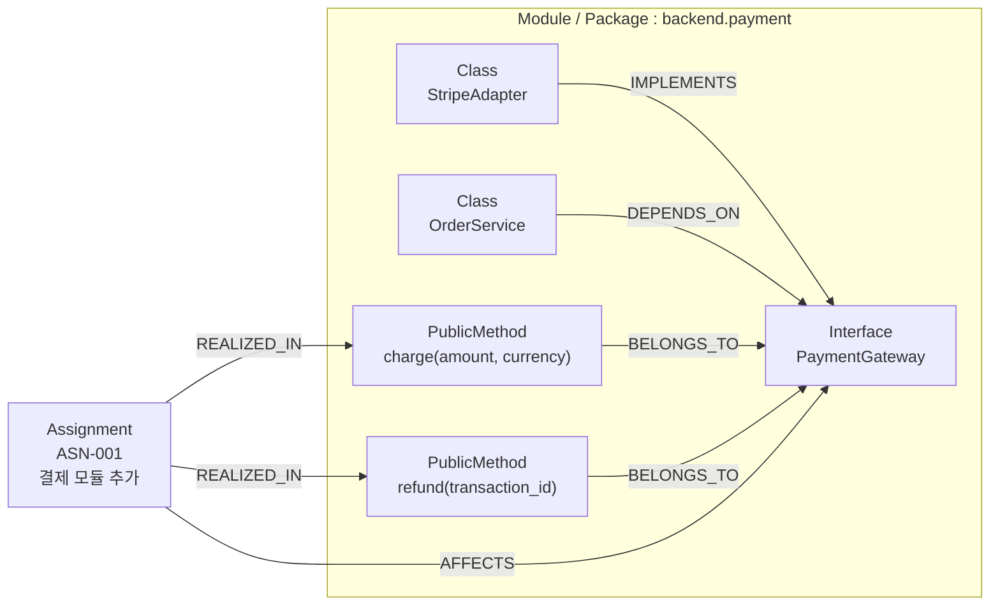

# 지식 모델링

> 본 문서는 [`proposal-main.md`](../proposal-main.md) §4 에서 분리. (#66)

## 4.1. Semantic Layer (Atlas)

Atlas 는 코드의 **인터페이스 의존성 그래프** + **Assignment-코드 추적 관계** 를 보관한다. 컨텍스트 정제의 핵심 자산.

### 인터페이스 중심 구현 모델

```
(Class)-[:IMPLEMENTS]->(Interface)
(Class)-[:DEPENDS_ON]->(Interface)
(PublicMethod)-[:BELONGS_TO]->(Interface)
(Module)-[:CONTAINS]->(Class)
```

- **Method 노드는 public 메소드(계약된 인터페이스 시그니처)만 포함** — 내부 구현 상세(private/protected)는 그래프에 포함하지 않음
- 에이전트가 특정 구현체에 종속되지 않고 유연하게 설계 논의
- 인터페이스 매개 객체 간 참조 관계로 변경 영향 범위 즉각 파악

### Assignment-코드 추적성 모델

```
(Assignment)-[:AFFECTS]->(Interface)
(Assignment)-[:REALIZED_IN]->(Method)
(Feature)-[:DECOMPOSED_INTO]->(Assignment)
(BugReport)-[:TRACES_TO]->(Method)
```

- Assignment, Feature, BugReport 노드가 독립적으로 존재
- 도메인 작업과 코드 직접 연결로 비즈니스 문맥 유지

> Atlas 그래프의 `Assignment` 노드는 Doc Store `assignments` 컬렉션의 row 와 1:1 매핑. **A2A 의 Task 와는 무관** (그건 wire-level 객체).

### 예시 — 결제 모듈 (ASN-001)

아래는 `backend.payment` 모듈에 결제 인터페이스를 추가하는 가상의 assignment 가 Atlas 에 어떻게 표현되는지의 illustration:



이 그래프 위에서 Engineer / QA 가 assignment_id 로 시작해 `Assignment → AFFECTS → Interface → IMPLEMENTS → Class → 파일 경로` 를 따라가며 **편집 대상 + 의존 시그니처** 만 정제해 받는다. 코드베이스 전체를 읽지 않고도 작업에 필요한 컨텍스트를 정확히 추출 — [code-agent §Context Assembly](architecture-code-agent.md#context-assembly-흐름) 참조.

## 4.2. Episodic Layer (Doc Store)

Doc Store 는 **시간 흐름의 사실 (episode)** — 대화 / 결정 / 산출물 / 추적 이슈 — 를 보관하는 layer. 도메인이 다른 사실들을 **분류별 컬렉션** 으로 분리해 보관한다. 본 §4.2 는 컨셉 수준의 컬렉션 모델 — 실제 스키마 / 물리적 컬렉션 매핑은 [`doc-store-schema.md`](../doc-store-schema.md) 참조.

| 컬렉션 분류 | 책임 / 호출자 | 용도 |
|---|---|---|
| Chat (UG↔P/A) | Chronicler (자동 영속) | 사용자 ↔ Primary/Architect 의 chat 대화 로그 |
| Assignment | Primary / Architect (직접 발급) | Chat 중 합의된 도메인 작업 단위 |
| A2A (에이전트 간) | Chronicler (자동 영속) | 에이전트 간 A2A 통신 로그 (Context / Message / Task) |
| 기술 노트 | Engineer / QA (직접 write) | 개발 / 검증 중 기술 기록 |
| 설계안 | Architect (직접 write) | 채택 / 미채택 설계 |
| 이슈 | Primary (직접 write + 외부 PM 동기화) | PM 작업 추적 |
| PRD | Primary (직접 write + 외부 PM 동기화) | 기획 산출물 |

> **Tier 분리**: 사용자 ↔ Primary/Architect 의 통신은 **chat protocol** (REST POST + 영속 SSE — [architecture-chat-protocol](architecture-chat-protocol.md)), 에이전트 간 통신은 **A2A** ([messaging.md](../../shared/src/dev_team_shared/a2a/messaging.md)). 두 layer 가 별도 개념 / 별도 영속 컬렉션.

### Chat 컬렉션 — UG↔P/A 대화 영속

사용자가 UG 통해 Primary / Architect 와 chat 한 내용. Chronicler 가 chat 이벤트를 consume 해 영속.

- **sessions (대화창)** — 한 chat 단위. agent_endpoint 별 (`primary` / `architect`). 사용자 측 multi-chat UI 의 단위
- **chats (메시지)** — session 안의 한 발화. `prev_chat_id` 로 시간순 chain

```json
// sessions
{
  "_id": "SES-xxx",
  "agent_endpoint": "primary",
  "initiator": "user",
  "counterpart": "primary",
  "started_at": "2026-04-16T10:00:00Z"
}

// chats
{
  "_id": "CHAT-42",
  "session_id": "SES-xxx",
  "prev_chat_id": "CHAT-41",
  "role": "user",       // user | agent | system
  "sender": "user",
  "content": [{"text": "결제 기능 추가하고 싶어"}],
  "message_id": "ug-msg-abc",
  "created_at": "2026-04-16T10:15:00Z"
}
```

### Assignment 컬렉션 — 도메인 work item

Chat 중 사용자와 합의해 정의된 작업. Primary / Architect 가 명시 발급. 한 Session 에서 N 개 Assignment 도출 가능. 한 Assignment 안에서 여러 A2A 위임 (= 여러 Context / Task) 발생.

```json
// assignments
{
  "_id": "ASN-001",
  "title": "결제 모듈 추가",
  "status": "in_progress",   // open | in_progress | done | cancelled
  "owner_agent": "primary",
  "root_session_id": "SES-xxx",   // 어느 chat session 에서 비롯
  "issue_refs": ["ISS-001"],
  "created_at": "2026-04-16T10:30:00Z",
  "updated_at": "2026-04-16T11:00:00Z"
}
```

### A2A 컬렉션 — 에이전트 간 통신 영속

에이전트 간 A2A 통신을 자동 수집한 로그. Valkey Streams 로 publish 된 이벤트를 Chronicler 가 구독해 영속화 ([architecture-event-pipeline](architecture-event-pipeline.md)).

- **a2a_contexts (대화 namespace)** — A2A `contextId` 와 1:1. 두 에이전트 사이의 대화. `parent_session_id` / `parent_assignment_id` 로 source 추적 (NULL 이면 system trigger 발 standalone)
- **a2a_messages (Message 응답)** — Context 안의 trivial / negotiation Message. 또는 commit 된 Task 의 history Message (이 경우 `a2a_task_id` 로 backlink)
- **a2a_tasks (Task 응답)** — stateful long-running work. Context 안의 wire-level 진행 추적
- **a2a_task_status_updates** — Task 의 state transition 로그
- **a2a_task_artifacts** — Task 의 산출물

> **A2A Message 와 Task 의 관계**: 응답 형식 alternative — trivial 은 Message, stateful 은 Task. Task commit 후 관련 Message 들은 Task 의 history 에 누적 (`a2a_messages.a2a_task_id` 로 backlink). 자세한 정의는 [messaging.md](../../shared/src/dev_team_shared/a2a/messaging.md).

> **Domain Assignment 와 A2A Task 는 다른 객체**. Assignment = 도메인 work item (며칠~몇 주, open→done), A2A Task = wire-level 한 호출의 진행 추적 (짧음, SUBMITTED→COMPLETED). 한 Assignment 안에 여러 A2A Task 발생 가능.

```json
// a2a_contexts
{
  "_id": "ACX-001",
  "context_id": "ctx-abc",
  "initiator_agent": "primary",
  "counterpart_agent": "engineer",
  "parent_session_id": "SES-xxx",
  "parent_assignment_id": "ASN-001",
  "trace_id": "trace-xyz",
  "topic": "PaymentGateway 인터페이스 설계 변경",
  "started_at": "2026-04-16T11:00:00Z"
}

// a2a_messages
{
  "_id": "AMG-42",
  "message_id": "msg-xxx",
  "a2a_context_id": "ACX-001",
  "a2a_task_id": "ATK-007",   // NULL 이면 standalone (negotiation)
  "role": "user",
  "sender": "primary",
  "parts": [{"kind": "text", "text": "이 인터페이스 시그니처 어떻게 보세요?"}],
  "prev_message_id": "AMG-41",
  "created_at": "2026-04-16T11:15:00Z"
}

// a2a_tasks
{
  "_id": "ATK-007",
  "task_id": "task-yyy",
  "a2a_context_id": "ACX-001",
  "state": "WORKING",
  "submitted_at": "2026-04-16T11:30:00Z",
  "assignment_id": "ASN-001"
}

// a2a_task_status_updates
{
  "_id": "ATU-100",
  "a2a_task_id": "ATK-007",
  "state": "WORKING",
  "transitioned_at": "2026-04-16T11:30:00Z"
}

// a2a_task_artifacts
{
  "_id": "ATA-50",
  "a2a_task_id": "ATK-007",
  "artifact_id": "art-zzz",
  "name": "design-proposal-v1",
  "parts": [{"kind": "text", "text": "..."}],
  "created_at": "2026-04-16T12:00:00Z"
}
```

### 기술 노트 컬렉션 — Engineer / QA 개발 기록

Engineer / QA 가 개발 / 검증 중 남긴 기술적 기록. 설계 결정 / 구현 특이점 / 주의사항 / TODO 등. 구현 산출물 영속과 함께 **각 에이전트가 직접 write** ([architecture-shared-memory](architecture-shared-memory.md)).

```json
// technical_notes
{
  "_id": "TN-007",
  "assignment_id": "ASN-001",
  "category": "implementation_note",  // design_decision | todo | caution | concept
  "title": "Stripe webhook 재시도 멱등성 보장",
  "content": "...",
  "source_agent": "Eng:BE",
  "source_diff_ref": "DIFF-015",
  "created_at": "2026-04-16T11:00:00Z"
}
```

### 설계안 컬렉션 — Architect 의 설계 의사결정

Architect 가 도출한 복수 설계안. **채택 / 미채택 모두 본 컬렉션에 보관**. 채택안의 본문은 코드베이스 `docs/design/` 의 md 파일에 저장하고 Doc Store 에는 메타 + 채택 여부만 둠. 미채택안은 전문 + rejection_reason 까지 Doc Store 에 보관.

```json
// design_decisions — adopted
{
  "_id": "DSN-001",
  "assignment_id": "ASN-001",
  "title": "Adapter 패턴으로 PaymentGateway 추상화",
  "status": "adopted",
  "risk_score": 0.3,
  "est_hours": 6,
  "content_ref": "docs/design/ASN-001-payment-gateway.md",
  "adopted_at": "2026-04-16T09:30:00Z"
}

// design_decisions — rejected
{
  "_id": "DSN-002",
  "assignment_id": "ASN-001",
  "title": "Adapter 없이 Stripe SDK 직접 호출",
  "status": "rejected",
  "risk_score": 0.6,
  "est_hours": 4,
  "content": "... 전문 ...",
  "rejection_reason": "Stripe 외 다른 PG 지원 어려움",
  "rejected_at": "2026-04-16T09:30:00Z"
}
```

### 이슈 컬렉션 — Primary 의 작업 추적

Primary 가 프로젝트 작업을 issue 단위로 분해해 추적. **외부 PM (GitHub Issue 등) 와 양방향 동기화** — Doc Store 가 SoT, 외부 시스템은 mirror. 동기화는 Primary 가 직접 IssueTracker MCP 호출로 수행 ([architecture-shared-memory](architecture-shared-memory.md)).

```json
// issues
{
  "_id": "ISS-001",
  "type": "story",  // epic | story | task | bug — 매 프로젝트 컨텍스트로 결정
  "title": "결제 모듈 추가",
  "status": "in_progress",  // 외부 PM 의 상태와 동기화
  "assignment_ref": "ASN-001",
  "external_ref": {
    "tracker": "github",
    "url": "https://github.com/.../issues/42",
    "number": 42
  },
  "assignees": ["Eng:BE"],
  "created_at": "2026-04-16T08:00:00Z"
}
```

> 외부 도구의 status / type 등 운영 메타데이터는 매 프로젝트 컨텍스트에 맞춰 Primary 가 자기 판단으로 결정 / 운영 (root [`CLAUDE.md`](../../CLAUDE.md) "에이전트 ↔ 외부 도구 운영 원칙").

### PRD 컬렉션 — Primary 의 기획 산출물

사용자 ↔ Primary 협의 결과로 정제된 제품 요구 문서. **외부 PM 의 wiki 와도 동기화** (이중 저장 — proposal-main §8 #21).

```json
// prds
{
  "_id": "PRD-001",
  "title": "결제 기능 도입",
  "version": "1.2",
  "goal": "Stripe 기반 신용카드 결제 지원으로 매출 확대",
  "scope": {
    "in": ["one-time payment", "refund"],
    "out": ["subscription", "split payment"]
  },
  "acceptance_criteria": ["..."],
  "constraints": ["..."],
  "external_ref": {
    "wiki": "github",
    "url": "https://github.com/.../wiki/PRD-001"
  },
  "history": [
    { "version": "1.0", "changed_at": "...", "summary": "초안" },
    { "version": "1.2", "changed_at": "...", "summary": "환불 정책 추가" }
  ]
}
```

### 조회 쿼리 예시

| 목적 | 쿼리 |
|------|------|
| 한 chat session 의 대화 | `chats.find({ session_id })` 정렬 by `created_at` |
| 한 session 에서 파생된 모든 assignment | `assignments.find({ root_session_id })` |
| 한 assignment 의 모든 A2A context | `a2a_contexts.find({ parent_assignment_id })` |
| 한 A2A context 의 모든 message | `a2a_messages.find({ a2a_context_id })` |
| 한 A2A task 의 history (Message 들) | `a2a_messages.find({ a2a_task_id })` |
| Standalone A2A context | `a2a_contexts.find({ parent_session_id: null, parent_assignment_id: null })` |
| 한 trace 의 전체 시스템 흐름 | `a2a_contexts.find({ trace_id })` 모두 묶어 시간순 |
| Assignment 의 기술 메모 | `technical_notes.find({ assignment_id })` |
| Assignment 의 설계안 (채택+미채택) | `design_decisions.find({ assignment_id })` |
| 외부 이슈로부터 assignment 역추적 | `issues.find({ "external_ref.number": 42 })` → `assignment_ref` 추출 |
| PRD 변경 이력 | `prds.find({ _id: "PRD-001" }).history` |

> **자연어 / 교차 컬렉션 쿼리** (예: "이 task 의 PRD + 채택 설계 + 미채택 후보 의 비교") 는 **Librarian 자연어 위임** — 단순 read 가 아닌 사서 역할의 가치 ([architecture-shared-memory](architecture-shared-memory.md)).
