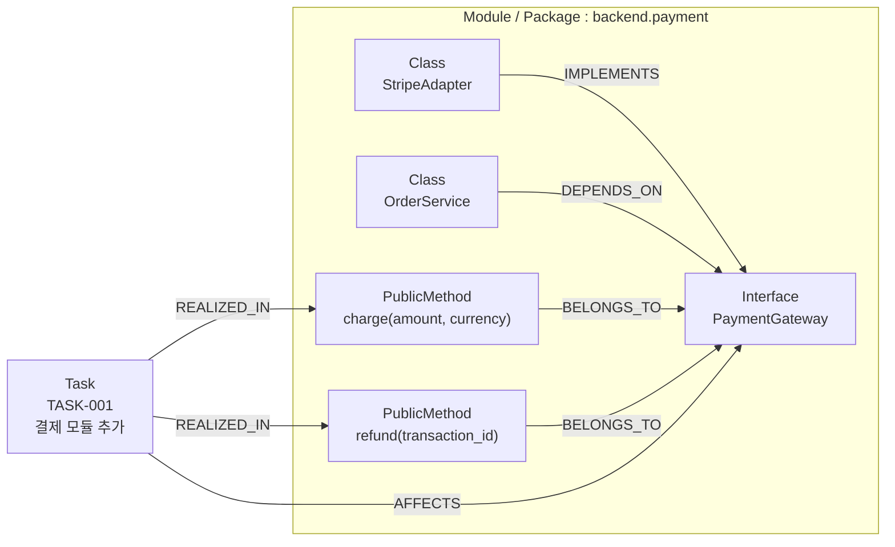

# 지식 모델링

> 본 문서는 [`proposal-main.md`](../proposal-main.md) §4 에서 분리. (#66)

## 4.1. Semantic Layer (Atlas)

Atlas 는 코드의 **인터페이스 의존성 그래프** + **태스크-코드 추적 관계** 를 보관한다. 컨텍스트 정제의 핵심 자산.

### 인터페이스 중심 구현 모델

```
(Class)-[:IMPLEMENTS]->(Interface)
(Class)-[:DEPENDS_ON]->(Interface)
(PublicMethod)-[:BELONGS_TO]->(Interface)
(Module)-[:CONTAINS]->(Class)
```

- **Method 노드는 public 메소드(계약된 인터페이스 시그니처)만 포함** — 내부 구현 상세(private/protected)는 그래프에 포함하지 않음
- 에이전트가 특정 구현체에 종속되지 않고 유연하게 설계 논의
- 인터페이스 매개 객체 간 참조 관계로 변경 영향 범위 즉각 파악

### 태스크-코드 추적성 모델

```
(Task)-[:AFFECTS]->(Interface)
(Task)-[:REALIZED_IN]->(Method)
(Feature)-[:DECOMPOSED_INTO]->(Task)
(BugReport)-[:TRACES_TO]->(Method)
```

- Task, Feature, BugReport 노드가 독립적으로 존재
- 태스크와 코드 직접 연결로 비즈니스 문맥 유지

### 예시 — 결제 모듈 (TASK-001)

아래는 `backend.payment` 모듈에 결제 인터페이스를 추가하는 가상의 task 가 Atlas 에 어떻게 표현되는지의 illustration:



이 그래프 위에서 Eng / QA 가 task_id 로 시작해 `Task → AFFECTS → Interface → IMPLEMENTS → Class → 파일 경로` 를 따라가며 **편집 대상 + 의존 시그니처** 만 정제해 받는다. 코드베이스 전체를 읽지 않고도 작업에 필요한 컨텍스트를 정확히 추출 — [code-agent §Context Assembly](architecture-code-agent.md#context-assembly-흐름) 참조.

## 4.2. Episodic Layer (Doc Store)

Doc Store 는 **시간 흐름의 사실 (episode)** — 대화 / 결정 / 산출물 / 추적 이슈 — 를 보관하는 layer. 도메인이 다른 사실들을 **분류별 컬렉션** 으로 분리해 보관한다. 본 §4.2 는 컨셉 수준의 컬렉션 모델 — 실제 스키마 / 물리적 컬렉션 매핑은 [`doc-store-schema.md`](../doc-store-schema.md) 참조.

| 컬렉션 분류 | 책임 / 호출자 | 용도 |
|---|---|---|
| A2A 대화 흐름 | Chronicler (자동 영속) | 에이전트 간 통신 로그 |
| 기술 노트 | Eng / QA (직접 write) | 개발 / 검증 중 기술 기록 |
| 설계안 | Architect (직접 write) | 채택 / 미채택 설계 |
| 이슈 | Primary (직접 write + 외부 PM 동기화) | PM 작업 추적 |
| PRD | Primary (직접 write + 외부 PM 동기화) | 기획 산출물 |

### A2A 대화 흐름 컬렉션 — Chronicler 영속

에이전트 간 A2A 통신을 자동 수집한 대화 로그. Valkey Streams 로 publish 된 이벤트를 Chronicler 가 구독해 영속화 ([architecture-event-pipeline](architecture-event-pipeline.md)).

- **agent_tasks (태스크)** — 한 단위 일의 메타 (목표 / 상태 / assignees / created_at 등)
- **agent_sessions (대화 세션)** — 한 task 안의 한 대화 흐름 (A2A `contextId` 와 1:1)
- **agent_items (개별 메시지)** — session 안의 한 메시지. `prev_item_id` 로 시간순 chain

```json
// agent_tasks
{
  "_id": "TASK-001",
  "title": "결제 모듈 추가",
  "goal": "Stripe 연동으로 신용카드 결제 지원",
  "status": "in_progress",
  "assignees": ["Eng:BE", "QA:BE"],
  "created_at": "2026-04-16T09:00:00Z"
}

// agent_sessions
{
  "_id": "SES-xxx",
  "task_id": "TASK-001",
  "context_id": "ctx-abc",
  "topic": "Eng:BE의 PaymentGateway 인터페이스 설계 변경 제안",
  "participants": ["Eng:BE", "A"],
  "started_at": "2026-04-16T10:00:00Z"
}

// agent_items
{
  "_id": "ITM-42",
  "session_id": "SES-xxx",
  "prev_item_id": "ITM-41",
  "from": "Eng:BE",
  "to": "A",
  "type": "design_change_proposal",
  "payload": { "...": "..." },
  "timestamp": "2026-04-16T10:15:00Z"
}
```

### 기술 노트 컬렉션 — Eng / QA 개발 기록

Eng / QA 가 개발 / 검증 중 남긴 기술적 기록. 설계 결정 / 구현 특이점 / 주의사항 / TODO 등. 구현 산출물 영속과 함께 **각 에이전트가 직접 write** ([architecture-shared-memory](architecture-shared-memory.md)).

```json
// technical_notes
{
  "_id": "TN-007",
  "task_id": "TASK-001",
  "category": "implementation_note",  // design_decision | todo | caution | concept
  "title": "Stripe webhook 재시도 멱등성 보장",
  "content": "...",
  "source_agent": "Eng:BE",
  "source_diff_ref": "DIFF-015",
  "created_at": "2026-04-16T11:00:00Z"
}
```

### 설계안 컬렉션 — Architect 의 설계 의사결정

Architect 가 도출한 복수 설계안. **채택 / 미채택 모두 본 컬렉션에 보관**. 채택안의 본문은 코드베이스 `docs/design/` 의 md 파일에 저장하고 Doc Store 에는 메타 + 채택 여부만 둠. 미채택안은 전문 + rejection_reason 까지 Doc Store 에 보관.

```json
// design_decisions — adopted
{
  "_id": "DSN-001",
  "task_id": "TASK-001",
  "title": "Adapter 패턴으로 PaymentGateway 추상화",
  "status": "adopted",
  "risk_score": 0.3,
  "est_hours": 6,
  "content_ref": "docs/design/TASK-001-payment-gateway.md",
  "adopted_at": "2026-04-16T09:30:00Z"
}

// design_decisions — rejected
{
  "_id": "DSN-002",
  "task_id": "TASK-001",
  "title": "Adapter 없이 Stripe SDK 직접 호출",
  "status": "rejected",
  "risk_score": 0.6,
  "est_hours": 4,
  "content": "... 전문 ...",
  "rejection_reason": "Stripe 외 다른 PG 지원 어려움",
  "rejected_at": "2026-04-16T09:30:00Z"
}
```

### 이슈 컬렉션 — Primary 의 작업 추적

P 가 프로젝트 작업을 issue 단위로 분해해 추적. **외부 PM (GitHub Issue 등) 와 양방향 동기화** — Doc Store 가 SoT, 외부 시스템은 mirror. 동기화는 P 가 직접 IssueTracker MCP 호출로 수행 ([architecture-shared-memory](architecture-shared-memory.md)).

```json
// issues
{
  "_id": "ISS-001",
  "type": "story",  // epic | story | task | bug — 매 프로젝트 컨텍스트로 결정
  "title": "결제 모듈 추가",
  "status": "in_progress",  // 외부 PM 의 상태와 동기화
  "task_ref": "TASK-001",
  "external_ref": {
    "tracker": "github",
    "url": "https://github.com/.../issues/42",
    "number": 42
  },
  "assignees": ["Eng:BE"],
  "created_at": "2026-04-16T08:00:00Z"
}
```

> 외부 도구의 status / type 등 운영 메타데이터는 매 프로젝트 컨텍스트에 맞춰 P 가 자기 판단으로 결정 / 운영 (root [`CLAUDE.md`](../../CLAUDE.md) "에이전트 ↔ 외부 도구 운영 원칙").

### PRD 컬렉션 — Primary 의 기획 산출물

사용자 ↔ P 협의 결과로 정제된 제품 요구 문서. **외부 PM 의 wiki 와도 동기화** (이중 저장 — proposal-main §8 #21).

```json
// prds
{
  "_id": "PRD-001",
  "title": "결제 기능 도입",
  "version": "1.2",
  "goal": "Stripe 기반 신용카드 결제 지원으로 매출 확대",
  "scope": {
    "in": ["one-time payment", "refund"],
    "out": ["subscription", "split payment"]
  },
  "acceptance_criteria": ["..."],
  "constraints": ["..."],
  "external_ref": {
    "wiki": "github",
    "url": "https://github.com/.../wiki/PRD-001"
  },
  "history": [
    { "version": "1.0", "changed_at": "...", "summary": "초안" },
    { "version": "1.2", "changed_at": "...", "summary": "환불 정책 추가" }
  ]
}
```

### 조회 쿼리 예시

| 목적 | 쿼리 |
|------|------|
| 태스크 전체 히스토리 | `agent_items.find({ task_id })` 정렬 by timestamp |
| 특정 대화 세션 맥락 | `agent_items.find({ session_id })` 정렬 by `prev_item_id` 체인 |
| 대화 쓰레드 역추적 | `item_id` 에서 `prev_item_id` 를 따라 올라가며 재귀 조회 |
| 태스크의 기술 메모 | `technical_notes.find({ task_id })` |
| 태스크의 설계안 (채택+미채택) | `design_decisions.find({ task_id })` |
| 외부 이슈로부터 task 역추적 | `issues.find({ "external_ref.number": 42 })` → `task_ref` 추출 |
| PRD 변경 이력 | `prds.find({ _id: "PRD-001" }).history` |

> **자연어 / 교차 컬렉션 쿼리** (예: "이 task 의 PRD + 채택 설계 + 미채택 후보 의 비교") 는 **Librarian 자연어 위임** — 단순 read 가 아닌 사서 역할의 가치 ([architecture-shared-memory](architecture-shared-memory.md)).
