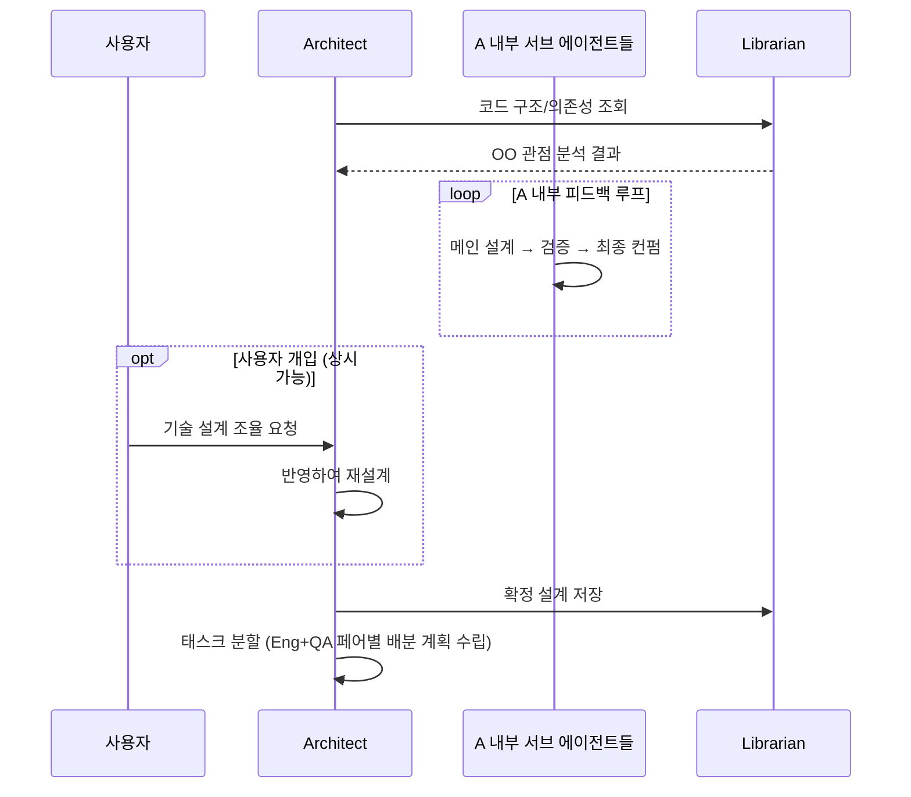
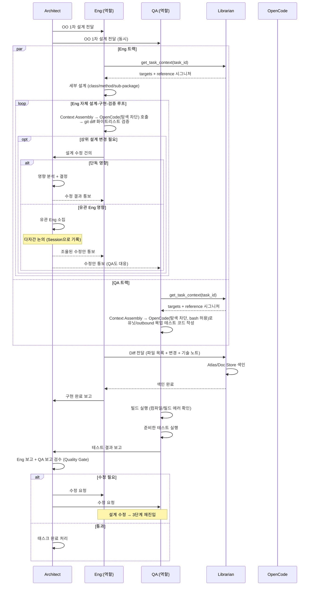

# 협업 프로세스 (Workflow)

> 본 문서는 [`proposal-main.md`](../proposal-main.md) §5 에서 분리. (#66)

## 5.1. 전체 프로세스 개요

| 단계 | 명칭 | 참여 에이전트 | 핵심 활동 |
|------|------|-------------|-----------|
| 1단계 | 기획 구체화 | 사용자, P, L | 사용자-P 대화, PRD 작성, 외부 PM 도구 동기화 |
| 2단계 | OO 설계 | P, A, 사용자, L | A의 서브 에이전트 루프, 사용자 기술 개입 수용, OO 1차 설계 확정 |
| 3단계 | 병렬 구현·검증 | A, Eng+QA 페어들, L | Eng 자체 루프 + QA 독립 테스트 + Diff 색인 |
| 4단계 | 검수/종료 | A, P, L | A 검수 → P 결과 보고 |

**인간 개입 지점:** 사용자는 단계와 무관하게 언제든 P(기획) 또는 A(기술)에게 직접 메시지를 보낼 수 있다. 개입 시점은 Task/Session/Item으로 기록되어 추적 가능하다.

## 5.2. 단계별 상세

### 1단계: 기획 구체화 및 PRD 작성
1. 사용자가 P에게 요청 전달
2. P ↔ 사용자: 요구사항 구체화 대화 (필요 시 여러 차례)
3. P: 구체화된 요구사항을 **PRD로 정리**
4. P → L: PRD 문서 저장 요청 (Doc Store)
5. P → 외부 PM 도구: 동일 PRD 동기화 (GitHub Wiki/Issue 등)
6. P → A: PRD 전달, 기술 설계 의뢰

### 2단계: OO 설계 및 확정

1. A → L: 관련 코드 구조/의존성 질의
2. A 내부: 메인 설계 → 검증 → 최종 컨펌 서브 에이전트 루프 수행
3. A: 정량적 지표(리스크/작업 시간) 포함 **복수 설계안** 도출
4. A → 사용자: 설계안 목록 제시 및 선택 요청
5. (사용자 개입 가능) 사용자 ↔ A: 기술 설계/결정 조율
6. 사용자 → A: 최종 설계안 선택
7. A가 수행하는 후처리:
    - **채택안**: 프로젝트 코드베이스의 `docs/design/`에 md 파일로 저장
    - **미채택안**: A 가 Doc Store MCP 직접 호출 (`wiki_pages.create` with `page_type=adr-alternative` 등) — write 직접 (§2.5 정정)
8. A 가 채택 설계의 OO 구조를 Atlas MCP 직접 호출로 색인 (write 직접). 정보 검색 / 외부 리소스 조사가 필요하면 L 에게 자연어 위임.
9. A: 태스크를 Eng+QA 페어 단위로 분할

### 3단계: 병렬 구현·검증

3단계의 핵심은 **Eng과 QA가 병렬로 작업**한다는 점이다. A의 1차 설계가 두 에이전트에게 **동시에** 전달되고, Eng은 구현 루프를, QA는 테스트 코드 작성을 각각 독립적으로 수행한다.

**상세 흐름:**

1. **설계 동시 배포**: A → Eng, QA에게 OO 1차 설계 전달
2. **Context Assembly (각 트랙 공통)**:
    - Eng/QA가 Librarian.`get_task_context(task_id)` 호출 → 편집 대상 파일 목록 + 의존 인터페이스/클래스 시그니처 수신
    - 대상 파일 내용과 참조 시그니처를 결합하여 OpenCode 호출용 프롬프트 조립
    - 전체 코드베이스를 스캔하지 않고 **Atlas로 정제된 컨텍스트만** 사용
3. **병렬 작업 시작:**
    - **Eng 트랙**: 세부 설계(클래스/메소드/서브 패키지) → Context Assembly → OpenCode(탐색 차단) 호출 → 구현 → `git diff` 화이트리스트 검증
    - **QA 트랙**: 설계 스펙 + 시그니처 컨텍스트 기반으로 테스트 코드(유닛/목업) 독립 작성
4. **상위 설계 수정 처리 (Eng 트랙 중)**:
    - Eng이 상위 설계 수정이 불가피하다고 판단 → A에게 건의
    - A는 영향 범위 분석:
        - **단독 영향**: A가 판단 후 수정 통보
        - **유관 Eng 영향**: A가 유관 Eng을 소집하여 **다자간 논의** (Session으로 기록)
    - 확정된 수정안은 A가 QA에게도 동시 통보 → QA 테스트 코드 재작성 (Context Assembly 재실행)
5. **Diff 색인**: Eng 구현 완료 시 Librarian에게 diff 전달 → Atlas/Doc Store 색인
6. **QA 빌드/테스트 실행**:
    - 빌드 에러 확인 (인터프리터 언어는 필요 시 스킵)
    - 준비한 테스트 실행 → 통과/실패 판정
7. **A 검수 (Quality Gate)**:
    - Eng 보고서 + QA 테스트 결과 + L의 색인 결과를 종합 검토
    - (수정 필요) A → Eng, QA 수정 요청 → 3단계 재진입
    - (통과) 태스크 완료

**Doc Store 기록 (자동, Librarian이 이벤트 수집):**
- Eng-A 설계 수정 제안/논의 Session
- 다자간 논의 Session (유관 Eng 포함)
- A-QA 수정 통보 Session
- Eng의 자체 루프 주요 의사결정 (기술 노트로 함께 전달)
- A의 검수 결과 및 수정 요청 이력

### 4단계: 검수/종료
1. 모든 Eng+QA 페어의 태스크 완료 확인
2. A → P: 전체 검수 완료 보고 (페어별 보고서 + L 색인 결과 종합)
3. P: 외부 PM 도구에 완료 상태 동기화
4. P: 최종 결과물 취합, 사용자에게 보고, 작업 종료
