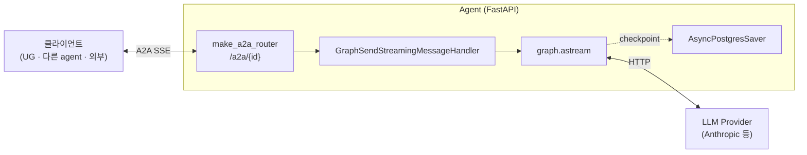

# SSE 연결 관리 — Agent 공용

본 문서는 모든 agent(Primary / Architect / Librarian / Engineer / QA 등)가
공통으로 따르는 **SSE 기반 A2A 연결의 자원 관리 · 예기치 못한 중단 대비 ·
관측성** 규약을 정리한다. agent 고유 구현 (UG 중계 등) 은 해당 모듈의 문서
(예: `user-gateway/docs/sse.md`) 에 위치.

- 관련 이슈: **#23** (shared SSE 하드닝)
- 공용 구현 위치: `shared/a2a/server/*`
- 적용 범위: `GraphSendStreamingMessageHandler` 를 쓰는 모든 에이전트

---

## 1. 배경

`shared/a2a/server` 에는 `make_a2a_router` + `MethodHandler` 추상이 있어
모든 에이전트가 동일한 A2A 서버 모양을 공유한다. 즉 **여기 심어둔 연결 관리
로직은 현재·미래의 전 에이전트에 자동 적용**된다. 따라서 개별 agent README
가 아닌 프로젝트 차원 공용 문서에 정리하는 것이 맞다.

---

## 2. 시스템 내 위치

모든 에이전트는 동일한 라우터 · 핸들러 · Saver wiring 을 쓴다 (shared 공용).
각자 추가로 역할별 노드 / tool 만 덧붙임.

---

## 3. 기본 자원 관리 현황

| 자원 | 정리 시점 | 현재 |
|---|---|---|
| `graph.astream` iterator | generator cancel / StopAsyncIteration | ✅ |
| `AsyncPostgresSaver` 연결 | lifespan shutdown | ✅ |
| per-request SSE generator | FastAPI `StreamingResponse` 소멸 | ✅ |
| Anthropic HTTP 호출 | langchain-anthropic 내부 httpx 관리 | ✅ |

---

## 4. 예기치 못한 중단 시나리오 (공용 관점)

| 시나리오 | 공용 대응 / 개선 항목 |
|---|---|
| 클라이언트 (UG · 다른 agent · curl 등) 측 단절 | Starlette write 감지 + `request.is_disconnected()` 폴링 (S1) |
| agent 프로세스 / 컨테이너 crash | 소켓 끊김 → 상류 fetch 예외 → 상류에서 error 번역 |
| agent ↔ LLM (Anthropic) 장애 | `except Exception` → `TASK_STATE_FAILED` + status.message |
| agent ↔ PostgresSaver 장애 | `graph.astream` 중 예외 → FAILED 전파 |
| LLM / graph 무한 대기 | agent total timeout (S4) |
| 프록시 / LB idle timeout | `:keepalive\n\n` comment 주기 발송 (S2) |
| Half-open TCP | OS/uvicorn 기본 socket keepalive 의존 (Later) |
| Slow client backpressure | Starlette write 대기로 자연스런 backpressure (Later) |
| 관측 공백 | 세션 lifecycle 구조화 로깅 (S3) |

---

## 5. #23 개선 항목

### 5.1. Must

| # | 항목 | 상세 |
|---|---|---|
| **S1** | Client disconnect 조기 감지 | `GraphSendStreamingMessageHandler` 가 chunk 루프 사이에서 `request.is_disconnected()` 폴링. 이탈 즉시 cascade cancel → Anthropic 비용 차단 |
| **S2** | SSE keepalive ping | 15~30s 간격 `:keepalive\n\n` comment. 프록시/LB idle timeout(보통 60s) 방어. EventSource 스펙상 comment 는 파서가 무시 |
| **S3** | SSE 세션 lifecycle 구조화 로깅 | `event` / `assistant_id` / `method_name` / `context_id` / `duration_ms` / `chunk_count` / `reason` 필드 통일. start · chunk · end · cancel · error |

### 5.2. Should

| # | 항목 | 상세 |
|---|---|---|
| **S4** | Agent 측 total timeout | LangGraph `astream` 전체 수명 상한 (`anyio.fail_after`). M2 단일 LLM 호출엔 과하지만 multi-tool / multi-node 그래프 대비 공용 인프라로 심어둠 |
| **S5** | Anthropic cascade cancel 실측 검증 (문서화) | S1 적용 후 실제 Anthropic 요청이 중단되는지 langchain-anthropic 로그로 확인. 결과 기록 |
| **S6** | PostgresSaver write 중 cancel 안정성 (문서화) | 체크포인트 저장 도중 cancel 시 transaction rollback 동작 확인 |

### 5.3. Later (별도 이슈)

- Prometheus metrics (`active_sessions` / `duration_histogram` / `errors_total`)
- Max concurrent SSE per agent (semaphore 상한)
- Graceful shutdown 시 진행 중 세션 drain (SIGTERM → 새 요청 거부 + 완료 대기 vs 즉시 cancel)
- TCP socket keepalive 튜닝 (OS / uvicorn 기본값 외)

---

## 6. 구현 위치 (shared/a2a/server)

| 대상 | 파일 |
|---|---|
| S1 disconnect polling · S2 keepalive · S3 lifecycle 로깅 | `graph_handlers.py` 의 `GraphSendStreamingMessageHandler.handle` |
| S4 total timeout | 동일 위치 — `anyio.fail_after` 로 `event_generator` 감쌈 |
| SSE 직렬화 (sse_pack / keepalive sentinel) | `sse.py` |
| MethodHandler 계약 | `handler.py` |
| 라우터 조립 | `router.py` |

---

## 7. 완료 조건 / 검증 (#23)

공용 변경 후 **Primary 를 consumer 로 사용해 회귀 확인** (#23 본문 참조).

| 검증 | 방법 |
|---|---|
| 회귀 없음 | Primary `/.well-known/agent-card.json`, `SendMessage`, `SendStreamingMessage` 가 #22 머지 상태와 동일한지 |
| S1 실측 | SSE 연결 후 curl `Ctrl-C` → 1초 이내 `sse_session.cancel(reason=client_disconnect)` 로그 |
| S2 실측 | idle 5s 초과 구간에 `:keepalive` 라인 주기 관찰 (`curl --no-buffer`) |
| S3 실측 | 세션 완료 시 `event=sse_session.end`, `duration_ms`, `chunk_count`, `reason=completed` JSON 로그 |
| S4 실측 | 의도적 LLM 지연으로 agent total timeout 초과 → `TASK_STATE_FAILED` + timeout 메시지 |
| S5 / S6 | 실측 결과를 PR 본문에 발췌 |

---

## 8. 미해결 / 재검토

- **LLM cancel cascade 완전성** — cascade 가 Anthropic API 호출까지 실제 닿는지
  `langchain-anthropic` / httpx 구현에 의존. 실측 결과를 S5 에서 기록.
- **PostgresSaver 중간 cancel 시 상태 일관성** — S6 에서 확인. 필요 시 별도 이슈.
- **Graceful shutdown 정책** — SIGTERM 수신 시 drain vs immediate cancel. 운영
  환경 도입 시 결정.

---

## 9. 향후 agent 추가 시 자동 혜택

Architect / Librarian / Engineer / QA 등이 `shared/a2a/server` 의 공용 핸들러
를 그대로 상속/재사용할 것이므로, **본 이슈(#23) 로 공용 계층에 심어둔 개선은
개별 에이전트 작업 없이 자동 적용**된다. 에이전트별 추가 처리 (예: UG 중계,
인증, rate limit) 는 해당 모듈의 문서에서 다룬다.

---

## 참고 문서

- `user-gateway/docs/sse.md` — UG 관점의 특수 사항 (브라우저 대면, upstream 중계, 번역 계약)
- `docs/agent-runtime.md` — 에이전트 런타임 / Dockerfile / 엔드포인트 규약
- `shared/src/dev_team_shared/a2a/README.md` — A2A 타입 / AgentCard 빌더
