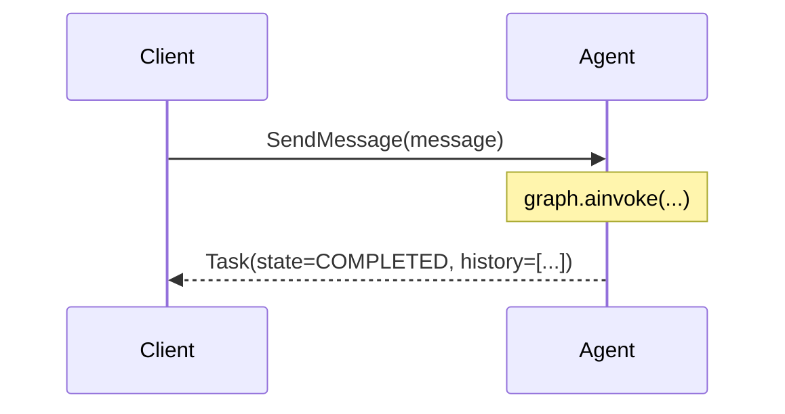
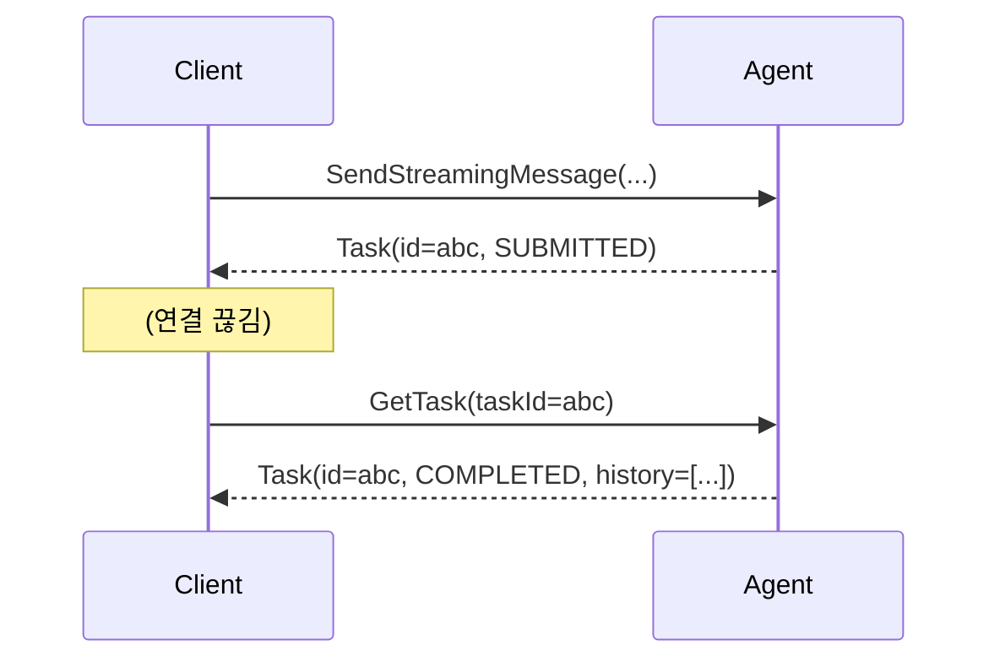
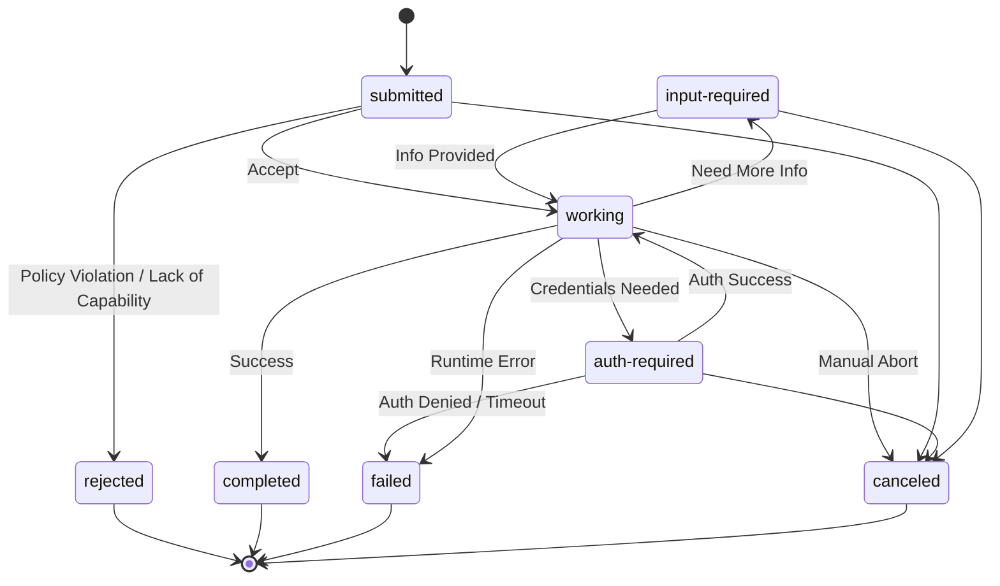
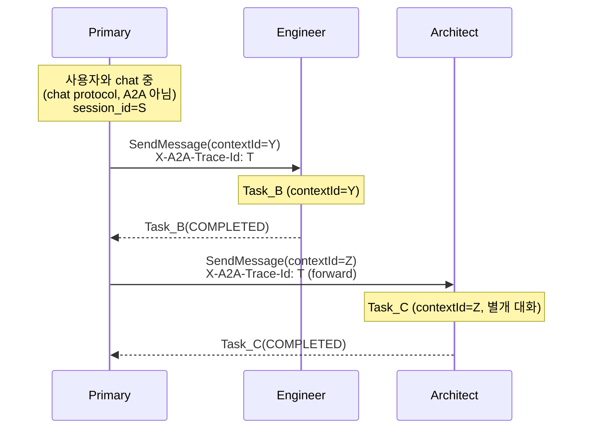

# A2A 메시징 / Task — 코드 진입 가이드

본 문서는 `shared/a2a` 코드를 처음 마주한 사람이 **A2A 프로토콜의 핵심 개념** 과
**우리 구현의 어디에 그게 들어가 있는지** 의 연결고리만 잡도록 짠 노트다.

A2A 스펙 전체 가이드가 아니다. 더 깊이가 필요하면
[A2A Protocol v1.0 spec](https://a2a-protocol.org/latest/specification/) 원문을
참조한다. 본 문서는 spec 의 한 단락과 우리 코드의 한 파일을 짝지어 보여주는
정도다.

> ⚠️ **본 프로토콜은 에이전트 간 통신 한정.** 사용자 ↔ Primary / Architect 의
> chat 통신은 A2A 가 아닌 별도 chat protocol (REST POST + 영속 SSE per session) —
> [`docs/proposal/architecture-chat-protocol.md`](../../../../../docs/proposal/architecture-chat-protocol.md) 참조.
> 사용자 ↔ 에이전트는 에이전트 간 통신과 다른 영역이라 자체 어휘 (Session /
> Chat / Assignment) 로 별도 정의했다 (#75).

---

## 1. 본 문서의 위치

`shared/a2a` 패키지에는 두 축의 문서가 있다:

| 문서 | 다루는 영역 |
|---|---|
| [`README.md`](./README.md) | **디스커버리 / 정체성** — AgentCard, `/.well-known/agent-card.json`, Config → 빌더 패턴 |
| **`messaging.md`** (본 문서) | **런타임 통신** — Message, Task, RPC 메서드, TaskState lifecycle |

전자가 "이 에이전트가 누구이고 뭘 할 수 있는지" 를 다루고, 후자가 "그 에이전트와 실제로 어떻게 대화하는지" 를 다룬다.

---

## 2. 핵심 어휘 — `Message` / `Task` / `contextId`

A2A 의 통신 계층은 세 가지 객체로 굴러간다:

**`Message`** — 한 발화의 단위 (입력).
사용자/에이전트가 보내는 한 마디로, `parts[]` 안에 텍스트(`Part.text`) 가 담긴다.
optional `taskId` 필드로 어느 Task 의 history 에 속하는지 명시 가능.
spec §6.4. 우리 코드: `types.py:Message`, `types.py:Part`, `types.py:Role` (`ROLE_USER` / `ROLE_AGENT`).

**`Task`** — 그 메시지를 처리하는 **서버 측 작업 단위 + 상태**.
ID 가 부여되고, `state` 가 lifecycle 을 따라 변하며 (§4 참조), `history[]` 에 받은 메시지와 응답이 누적된다. spec §6.2. 우리 코드: `events.py:Task`, `events.py:TaskStatus`.

> 비유: Message 가 손님의 **주문서**, Task 가 주방의 **작업 티켓**. 주문서는 한 장 받고 끝, 티켓은 "접수 → 조리 → 완료" 처럼 상태가 변한다.

### Message 와 Task 의 관계 — 응답 형식 alternative

A2A 공식 가이드 (https://discuss.google.dev/t/a2a-protocol-demystifying-tasks-vs-messages/255879):

- **Messages for Trivial Interactions** — 짧은 Q&A / discovery / clarification / pre-commitment negotiation. Task 미생성, Message 만 주고받음.
- **Tasks for Stateful Interactions** — long-running / 여러 step / 추적 필요. agent 가 "이 의도는 추적 가치 있다" 판단되면 Task 객체로 응답.
- 즉 **응답 형식의 alternative** — 첫 응답은 Message 또는 Task 둘 중 하나.

Task 가 commit 된 후엔 **그 Task 와 관련된 후속 Message 들이 Task 에 속함**:
- Message 의 `taskId` 필드로 backlink ("Notice how the `task_id` field in the Message object clearly indicates which task the user is referring to")
- Task 의 `history[]` 필드에 누적

**우리 도메인 Task = Assignment** (이름 변경 — #75). A2A Task 와 다른 객체:
- Assignment = 도메인 work item (open → done)
- A2A Task = wire-level 한 호출의 진행 추적 (SUBMITTED → COMPLETED)
- 한 Assignment 는 1 개 이상의 A2A Task 로 구성 가능 (위임 다회).

⚠️ **자동 Task wrap 은 A2A 스펙 요구사항 아님**. 현재 `graph_handlers/send_message.py` /
`send_streaming.py` 가 모든 SendMessage 응답을 Task 로 감싸고 있으나 이는 단순화일 뿐.
trivial 응답은 Message 만, stateful 만 Task — 후속 작업으로 분기 (#75).

---

### `contextId` — 에이전트 boundary 의 대화 namespace

**`contextId`** — **한 에이전트 boundary 안의** 다중 turn 대화 묶음.
같은 `contextId` 를 공유하는 여러 Task = 한 대화. 우리 구현은 이를 **LangGraph 의 `thread_id` 로 매핑** 해 체크포인터(Postgres) 가 대화별 state 를 영속화한다 — `graph_handlers/send_message.py` 의 `graph.ainvoke(..., config={"configurable": {"thread_id": ctx.context_id}})` 부분.

⚠️ `contextId` 는 **에이전트 쌍 사이의 conversation 식별자**이지 시스템 전체 trace 식별자가 아니다. Primary ↔ Engineer 의 contextId 와 Primary ↔ QA 의 contextId 는 다른 값이어야 한다 (각각 다른 두 당사자의 대화). 시스템 전체를 묶어 추적하려면 **`traceId`** (§5.x) 를 쓴다.

#### Context lifecycle — start / end

| 시점 | 트리거 | publish |
|---|---|---|
| start | 새 contextId 의 첫 RPC 도착 시 | `a2a.context.start` (CHR idempotency 가 dedup) |
| end | **agent 가 "이 inter-agent 대화 마무리" 라 판단한 시점** | `a2a.context.end` |

end 는 RPC 라이프사이클이 아니다. 한 contextId 위에 여러 RPC (Task / Message)
가 누적될 수 있고, agent 가 자기 graph / handler 안에서 "더 이상 대화 이어
받을 일 없음" 이라 결정한 시점에만 발화. publish 위치 / 결정 로직은 agent
통합 PR 에서.

session (chat tier) 과 다르게 a2a_context 는 종료 개념이 있다 — agent 가
관리하는 대화로 명시적 끝맺음이 의미를 가짐 (반면 session 은 사용자가
언제든 재개하는 namespace 라 종료 개념 없음).

> ※ 사용자 ↔ Primary / Architect 의 chat 통신은 A2A 가 아니므로 contextId 가 아닌 **session_id** (chat protocol 의 식별자) 를 사용한다. A2A Context 가 chat session 에서 비롯되는 경우 (예: Primary 가 사용자 chat 중 Architect 에게 위임) 새 contextId 를 만들고, Doc Store 의 `a2a_contexts.parent_session_id` 로 source session 을 backlink ([knowledge-model](../../../../../docs/proposal/knowledge-model.md) §4.2).

---

## 3. 세 가지 동사 — RPC 메서드

A2A 가 정의하는 메서드 중 우리가 다루는 셋. 모두 JSON-RPC 2.0 의 `method` 필드 값이다.

### 3.1. `SendMessage` — 동기 요청-응답 (spec §9.4.1)

응답 받을 때까지 한 connection 을 유지하고 `Task` 한 덩어리를 받는다.



본 구현은 `graph_handlers/send_message.py:GraphSendMessageHandler`. 핸들러 본문은 *parse → RPCContext.create → graph.ainvoke (`anyio.fail_after` 로 S4 timeout 적용) → make_completed_task / make_failed_task* 의 얇은 오케스트레이터.

### 3.2. `SendStreamingMessage` — SSE 스트림 (spec §9.4.2)

같은 일을 하지만 **응답을 조각조각** 받는다. 한 connection 위에서 이벤트 시퀀스가 흐른다:

```
Task(SUBMITTED) → ArtifactUpdate × N → StatusUpdate(COMPLETED|FAILED, final=true)
```

본 구현은 `graph_handlers/send_streaming.py:GraphSendStreamingMessageHandler`. LLM 토큰 chunk → `TaskArtifactUpdateEvent` 변환은 `graph_handlers/stream.py:stream_artifact_events` 가 담당하며, 같은 함수가 client disconnect 폴링(S1) / keepalive sentinel 처리(S2) 도 겸한다 (자세한 SSE 자원 관리는 [`docs/sse-connection.md`](../../../../../docs/sse-connection.md) 참조).

### 3.3. `GetTask` — 상태 조회 (spec §9.4.3)

이전에 시작한 Task 를 ID 로 조회하는 한 컷 snapshot.



본 구현은 `client.py` 의 `A2AClient.get_task` (호출자 쪽) 만 있고 **서버 핸들러는 미구현**. 향후 `MethodHandler` 구현체 1개 추가 + `server.py` 의 list 에 등록만 하면 된다 (OCP — 다른 코드 변경 0줄).

### 비교

| | 시작 | 진행 관찰 | 사후 조회 |
|---|:---:|:---:|:---:|
| `SendMessage` | ✅ | ❌ | ❌ |
| `SendStreamingMessage` | ✅ | ✅ (SSE) | ❌ |
| `GetTask` | ❌ | ❌ | ✅ |

`SendMessage` / `SendStreamingMessage` 는 **새 Task 또는 Message 를 만드는** 동사, `GetTask` 는 **기존 Task 를 들여다보는** 동사.

### 3.4. Task wrap vs Message-only — agent 결정 (#75 PR 3)

A2A 공식 가이드: *"Messages for Trivial Interactions, Tasks for Stateful Interactions"*. 응답을 항상 Task 로 감싸지 않고 **trivial 응답은 Message 만**, **stateful 작업만 Task wrap**.

#### 두 axis 는 직교

| Axis | 결정 주체 | 가능한 값 |
|---|---|---|
| Transport | 호출자 (caller) | `SendMessage` (sync) / `SendStreamingMessage` (stream) |
| Response shape | **agent** | `Message` only / `Task` wrap |

method 이름이 response shape 를 결정하지 않는다 (예: SendStreamingMessage 도 trivial 응답이면 Message stream 만 보내면 됨). spec 상 4가지 조합이 모두 가능:

| Method | Response | 시나리오 |
|---|---|---|
| SendMessage | Message | 짧은 동기 응답 |
| SendMessage | Task | 동기 호출인데 stateful work — caller 가 task_id 받아 후속 GetTask / 폴링 |
| SendStreamingMessage | Message stream | streaming 인데 trivial — chunk 단위 텍스트만 |
| SendStreamingMessage | Task stream | streaming + stateful work (가장 일반적) |

#### 결정 메커니즘 — LLM 추론 (callee graph 안)

callee 의 graph 안 LLM 이 자기 응답이 trivial 인지 stateful 인지 **추론**해 결정. 룰베이스 / 휴리스틱 도입 X — 진짜 에이전트는 추론하지 룰 따르지 않는다.

구현은 **structured output**: ReAct 의 응답 생성 LLM 이 자기 출력에 hint 필드 포함하도록 schema 강제.

```python
# 응답 generation LLM 의 structured output schema
class A2AResponseDecision(BaseModel):
    text: str                        # 응답 본문
    requires_task: bool              # LLM 이 추론한 결정 (Task wrap 필요한가)
    # 또는 더 풍부:
    # task_state: TaskState | None   # None 이면 Message only
```

graph 는 이 출력을 state 에 담아 handler 로 전달. handler 는 hint 만 보고 wrap 분기 — 분류 / 분석 로직 0 (LLM 이 이미 결정).

#### 결정 prompt 의 위치 — shared

본 결정은 **A2A 프로토콜 차원** (agent 정체성이 아님) — 모든 agent (Primary / Architect / Engineer / QA …) 가 동일 기준으로 답해야 함. 따라서 prompt 텍스트는 `shared/src/dev_team_shared/a2a/decision.py:DEFAULT_RESPONSE_DECISION_PROMPT` 상수로 두고 모든 agent 가 import 해 사용. agent 별 customize 가 필요해지면 (드물 것) config 에서 override 가능한 형태로 확장.

> agent 정체성 / 도메인 워크플로 자료는 `agents/<name>/config/base.yaml`(persona) 와 `agents/<name>/resources/*.md`. **protocol-level 공통 텍스트** 는 shared. 코드 안에 자연어 prompt 박지 않음 — root [`CLAUDE.md`](../../../../../CLAUDE.md) "AI 에이전트 런타임 자산" 원칙.

#### default — hint 누락 시

LLM 출력 파싱 실패 / graph 미구현 등 hint 가 비어 있으면 보수적으로 **Message only**. Task wrap 은 LLM 이 명시한 경우만 — Task 는 a2a_tasks / status_updates / artifacts 까지 publish 하므로 부수 비용이 있다.

#### publish 패턴 (server 측)

| 결정 | publish |
|---|---|
| Message only | `a2a.context.start` (idempotent) + `a2a.message.append` (task_id=NULL) |
| Task wrap | 위 + `a2a.task.create` + `a2a.message.append` (task_id 채움) + `a2a.task.status_update` (WORKING→COMPLETED) + agent reply `a2a.message.append` (task_id) |

같은 contextId 위에 두 결정이 섞여도 모두 같은 a2a_context 에 누적 (contextId 가 grouping key, method / shape 무관). LangGraph thread (`thread_id = contextId`) 도 동일 thread 위 history 이어짐.

#### 현재 구현 제한 — streaming 은 Task wrap 만

spec 상 4 조합 모두 가능하지만 현재 우리 구현 상:
- `SendMessage` — `requires_task` hint 따라 Message / Task 양쪽 분기 ✅
- `SendStreamingMessage` — **항상 Task wrap** (hint 무시)

이유: streaming SSE 형식이 Task 중심 (initial Task → TaskArtifactUpdateEvent × N → TaskStatusUpdateEvent). Message-only streaming 은 별도 SSE 이벤트 흐름이 필요해 향후 확장 사항. classify_response 노드는 streaming 경로에서도 실행되며 hint 는 graph state 에 기록되지만 (관찰용) handler 가 사용하지 않는다.

---

## 4. TaskState — Task 의 lifecycle

`Task.status.state` 가 거치는 상태 머신. spec §6.3 + 우리 코드 `types.py:TaskState`.

### 4.1. State 카탈로그

| Enum | spec | 의미 | terminal? |
|---|---|---|:---:|
| `UNSPECIFIED` | `TASK_STATE_UNSPECIFIED` | protobuf zero-value placeholder. 런타임 상태 아님 | – |
| `SUBMITTED` | `submitted` | 접수 완료, 처리 미시작 | |
| `WORKING` | `working` | 활발히 처리 중 | |
| `INPUT_REQUIRED` | `input-required` | 추가 입력 대기 (사용자에게 질문) | |
| `AUTH_REQUIRED` | `auth-required` | 인증·인가 대기 | |
| `COMPLETED` | `completed` | 정상 완료 | ✅ |
| `FAILED` | `failed` | 오류로 종료 | ✅ |
| `CANCELED` | `canceled` | 취소됨 | ✅ |
| `REJECTED` | `rejected` | 처리 시작 전 거절 (정책 위반 / 능력 부족) | ✅ |

### 4.2. 전이 다이어그램



핵심 불변식:

- 진입은 `submitted` 단 하나.
- `rejected` 는 `submitted` 에서만 도달 — 처리 *전* 거절 의미를 보존.
- terminal 4개: `rejected` / `completed` / `failed` / `canceled`. 같은 Task 재시작 불가.
- pause/resume 쌍: `working ↔ input-required`, `working ↔ auth-required`.

### 4.3. 본 구현의 정책 결정 (spec 미정의 영역)

- **`auth-required → failed`**: 인증 거부 / 타임아웃은 `failed` 로 처리. spec 은 미정의이지만 "외부 입력으로 회복 불가능한 비정상 종료" 라 `failed` 의 의미와 부합.
- **`input-required → failed` 부재**: 본 구현은 `input-required` 를 무기한 대기로 둔다. 사용자 응답 시간이 가변적이라 일률적 timeout 부적절. 영구 점유가 문제면 운영 도구로 stale Task 일괄 cancel 정책이 적합 (별도 이슈).
- **`submitted → canceled` 허용**: agent 가 working 으로 옮기기 전 사전 cancel 가능.

### 4.4. 현재 코드가 emit 하는 state

| 모듈 | emit 하는 state |
|---|---|
| `graph_handlers/factories.py` | `SUBMITTED` (initial) / `COMPLETED` / `FAILED` |
| `graph_handlers/send_streaming.py` | 위 + `TaskStatusUpdateEvent.final=true` 로 스트림 종결 |

`INPUT_REQUIRED` / `AUTH_REQUIRED` / `CANCELED` / `REJECTED` 는 enum 에 정의되어 있으나 아직 어떤 핸들러도 emit 하지 않는다. 추가 메서드 / 분기 도입 시 §4.2 전이 표를 따른다.

---

## 5. 호출 단위 = Task 단위

A2A spec 의 불변식: **`SendMessage` / `SendStreamingMessage` 한 호출 = `Task` 0 또는 1개**. spec §9.4 가 응답을 `Task` 또는 `Message` 중 하나로 한정.

| 응답 타입 | Task 개수 |
|---|:---:|
| `Task` | 1 |
| `Message` (즉답, lifecycle 추적 불필요) | 0 |

본 구현은 **현재 항상 `Task` 를 반환** — `Message`-only 응답 경로 미사용 (`graph_handlers/factories.py` 가 `make_*_task` 만 만든다). 이는 단순화이지 스펙 요구사항 아님 — trivial / stateful 분기는 후속 작업 (#75).

### 위임은 별도 호출 → 트리

Primary / Architect 가 다른 에이전트에게 일을 넘기는 건 **새로운 A2A 호출** 이고 그 호출은 그 호출대로 **자기 Task + 자기 contextId** 를 가진다:



각 호출 경계에서 **1:1** 이고, 트리는 그 노드들이 모인 결과. `client.py:A2AClient` 가 위임 호출자 역할.

**핵심 — `contextId` 는 forward 하지 않는다**: Primary ↔ Engineer 의 `Y` 와 Primary ↔ Architect 의 `Z` 는 다른 값. 각 에이전트 boundary 가 자기 대화 namespace 를 가져 체크포인터 thread 가 격리된다. 시스템 전체 추적은 별도의 **`traceId`** 가 책임진다 (§5.x).

### 5.x. `traceId` — 시스템 전체 추적

`contextId` 가 boundary 안의 대화라면, `traceId` 는 boundary 를 **가로지르는** 추적 ID — 한 의도가 시스템 전체로 퍼진 흔적. 같은 traceId 의 모든 a2a_context / 로그를 묶으면 그 의도의 전체 흐름이 복원된다.

trace 의 시작점은 셋:

| 시작점 | 예 |
|---|---|
| 사용자 | UG chat 으로 시작한 의도 (UG → Primary → Engineer → QA …) |
| agent autonomous | scheduled task / cron / agent 자체 판단으로 다른 agent 호출 |
| 외부 system trigger | webhook / external event |

> ⚠️ trace 는 **사용자 의도에서만 시작하지 않는다**. agent 가 자력으로 시작한 일도 trace 가 붙어 boundary 가로지르는 추적이 가능하다. 시작점에 따라 `a2a_contexts` 의 source link (`parent_session_id` / `parent_assignment_id` / 둘 다 NULL) 가 달라질 뿐, traceId 매핑은 동일하다.

규약 (`tracing.py:TRACE_ID_HEADER`):

| 항목 | 값 |
|---|---|
| Wire 위치 | HTTP 헤더 `X-A2A-Trace-Id` |
| 부재 시 | 서버 (`router.py`) 가 새 UUID 발급 → `request.state.trace_id` 에 보관 |
| 위임 시 forward | 위임자가 받은 traceId 를 `A2AClient.send_message(..., trace_id=...)` 인자로 그대로 forward |
| 로그 | `a2a_rpc.start/cancel/end` 모든 로그에 `trace_id=...` 포함 (`rpc.py:log_rpc`) |

코드 매핑:

- 서버 수신 — `router.py` 가 헤더 읽음 → `request.state.trace_id` 보관
- 핸들러 — `RPCContext.create()` 가 자동으로 읽어 `ctx.trace_id` 에 저장
- 클라이언트 송신 — `A2AClient(trace_id=...)` (생성자 default) 또는 메서드 인자 `send_message(trace_id=...)` (per-call override)

추후 OpenTelemetry `traceparent` 헤더 도입 시 `tracing.py` 가 두 헤더를 모두 인식하도록 확장하면 된다.

### `contextId` 로 묶이는 다중 turn

같은 `contextId` 의 SendMessage 를 N 번 부르면 → Task 가 N 개 누적되며 같은 LangGraph thread 위에서 history 가 이어진다. "한 발화당 Task 1개" 가 누적되어 "한 대화" 를 이룬다 (단일 에이전트 boundary 안에서).

---

## 6. 부록

### 6.1. JSON 직렬화 규약 (spec §5.5)

- 필드명: **camelCase** (e.g., `messageId`, `contextId`)
- enum: **SCREAMING_SNAKE_CASE** 문자열 (e.g., `"TASK_STATE_COMPLETED"`)

본 구현은 Pydantic `model_dump(by_alias=True, exclude_none=True)` + `StrEnum` 으로 자동 처리. `graph_handlers/envelope.py:rpc_result` 가 한 곳에서 직렬화 옵션을 적용한다.

### 6.2. Method naming — pascal vs slash

A2A v1.0 (§9.4) 의 표기는 **PascalCase** (`SendMessage`, `SendStreamingMessage`, `GetTask`). 단, langgraph-api 초기 버전이 구(舊) 명세의 슬래시 표기 (`message/send` 등) 를 노출한 적이 있어, `client.py:_METHOD_MAP` 에서 두 스타일을 모두 지원한다 (기본값 = `pascal`).

### 6.3. 향후 확장

| 항목 | 도입 시 영향 |
|---|---|
| `CancelTask` 메서드 | `MethodHandler` 구현체 1개 추가 → `working`/`input-required`/`auth-required`/`submitted` → `canceled` 전이 활성화 |
| `ResubscribeTask` 메서드 | SSE 재구독으로 끊긴 스트리밍 복구 — 현 SSE 핸들러는 1회성이라 별도 핸들러 필요 |
| push notification | AgentCard `capabilities.pushNotifications=true` 와 연계, `input-required` / `auth-required` 진입 시 사용자에게 알림 |
| `input-required` timeout 정책 | §4.3 의 무기한 대기 정책 재검토 |

---

## 7. 관련 문서

- [`README.md`](./README.md) — 디스커버리 / AgentCard
- [`server/README.md`](./server/README.md) — A2A 서버 추상화 / `MethodHandler` 계약
- [`docs/sse-connection.md`](../../../../../docs/sse-connection.md) — SSE 자원 관리 정책 (#23)
- [A2A Protocol v1.0 spec](https://a2a-protocol.org/latest/specification/) — 공식 spec 원문
