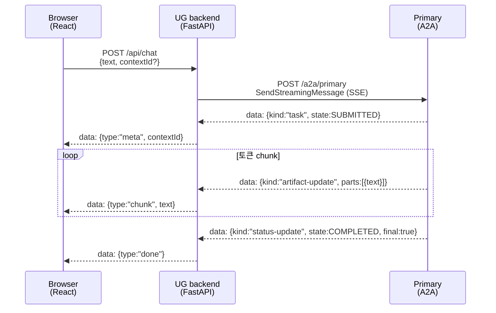

# User Gateway

사용자가 웹 UI 로 Primary 에이전트와 대화하는 최소 구성.

- 이슈: #7
- 역할: 브라우저 ↔ UG backend ↔ Primary A2A 중계
- M2 스코프: SSE 기반 실시간 스트리밍 채팅 · 인증/다중 세션/다중 에이전트 X

---

## 구성

```
user-gateway/
├── Dockerfile                 # 멀티스테이지 (node → python)
├── pyproject.toml             # FastAPI + dev-team-shared + httpx
├── docs/sse.md                # UG 고유 SSE 사항 (모듈 책임 / 하드닝 / 번역 계약)
├── src/user_gateway/
│   ├── main.py                # 조립 (lifespan · 미들웨어 · 라우터 include · static mount)
│   ├── config.py              # frozen AppConfig + env loader
│   ├── upstream.py            # A2AUpstream — httpx 기반 Primary 호출 (connect retry)
│   ├── translator.py          # A2A 이벤트 → UG ChatEvent 순수 함수
│   ├── sse.py                 # sse_pack · KEEPALIVE_SENTINEL · line-iter
│   ├── middleware.py          # CacheControlMiddleware
│   └── routes.py              # /healthz · /api/agent-card · /api/chat
├── frontend/
│   ├── package.json           # React 18 + Vite + TypeScript
│   ├── index.html · vite.config.ts · tsconfig.json
│   └── src/
│       ├── App.tsx            # 상단 AgentCard + <Chat/>
│       ├── components/Chat.tsx            # 입력창 + 버블 리스트 + SSE 소비
│       ├── components/MessageBubble.tsx   # user/agent 버블 + retry 버튼
│       ├── api.ts             # fetchAgentCard · streamChat (SSE 파서)
│       ├── types.ts           # ChatEvent / ChatMessage / AgentCardSummary
│       └── styles.css
└── static/                    # Dockerfile 이 frontend/dist 를 여기 복사 (gitignored)
```

각 모듈의 책임 / SOLID 분리 근거 / SSE 하드닝 (timeout · keepalive · disconnect
polling · lifecycle 로깅 등) 의 환경변수 / 동작 상세는
[`docs/sse.md`](./docs/sse.md) 참조.

---

## 런타임 흐름



브라우저가 A2A 프로토콜 세부(Task/Artifact/StatusUpdate) 를 알 필요 없게끔
UG 가 간단화한 이벤트(`meta` / `chunk` / `done` / `error`) 로 번역해 보낸다.

---

## 로컬 dev

### 1. 인프라 + Primary 먼저
```bash
docker compose -f infra/docker-compose.yml --env-file .env --profile agents up -d postgres postgres-init valkey primary
```

### 2. UG backend (호스트 uvicorn, 핫리로드)
```bash
uv run uvicorn user_gateway.main:app \
  --app-dir user-gateway/src \
  --host 127.0.0.1 --port 8000 --reload
```
(`PRIMARY_A2A_URL`, `PRIMARY_CARD_URL` 은 기본값이 `http://primary:8000/*` 이므로
로컬 실행 시 `http://localhost:9001/*` 로 export 필요)

```bash
export PRIMARY_A2A_URL=http://localhost:9001/a2a/primary
export PRIMARY_CARD_URL=http://localhost:9001/.well-known/agent-card.json
```

### 3. Frontend (Vite dev server, 자동 리로드)
```bash
cd user-gateway/frontend
npm install   # 최초 1회
npm run dev
```
→ http://localhost:5173 접속. `/api/*` 는 Vite proxy 가 `localhost:8000` 으로 전달.

---

## 프로덕션 (docker compose)

전체 스택 기동:
```bash
docker compose -f infra/docker-compose.yml --env-file .env --profile agents up -d --build
```

접속: **http://localhost:8080**

### 검증

```bash
# liveness
curl http://localhost:8080/healthz

# Primary AgentCard 프록시
curl -sS http://localhost:8080/api/agent-card | jq .

# SSE 중계 (토큰 스트리밍)
curl -sS --no-buffer -X POST http://localhost:8080/api/chat \
  -H 'Content-Type: application/json' \
  -d '{"text":"한 문장 자기소개."}'
```

기대:
- `/api/agent-card`: Primary 카드 JSON (name, capabilities, skills)
- `/api/chat`: SSE. `{type:"meta",contextId}` → `{type:"chunk",text}` × N → `{type:"done"}`
  실패 시 `{type:"error",message}`

---

## 환경변수

| 변수 | 기본값 | 용도 |
|---|---|---|
| `PRIMARY_A2A_URL` | `http://primary:8000/a2a/primary` | Primary 의 A2A 엔드포인트 (compose 내부 DNS) |
| `PRIMARY_CARD_URL` | `http://primary:8000/.well-known/agent-card.json` | Primary AgentCard URL |
| `STATIC_DIR` | `<pkg>/../../static` | Vite 빌드 결과 디렉토리 (Docker 는 자동) |

---

## 제약 (M2)

- **인증 없음** — 누구나 접속 / 대화 가능 (로컬 dev 용도)
- **단일 세션** — thread 는 브라우저 세션당 1개 (React state). 새로고침 시 새 thread
- **Primary 전용** — Architect / Librarian 등과는 미연동
- **UI 최소** — shadcn / MUI 등 무거운 kit 배제, 기본 CSS

---

## 관련 문서

- [`docs/sse.md`](./docs/sse.md) — UG 고유 SSE 사항 (모듈 책임, 하드닝, 환경변수, 번역 계약)
- [`../docs/proposal-main.md`](../docs/proposal-main.md) — 전체 시스템 설계
- [`../docs/agent-runtime.md`](../docs/agent-runtime.md) — A2A 서버 규약 (Primary 기준)
- [`../agents/primary/README.md`](../agents/primary/README.md) — Primary 기동/검증
