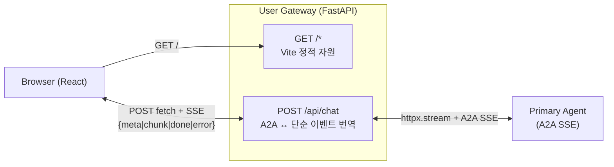

# SSE — User Gateway 전용 사항

**agent 공통 규약은 [`docs/sse-connection.md`](../../docs/sse-connection.md) 참조.**
본 문서는 UG 가 브라우저 대면 + A2A 중계자 역할을 맡음으로써 생기는 **UG
고유 사항** 만 다룬다.

- 관련 이슈: #7
- UG 특수성: (a) 브라우저에게 서비스, (b) upstream agent 를 호출 (다른 agent 와
  달리 UG 는 outbound caller 역할도 겸함)

---

## 1. UG 고유 아키텍처 관점

UG 가 **단순화된 이벤트 포맷** 으로 브라우저에게 번역해 제공하므로, FE 는 A2A
스펙 (Task / Artifact / StatusUpdate) 을 직접 이해할 필요가 없다. 브라우저 ↔
UG 는 `POST + ReadableStream` (EventSource 는 GET 만 되어 body 실을 수 없음).

---

## 2. 코드 위치 (SOLID 분리)

| 모듈 | 책임 |
|---|---|
| `user_gateway/main.py` | app 조립 (lifespan · 미들웨어 · 라우터 include) |
| `user_gateway/routes.py` | `/api/chat` 오케스트레이션 (SSE generator · lifecycle) |
| `user_gateway/upstream.py` | `A2AUpstream` (httpx → Primary, connect retry) |
| `user_gateway/translator.py` | A2A 이벤트 → UG ChatEvent 순수 함수 |
| `user_gateway/sse.py` | `sse_pack` · `KEEPALIVE_SENTINEL` · line-iter |
| `user_gateway/middleware.py` | `CacheControlMiddleware` |
| `user_gateway/config.py` | env 기반 AppConfig |
| `user-gateway/frontend/src/api.ts` | fetch + ReadableStream SSE 파서 |

---

## 3. UG 전용 조치 항목

### 3.1. Upstream (UG → Primary) 통신 관리

UG 는 agent 와 달리 outbound caller 이므로 httpx pool / 재시도 / 호출 수명
관리가 자기 책임.

| 항목 | 우선 | 상태 | 구현 |
|---|---|---|---|
| **Upstream 전체 스트림 timeout** (U1) | 🟥 Must | ✅ 반영됨 | `routes.chat` 의 `event_stream` 을 `anyio.fail_after(UG_UPSTREAM_TOTAL_TIMEOUT_S)` 로 감쌈. 기본 300s |
| **httpx.Limits 튜닝** (U2) | 🟨 Should | ✅ 반영됨 | `main.lifespan` 에서 `httpx.Limits(...)` 명시. `UG_UPSTREAM_MAX_CONN` / `UG_UPSTREAM_MAX_KEEPALIVE` env override |
| **Upstream connect retry / backoff** (U3) | 🟨 Should | ✅ 반영됨 | `A2AUpstream.stream_message` 가 connect error / 5xx 시 지수 backoff. `UG_UPSTREAM_CONNECT_RETRIES` (기본 2). 스트리밍 중간 실패는 재시도 불가 |
| **Upstream 요청 header 전파** | 🟩 Later | — | 인증 토큰 propagation (M3+) |

### 3.2. 브라우저-facing 보호

Agent 는 내부망에서만 접근되지만 UG 는 브라우저에 노출되므로 고유하게 필요.

| 항목 | 우선 | 상태 | 구현 |
|---|---|---|---|
| **CORS 정책** (U4) | 🟨 Should | ✅ 반영됨 | `main.py` 에서 `CORSMiddleware` + `UG_ALLOWED_ORIGINS` env (콤마 구분). 빈 값이면 same-origin |
| **Per-client rate limit** | 🟩 Later | — | slowloris / 남용 방어 |
| **Request body size limit** | 🟩 Later | — | FastAPI 기본값 외 추가 |

### 3.3. 프로토콜 번역 계약 (A2A → UG → FE)

Agent 는 A2A spec 만 책임지는 반면, UG 는 **A2A 를 FE 용 단순 포맷으로 번역**
하는 고유 책임이 있다.

| 항목 | 우선 | 상태 | 구현 |
|---|---|---|---|
| **UG → FE 이벤트 포맷 계약 문서화** (U5) | 🟨 Should | ✅ 반영됨 | 본 문서 §4 표 + FE `types.ts` 의 `ChatEvent` 타입 |
| **A2A → UG 번역 테이블 공식화** (U6) | 🟨 Should | ✅ 반영됨 | 본 문서 §5 매핑 표. 구현은 `translator.translate()` 순수 함수 |

### 3.4. FE 재시도 / 재연결 UX

Agent 는 server-side 라 무관. UG ↔ FE 는 브라우저 UX 고유 이슈.

| 항목 | 우선 | 상태 | 구현 |
|---|---|---|---|
| **실패 시 재시도 버튼** (U7) | 🟨 Should | ✅ 반영됨 | 실패 agent 버블에 "↻ 다시 시도" 버튼 (`MessageBubble`). 클릭 시 `sourceText` 로 `doSend` 재호출 |
| **Request idempotency** | 🟩 Later | — | 현재 FE 가 매 전송마다 새 `messageId` 생성 |

### 3.5. 정적 자원 서빙

Agent 엔 static content 없음 — UG 고유.

| 항목 | 우선 | 상태 | 구현 |
|---|---|---|---|
| **Cache-Control 헤더** (U8) | 🟨 Should | ✅ 반영됨 | `middleware.CacheControlMiddleware`: `/assets/*` → `immutable`, `/` 및 `*.html` → `no-cache` |
| **gzip / brotli 압축** | 🟩 Later | — | 프록시 레이어에서 처리 권장 |
| **SPA fallback** | 🟩 Later | — | 단일 페이지라 불필요 |

### 3.6. 인증 / 세션 (M3+)

UG 가 세션 시작점이라 인증이 얹힐 때 UG 가 1선.

| 항목 | 우선 | 비고 |
|---|---|---|
| Session token 발급 / 검증 | 🟩 Later | 현재 M2 는 no-auth |
| Token upstream A2A 전달 | 🟩 Later | Primary 가 user-id 식별 시 |

---

## 4. UG → FE 이벤트 포맷 계약

`POST /api/chat` SSE 응답의 JSON payload:

| `type` | 언제 | 필드 | 의미 |
|---|---|---|---|
| `meta` | 세션 최초 1회 | `contextId: string` | FE 가 후속 요청에 이어붙여 thread 유지 |
| `chunk` | LLM 토큰 조각마다 N회 | `text: string` | 현재 agent 버블에 append |
| `done` | 정상 완료 1회 | — | 스트림 종료 |
| `error` | 실패 1회 (최종) | `message: string` | 오류 설명. 향후 `code`, `retryable` 필드 확장 가능 |

SSE 인코딩: `data: {json}\n\n`. keepalive 는 `:keepalive\n\n` comment — FE 가 무시.

---

## 5. A2A → UG 이벤트 번역 테이블

`translator.translate()` 가 수행 (순수 함수):

| A2A 이벤트 | 조건 | UG 이벤트 |
|---|---|---|
| `Task{status.state=TASK_STATE_SUBMITTED}` | 최초 1회 | — (UG 가 별도로 `meta` 를 먼저 발송) |
| `TaskArtifactUpdateEvent{append=true, parts:[{text}]}` | N회 | `chunk{text}` |
| `TaskStatusUpdateEvent{state=TASK_STATE_COMPLETED, final=true}` | 종료 | `done` |
| `TaskStatusUpdateEvent{state=TASK_STATE_FAILED, final=true}` | 오류 | `error{message}` (`status.message.parts[0].text` 추출) |
| rpc `error` envelope | rpc 수준 에러 | `error{message}` |
| `TaskArtifactUpdateEvent` 의 `parts` 에 text 외 타입 (file / data) | 미래 | 현재는 skip. 확장 시 타입 추가 필요 |

---

## 6. UG 레벨 검증 체크리스트

UG 쪽 반영 사항 실측:

- Cache-Control: `curl -I /` → `no-cache`, `curl -I /assets/<hash>.js` → `immutable, max-age=31536000`
- Upstream timeout: `UG_UPSTREAM_TOTAL_TIMEOUT_S=5` 로 낮추고 긴 지연 유도 → `{type:"error", message:"upstream timeout after 5s"}`
- CORS: `UG_ALLOWED_ORIGINS=http://localhost:5173` 설정 후 preflight 통과 확인
- FE retry: 브라우저에서 UG 강제 종료 → 실패 버블 + retry 버튼 노출 / 복구 후 버튼 클릭 → 이어서 정상 응답
- 번역: 의도적으로 Primary 를 FAILED 상태로 유도 → `{type:"error"}` 이벤트

> disconnect polling / keepalive 실측은 [`docs/sse-connection.md`](../../docs/sse-connection.md) §7 참조 — UG 쪽도 동일 효과 확인 가능.

---

## 7. UG 고유 미해결 / 재검토

- **멀티 에이전트 시대의 UG 확장** — 현재 `PRIMARY_A2A_URL` 하드코딩. UG 가
  Primary 외 다른 agent (Architect, Librarian) 와도 대화해야 할 때 `/api/chat?agent=architect`
  같은 라우팅 / UI 에이전트 선택기 필요.
- **대화 이력 영속** — 현재 브라우저 state 만. 세션 복구 / 다기기 이어쓰기는 M3+.
- **파일 · 이미지 파트 지원** — `Artifact.parts` 에 file / data 타입이 섞여 오는
  경우 번역 규칙 추가 필요.

공용 성격의 미해결 (LLM cancel cascade 완전성, graceful shutdown 등) 은
[`docs/sse-connection.md §8`](../../docs/sse-connection.md) 참조.
