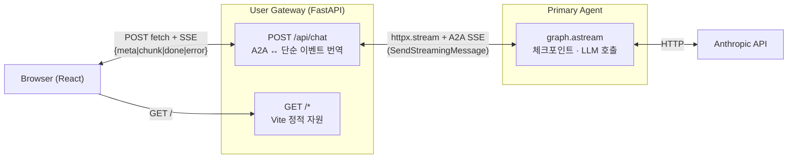

# SSE 연결 설계 노트 — User Gateway

본 문서는 UG 와 관련된 **SSE(Server-Sent Events) 기반 A2A 중계** 의 설계 맥락과
지금까지 검토한 자원 관리 / 예기치 못한 중단 대비 / UG 고유 계약 사항을 기록한다.

- 작성 배경: #6 / #7 구현 과정에서 공유된 고려 사항. 공용(shared) 계층 개선은
  **#23 이슈** 로 별도 관리, 본 문서는 **UG 레벨에서만 의미 있는 항목** 중심.
- 코드 위치:
  - `user-gateway/src/user_gateway/main.py` — `/api/chat` SSE 중계 핸들러
  - `user-gateway/frontend/src/api.ts` — fetch + ReadableStream 기반 SSE 파서

---

## 1. 현재 구조

- **브라우저는 A2A 스펙을 직접 알 필요가 없다.** UG 가 A2A 이벤트
  (`task` / `artifact-update` / `status-update`) 를 UG 고유의 단순 이벤트
  (`meta` / `chunk` / `done` / `error`) 로 번역한다.
- 브라우저 ↔ UG 는 `POST + ReadableStream` (EventSource 는 GET 만 되어
  메시지 body 를 실을 수 없음).

---

## 2. 자원 관리 현황 (#7 머지 시점)

| 자원 | 정리 시점 | 상태 |
|---|---|---|
| UG 의 공용 `httpx.AsyncClient` | FastAPI lifespan finally → `aclose()` | ✅ |
| per-request upstream stream (`http.stream`) | `async with` context exit | ✅ |
| Primary 쪽 `graph.astream` iterator | cancel 전파 | ✅ (#23 로 보강 예정) |
| 정적 자원 (`/`, `/assets/*`) | `StaticFiles` 가 자동 | ✅ |

## 3. 예기치 못한 연결 중단 — 전수 검토

| 시나리오 | 현재 대응 | 개선 대상? |
|---|---|---|
| 브라우저 탭 닫기 / 네트워크 단절 | Starlette 가 write 시점에 감지 → generator cancel → cascade | ⚠️ idle 시간 길면 감지 지연 (#23 S1 에서 polling 보강) |
| UG ↔ Primary TCP 장애 | `except httpx.HTTPError` → `{type:"error"}` | ✅ |
| Primary ↔ Anthropic 장애 | Primary 의 `except Exception` → `TASK_STATE_FAILED` → UG 가 error 이벤트로 전달 | ✅ |
| Primary / UG 프로세스 crash | 소켓 끊김 → fetch 예외 → FE 의 catch | ✅ |
| LLM 무한 대기 | langchain-anthropic 내부 timeout 에 의존 | ⚠️ UG 쪽 total timeout 부재 (U1) |
| 프록시/LB idle timeout | 방어 無 | ⚠️ keepalive ping 필요 (#23 S2 공용, UG 도 같은 패턴) |
| Half-open TCP | OS/uvicorn 기본 socket keepalive 에 의존 | 🟩 Later |
| Slow client backpressure | Starlette 가 write 대기로 자연스러운 backpressure | 🟩 Later |

---

## 4. UG 에만 적용되는 조치 전수 목록

Agent 와 달리 UG 는 **브라우저 대면 + upstream 호출자** 역할이라 고유한 책임이 있음.
개선 항목을 영역별로 정리한다 (공용 계층에 이미 심을 항목은 별도 표기).

### 4.1. Upstream (UG → Primary) 통신 관리

| 항목 | 우선 | 현재 | 개선 |
|---|---|---|---|
| **Upstream 전체 스트림 timeout** (U1) | 🟥 Must | `httpx.Timeout(120.0, connect=5.0)` 만 — 개별 read timeout 기준. 누적 수명 상한 없음 | `anyio.fail_after(N=300s)` 로 전체 감싸기. 초과 시 `{type:"error", message:"upstream timeout"}` |
| **httpx.Limits 튜닝** (U2) | 🟨 Should | 기본값 (`max_connections=100`, `max_keepalive=20`) | 명시적으로 설정 + 환경변수 override 가능하도록 |
| **Upstream retry / backoff** (U3) | 🟨 Should | 즉시 실패 | connect error / 5xx 일 때 1~2회 exponential backoff. 스트리밍 중간 실패는 재시도 불가 (이미 토큰 방출됨) — **초기 연결 단계에만** 적용 |
| **Upstream 요청 header 전파** | 🟩 Later | 없음 | 인증 토큰 propagation. M3+ 인증 도입 시 |

### 4.2. 브라우저-facing 보호

| 항목 | 우선 | 현재 | 개선 |
|---|---|---|---|
| **CORS 정책** (U4) | 🟨 Should | same-origin 만 (프로덕션 OK, dev 에서 Vite :5173 → BE :8000 도 proxy 로 우회중) | `CORSMiddleware` 로 origin allowlist 명시. `ALLOWED_ORIGINS` 환경변수 |
| **Per-client rate limit** | 🟩 Later | 없음 | slowloris / 남용 방어. 단일 사용자 환경엔 불필요 |
| **Request body size limit** | 🟩 Later | FastAPI 기본 | 초장문 메시지 악용 방어 |

### 4.3. 프로토콜 번역 계약

| 항목 | 우선 | 현재 | 개선 |
|---|---|---|---|
| **UG → FE 이벤트 포맷 문서화** (U5) | 🟨 Should | `types.ts` 에 타입 존재, 백엔드 inline | 본 문서 §5 에 표로 공식화 + `code` / `retryable` 필드 추가 고려 |
| **A2A → FE 번역 테이블 공식화** (U6) | 🟨 Should | `main.py` inline | 본 문서 §6 에 매핑 표. Artifact 파트 타입(text/file/data) 확장 시 번역 규칙 가이드 |

### 4.4. FE 재시도 / 재연결 UX

| 항목 | 우선 | 현재 | 개선 |
|---|---|---|---|
| **FE 끊김 시 재시도 정책** (U7) | 🟨 Should | 에러 버블 표시만. 자동 재연결 없음 (EventSource 였다면 자동) | 수동 retry 버튼 노출 or 지수 백오프 자동 재시도. 스트리밍 도중 끊긴 답변은 부분적으로만 남아 있을 수 있으므로 "이어받기" 는 M3+ (`resubscribe` A2A 메서드) |
| **Request idempotency** | 🟩 Later | FE 가 매 전송마다 새 `messageId` 생성 | 서버 측 dedup 까지는 아직 불필요 |

### 4.5. 정적 자원 서빙

| 항목 | 우선 | 현재 | 개선 |
|---|---|---|---|
| **Cache-Control 헤더** (U8) | 🟨 Should | `StaticFiles` 기본 (Cache-Control 없음) | `index.html` → `no-cache`, `/assets/<hash>.*` → `immutable, max-age=31536000` (Vite 가 파일명에 hash 붙이므로 안전) |
| **gzip / brotli 압축** | 🟩 Later | 없음 | 프록시 레이어에서 처리 권장 |
| **SPA fallback** | 🟩 Later | 단일 페이지라 불필요 | 라우팅 도입 시 `/*` → `index.html` |

### 4.6. 인증 / 세션 (M3+)

| 항목 | 우선 | 비고 |
|---|---|---|
| Session token 발급 / 검증 | 🟩 Later | 현재 M2 는 no-auth |
| Token upstream A2A 전달 | 🟩 Later | Primary 가 user-id 식별할 때 필요 |

---

## 5. UG → FE 이벤트 포맷 계약

`POST /api/chat` 의 SSE 응답은 다음 타입의 JSON payload 를 `data:` 라인으로 전달한다.

| `type` | 언제 | 필드 | 의미 |
|---|---|---|---|
| `meta` | 세션 최초 1회 | `contextId: string` | FE 가 후속 요청에 `contextId` 를 이어붙여 thread 를 유지하도록 알림 |
| `chunk` | LLM 토큰 chunk 도착 시 N회 | `text: string` | 현재 agent 버블에 append 할 텍스트 조각 |
| `done` | 정상 완료 시 1회 | — | 스트림 종료. FE 는 버블의 `streaming` 상태 해제 |
| `error` | 실패 시 1회 (최종) | `message: string` | 오류 설명. 향후 `code`, `retryable` 필드 추가 가능 |

SSE 인코딩: `data: {json}\n\n`. 하트비트는 (개선 후) `:keepalive\n\n` comment 라인
— FE 는 comment 라인을 무시한다.

---

## 6. A2A → UG 이벤트 번역 테이블

UG 가 Primary 로부터 받는 A2A SSE 이벤트는 다음과 같이 번역된다:

| A2A 이벤트 | 조건 | UG 이벤트 |
|---|---|---|
| `Task{status.state=TASK_STATE_SUBMITTED}` | 최초 1회 | `meta{contextId}` (UG 가 만든 contextId 를 그대로 전달) |
| `TaskArtifactUpdateEvent{append=true, parts:[{text}]}` | N회 | `chunk{text}` |
| `TaskStatusUpdateEvent{status.state=TASK_STATE_COMPLETED, final=true}` | 종료 | `done` |
| `TaskStatusUpdateEvent{status.state=TASK_STATE_FAILED, final=true}` | 오류 | `error{message}` (status.message.parts[0].text 추출) |
| `TaskArtifactUpdateEvent` 의 `parts` 에 text 외 타입 (file, data 등) | 미래 | 현재는 skip. 확장 시 추가 타입 정의 필요 |

## 7. 의존 관계 / 구현 순서 힌트

- **#23 (공용 SSE 하드닝)** 이 먼저 들어가 있으면 UG 의 U1 timeout 실측이 깨끗함
  (Primary 쪽 keepalive / disconnect polling 이 이미 동작).
- 다만 독립 변경이라 병렬 진행 가능.

## 8. 검증 체크리스트 (UG 레벨)

개선 반영 후 다음을 수동 확인:

- `curl -sS --no-buffer -X POST http://localhost:8080/api/chat -d '{"text":"긴 질문..."}'` 중
  **Ctrl-C** → UG 로그에 `sse_session.cancel(reason=client_disconnect)` 기록
- idle 5초 초과 시 스트림에 `:keepalive` 라인 주기 관찰
- UG 의 upstream timeout (예: 5s 로 임시 설정) 을 초과하는 LLM 지연 유도 →
  `{type:"error", message:"upstream timeout"}` 이벤트 수신
- `curl -I http://localhost:8080/` → `Cache-Control: no-cache`, `/assets/<hash>.js` → `Cache-Control: immutable, max-age=31536000`
- FE 브라우저에서 서버 강제 종료 → 에러 버블 + retry 버튼 (U7 적용 후) 노출

---

## 9. 미해결 / 재검토 필요

- **LLM cancel cascade 완전성** — cascade 가 Anthropic API 요청까지 닿는지
  `langchain-anthropic` / httpx 구현 의존. 실측 결과를 #23 에 기록.
- **Graceful shutdown 시 진행 중 세션 drain 정책** — SIGTERM 수신 시 새 요청
  거부 + 진행 중 세션 완료 대기 vs 즉시 cancel 후 에러 이벤트 방출. M3+ 결정.
- **멀티 에이전트 시대의 UG 확장** — UG 가 Primary 외 다른 agent 로도 라우팅
  하게 될 때, `/api/chat?agent=architect` 같은 디스패치 필요. 현재 구조는
  Primary 하드코딩.
